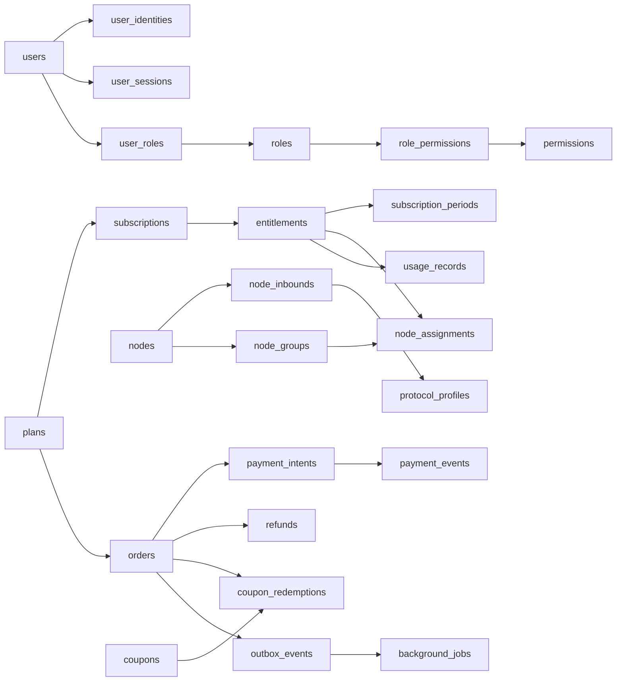

# Server Greenfield 重建（商业主链）

## Problem Frame

当前 `server` 的数据库与 API 处于明显的过渡态：一部分能力已经开始向规范化持久层收口，另一部分能力仍依赖旧表、兼容 façade（Facade）和历史语义。结果不是“已经完成现代化”，而是“同时维护两套真相”。这会把空库启动、seed、revision、运行时查询和接口行为全部绑在一起，只要其中一环没有完全对齐，就会出现连锁 `500`。

这次工作不再把问题定义为“继续修补兼容型数据库规范化”，而是直接把 `server` 当作一个**全新的商业化代理面板后端**来重建：

- 不保留现有 HTTP API、节点协议、支付回调、Telegram webhook 的兼容义务
- 不保留现有数据库数据迁移义务
- 不以旧表、旧模型、旧 migration 资产作为设计边界
- 第一版只保留商业主链能力，不把内容系统和外围能力一起带进来

目标不是做“能兼容旧世界的新数据库”，而是做一套可以独立成立、边界清晰、可长期演进的新 `server`。

## High-Level Model

## Requirements

**产品范围**

- R1. 新 `server` 第一版仅保留商业主链能力：用户与认证、后台权限、套餐目录、订阅履约、节点管理、订单支付、优惠券、系统配置与运营审计。
- R2. 第一版不包含 `ticket / announcement / document / Telegram` 相关产品能力，也不为它们预建数据库空壳。
- R3. 新 `server` 不承诺兼容现有 HTTP API、节点拉取与上报协议、支付回调格式或其他外部协议；这些协议允许随新设计一起重做。
- R4. 本次重建允许直接丢弃现有数据库数据，按空库初始化新项目，不要求提供旧数据迁移方案。

**身份与权限**

- R5. 系统采用单一 `users` 主体模型，不区分 `admin_users` 与 `end_users` 两张主体表。
- R6. 第一版认证方式仅支持邮箱（Email）主链，包括注册、登录、验证码、密码重置、会话管理和安全审计。
- R7. 身份系统至少需要 `users / user_identities / user_sessions / verification_tokens / security_events` 这组稳定边界。
- R8. 后台权限采用标准 RBAC（Role-Based Access Control）模型，至少包含 `roles / permissions / role_permissions / user_roles`。

**商品、订阅与授权**

- R9. 商品与履约必须分离，核心链路采用 `plans -> subscriptions -> entitlements`。
- R10. 用户可用配额不能直接堆在单一订阅主表里，必须通过 `entitlements` 或 `subscription_periods` 保存周期性配额快照。
- R11. 节点授权解析必须采用 `entitlements -> node_groups -> node_assignments`，不允许依赖逗号字段、动态字符串匹配或 `FIND_IN_SET` 一类关系表达。
- R12. `node_assignments` 必须是预计算结果；订阅变更、套餐切换、到期和续费时刷新，节点读取时只查询结果，不做运行时现算。
- R13. 配额消费必须进入独立 usage 事实表，不能通过覆盖主表字段来同时承担当前状态与历史审计。

**订单、支付与营销**

- R14. 交易事实至少拆分为 `orders / payment_intents / payment_events / refunds`，不得把支付尝试、支付回调和订单状态继续混在一张主表里。
- R15. 第一版只支持优惠券（Coupon）模型，不引入更重的 promotion 规则引擎；至少包含 `coupons / coupon_redemptions`。
- R16. 第一版采用单币种（Single Currency）计费模型，不设计汇率与多币种结算体系。

**节点与协议**

- R17. 节点体系至少拆为 `nodes / node_inbounds / protocol_profiles` 三类实体，不允许把所有协议配置长期堆回单一节点主表。
- R18. 第一版产品能力需要覆盖当前主流协议面：Shadowsocks、VMess、VLESS、Trojan、Hysteria2、TUIC、WireGuard、AnyTLS。
- R19. 协议覆盖指产品能力保留，不代表兼容当前实现中的既有字段命名、配置结构或下发格式。

**配置、审计与异步副作用**

- R20. 配置系统采用分域配置表，而不是重新引入万能 `settings/system` 大表；至少需要站点、认证、计费、节点、邮件等分域策略边界。
- R21. 主表生命周期统一使用 `status` 与 `archived_at` 等显式字段表达，不依赖全局 `soft delete` 作为主要生命周期模型。
- R22. 关键状态变化必须有审计事件或操作日志，不能只依赖主表当前值推断历史。
- R23. 异步副作用采用统一的 `outbox_events + background_jobs` 模型，保证数据库提交与异步任务投递之间的一致性边界。

**跨库与标识**

- R24. 新数据库必须把 MySQL 8+ 与 PostgreSQL 作为第一版一等公民（first-class）支持对象，而不是“主库 + 测试兼容库”的关系。
- R25. 核心主表统一使用 UUID 作为内部与对外主标识，不再依赖雪花或自增整型作为产品主 ID。

## Success Criteria

- 可以在全新空库上完成初始化，并在 MySQL 8+ 与 PostgreSQL 两种数据库上成功启动新 `server`
- 新 `server` 启动与运行不依赖任何 legacy 表、compatibility façade 或历史 SQL migration 资产
- 完整商业主链可闭环运行：注册登录 -> 购买 -> 支付 -> 开通订阅 -> 生成授权 -> 下发节点可用结果 -> 记录配额消费
- 节点授权读取只依赖显式关系与预计算结果，不再依赖逗号字段、模糊匹配或运行时跨表现算
- 订单、支付尝试、支付事件、退款、异步副作用与安全审计都能独立追溯
- 第一版范围内没有内容系统和 Telegram 的数据库包袱

## Scope Boundaries

- 不要求兼容当前 `server` 的任何外部协议或 API 契约
- 不要求迁移当前数据库中的任何历史数据
- 不包含 `ticket / announcement / document / Telegram`
- 不包含多币种、汇率体系与复杂营销规则引擎
- 不引入事件溯源（Event Sourcing）、多租户或跨产品平台化抽象
- 不要求第一版就覆盖所有未来扩展能力，只要求商业主链扎实成立

## Key Decisions

- **Greenfield 而非兼容重构**：当前系统的主要成本来自双重真相和兼容层，而不是单点 schema 设计缺陷；继续补洞只会放大维护成本。
- **商业主链优先**：新 `server` 先保证注册、购买、开通、授权、计费和后台管控成立，再考虑内容与外围能力。
- **单一 `users` + RBAC**：后台与终端用户共用主体体系，减少权限、审计和认证模型裂变。
- **邮箱优先的身份系统**：第一版先把主认证链做稳，再考虑 OAuth、短信或无密码扩展。
- **`plans -> subscriptions -> entitlements`**：把商品目录、订阅关系和履约授权拆开，避免重回“套餐即一切”的旧模型。
- **预计算 `node_assignments`**：把复杂度放在订阅变更时处理，而不是放在节点运行时读路径。
- **`orders + payment_intents + payment_events + refunds`**：把订单、支付尝试、支付回调和退款明确拆层，保证对账、幂等和审计能力。
- **分域配置表**：拒绝万能配置表重新出现，让配置边界与业务域同步收口。
- **`status / archived_at` 优先于 `soft delete`**：让生命周期更显式，减少跨库查询和唯一约束被软删污染的问题。
- **`outbox_events + background_jobs`**：统一处理副作用，避免“主表写成功但异步任务丢失”的一致性问题。
- **MySQL 8+ / PostgreSQL 双栈**：新项目从一开始就把双数据库作为真实约束，而不是在 MySQL 设计完成后被动适配。
- **UUID 作为主标识**：让跨域关联、公开资源标识和未来服务拆分都保持稳定。

## Dependencies / Assumptions

- 前端可以在后续阶段跟随新 API 一起调整，不受现有 OpenAPI 契约约束
- 节点协议实现可以跟随新 server 一起升级，不要求兼容旧下发结构
- 支付网关接入可以跟随新的 `payment_intents / payment_events` 模型重写
- 空库重建是可以接受的交付前提，历史数据库不会作为上线阻塞项
- Redis、异步任务系统和对象缓存策略可以在规划阶段继续细化，但不会改变本文件定义的持久层主边界

## Outstanding Questions

### Deferred to Planning

- [Affects R3][Technical] 新 HTTP API 是否保留现有 admin/user 双 API 面，还是直接统一为更清晰的资源模型
- [Affects R18][Technical] 多协议下发格式是否采用统一抽象层后再渲染到各协议，还是按协议族拆为多条明确读路径
- [Affects R20][Technical] 分域配置表里哪些策略应该强结构化建模，哪些可以接受受控 JSON 字段
- [Affects R23][Technical] `background_jobs` 与现有 Asynq 的关系是保留、封装还是替换
- [Affects R24][Needs research] MySQL 与 PostgreSQL 双栈下 UUID 生成、索引策略、JSON 字段和时间精度的统一约束如何定义

## Next Steps

-> `/ce:plan` for structured implementation planning
