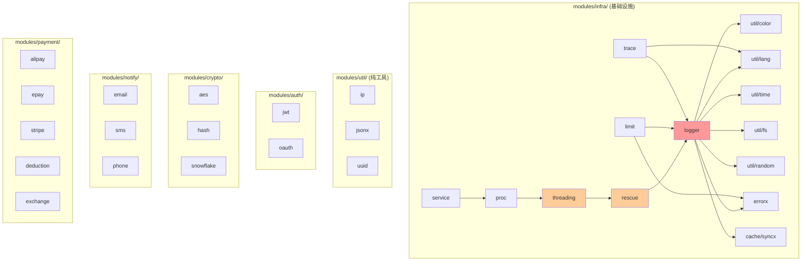

# Design: Server 目录结构全面重构 — Gitea 风格分层 + huma v2

Generated by /office-hours on 2026-04-07
Branch: feat/monorepo-baseline
Repo: cosaria/perfect-panel
Status: DRAFT (rev.3 — 两轮六方审查后修订)
Mode: Builder
Supersedes: admin-feat/monorepo-baseline-design-20260403-130337.md

## Problem Statement

PPanel 的 server/ 目录结构继承自 goctl 代码生成体系：handler/ 和 logic/ 完全镜像（19 个子模块一一对应，242 + 256 个文件）、pkg/ 有 44 个扁平包（从 12 行的 md5 到 5250 行的 logger）、所有代码包裹在 internal/ 下增加了无意义的目录深度。这套结构对贡献者不友好——新人打开仓库无法快速定位代码，改一个功能需要同时修改 handler + logic + types 三个目录。

**当前状态**：huma v2 路由迁移已完成（routes.go 中有 229 个 `huma.Register` 调用），但目录结构仍保持 goctl 的 handler/logic 镜像布局。types.go（2790 行，389 个 struct）仍为 goctl 生成的单体文件。本次重构的核心是**目录语义重组**，而非框架迁移（框架迁移已完成）。

**诚实的动机**（三方审查共识）：这次重构的主要受益者是开发者自己的效率，而非假想中的贡献者社区。项目目前只有 1-2 个活跃贡献者。goctl 遗留结构让每次修改都需要跨 3 个目录操作，这是切实的开发效率损耗。

## What Makes This Cool

一个 Go 开源项目，目录结构和 Gitea 一样直观。贡献者打开 `server/` 就知道：`routers/` 是路由、`services/` 是业务逻辑、`models/` 是数据模型、`modules/` 是可复用模块。改 server API 后跑一条命令，前端 TypeScript SDK 自动更新。不需要中间仓库，不需要 goctl，不需要 `DO NOT EDIT`。

## Constraints

- Go 1.23+，Gin 作为 HTTP 框架保留
- huma v2 (humagin adapter) 包装 Gin，生成 OpenAPI 3.1
- huma v2 路由迁移已完成（229/235 个路由），本次重构不涉及框架迁移
- 错误响应格式迁移（all-200 → 标准 HTTP 状态码）作为独立 RFC，不包含在本次目录重构范围内
- ServiceContext 拆解作为独立后续工作，不包含在本次目录重构范围内
- GORM v2 作为 ORM 保留
- Asynq 作为异步任务框架保留
- Cobra 作为 CLI 框架保留
- 前端 embed 方案（server/web/）保留
- Monorepo 根目录结构不变（apps/ + packages/ + server/ + docs/）

## Premises

1. 采用 Gitea 风格分层（routers/services/models/modules），替代 goctl 的 handler/logic 镜像结构
2. 废弃 internal/ 包裹层，主要包直接放在 server/ 根层，降低目录深度
3. pkg/ 的 44 个扁平包按功能域重组为 modules/，小工具合并
4. queue/ + scheduler/ 合并为 worker/，融入主结构
5. monorepo 根目录保持现状，重构范围主要在 server/ 内部

## Cross-Model Perspective

### 初始 Claude subagent 冷读（Phase 4 前）

- 指出这次重构最有价值的不是目录调整，而是「代码即来源」的架构转变
- huma v2 的 OpenAPI schema 作为唯一真实来源，消除三跳链路
- 建议优先「建骨架让现有代码跑在新结构里」

### 三方独立审查修正（Phase 4 后）

- **CE 审查发现**：huma v2 迁移实际已完成（229 个路由），初始假设过时。Phase 3 的核心工作变为文件合并而非框架迁移
- **CEO 审查挑战**：机会成本分析——项目当前阶段应优先产品增长而非工程整洁。重构的真正受益者是开发者效率
- **Brainstorm 审查补充**：Phase 3 原计划捆绑三个低可逆性决策，应拆分。types.go 全量内联过于激进

## Approaches Considered

### Approach A: 最小改动（只动目录）

只移动文件位置，不改代码逻辑。internal/ 下的包提升到 server/ 根层，pkg/ 重组为 modules/，保留 goctl handler/logic 镜像结构。

- Effort: S (CC+gstack: ~1h)
- Risk: Low
- Pros: 风险最低，每步可验证，不破坏现有功能
- Cons: handler/logic 镜像仍在，未解决核心架构问题
- Completeness: 4/10

### Approach B: Gitea 风格分层 + 异步任务融合 (chosen)

routers/services/models/modules/worker 五层架构。保留 Gin + huma v2（已集成）。adapter/ 保持独立。queue + scheduler 合并为 worker/。ServiceContext 本次保留，后续渐进式拆解。

- Effort: M (CC+gstack: ~9h，分 6 Phase)
- Risk: Med（Phase 0-2 Low，Phase 3 Med）
- Pros: Gitea 级别目录语义，modules/ 边界清晰，开发效率提升
- Cons: 需要修改所有 import path，测试覆盖率可能临时下降
- Completeness: 7/10（错误响应和 ServiceContext 拆解留到后续 RFC）

### Approach C: Feature-based 按功能域组织（已排除）

每个功能域一个目录，内含 routes/service/model/types：
```
server/user/    → routes.go, service.go, model.go
server/order/   → routes.go, service.go, model.go
```

- Effort: L
- Risk: Med
- Pros: 改一个功能只在一个目录里操作
- Cons: PPanel 的 admin/user/auth 三个角色共享相同数据模型（如 order 同时被 admin 和 user 操作），按功能域分会导致模型归属不清。多角色共享模型的场景下，按层分比按域分更适合。
- Completeness: 6/10

### Approach D: 分布式微服务化

拆分为独立的 Go 服务，通过 gRPC/protobuf 通信。

- Effort: XL (CC+gstack: ~20h+)
- Risk: High
- Pros: 最灵活的架构，可独立部署和扩展
- Cons: 对于开源面板来说过度设计，部署复杂度与「一个 Docker 就能跑」目标矛盾
- Completeness: 10/10 但是 ocean 不是 lake

## Recommended Approach

**Approach B: Gitea 风格分层 + 异步任务融合**

### 目标目录结构

```
server/
├── cmd/                           # CLI 入口 (Cobra) — 保持不变
│   ├── root.go
│   ├── run.go
│   ├── version.go
│   └── openapi.go
│
├── routers/                       # HTTP 路由层 (替代 internal/handler/)
│   ├── router.go                  # 路由注册总入口 + 中间件挂载
│   ├── response.go                # HTTP 响应封装 (← pkg/result)
│   ├── middleware/                 # HTTP 中间件 (从 internal/middleware/ 平移)
│   │   ├── auth.go
│   │   ├── cors.go
│   │   ├── device.go
│   │   ├── logger.go
│   │   ├── server.go
│   │   └── trace.go
│   └── api/                       # huma v2 路由定义
│       └── v1/
│           ├── admin/             # 管理端 API (19 个子模块)
│           │   ├── user.go
│           │   ├── system.go
│           │   ├── server.go
│           │   ├── subscribe.go
│           │   ├── order.go
│           │   ├── ...
│           ├── auth/              # 认证 API
│           │   ├── email.go
│           │   ├── phone.go
│           │   └── oauth.go
│           ├── public/            # 用户端 API
│           │   ├── user.go
│           │   ├── order.go
│           │   ├── portal.go
│           │   ├── ticket.go
│           │   └── ...
│           ├── node/              # 节点通信 API (改名避免与项目名混淆；保持原始 Gin，不经 huma 注册，不生成 OpenAPI spec)
│           ├── common/            # 公共 API
│           ├── subscribe.go       # 订阅链接生成路由
│           └── telegram.go        # Telegram Bot webhook 路由
│
├── services/                      # 业务逻辑层 (替代 internal/logic/)
│   ├── admin/                     # 管理业务逻辑
│   │   ├── user.go                # 合并原 28 个文件为按功能聚合
│   │   ├── system.go              # 合并原 25 个文件
│   │   ├── server.go
│   │   ├── subscribe.go
│   │   ├── order.go
│   │   ├── marketing.go
│   │   ├── ...
│   ├── auth/                      # 认证业务逻辑
│   ├── user/                      # 用户端业务逻辑 (替代 public/)
│   ├── node/                      # 节点通信业务逻辑 (替代 server/)
│   ├── common/                    # 公共业务逻辑
│   ├── subscribe/                 # 订阅链接生成 (从 logic/subscribe/ 平移)
│   ├── webhook/                   # 支付回调处理 (避免与 modules/notify/ 命名冲突)
│   └── telegram/                  # Telegram Bot
│
├── models/                        # 数据模型层 (替代 internal/model/)
│   ├── user/                      # 用户模型 + CRUD
│   ├── node/                      # 节点模型
│   ├── order/                     # 订单模型
│   ├── subscribe/                 # 订阅模型
│   ├── payment/                   # 支付模型
│   ├── ticket/                    # 工单模型
│   ├── ...                        # 其余 10 个子包保持
│   └── migrate/                   # 数据库迁移 (从 initialize/migrate/ 移入)
│
├── modules/                       # 可复用模块 (替代 pkg/ 的 44 个包)
│   ├── auth/                      # 认证模块
│   │   ├── jwt.go                 # ← pkg/jwt
│   │   ├── method.go              # ← pkg/authmethod
│   │   └── oauth/                 # ← pkg/oauth (apple/google/telegram)
│   ├── cache/                     # 缓存模块
│   │   ├── redis.go               # ← pkg/cache
│   │   └── syncx/                 # ← pkg/syncx (如果仍需要)
│   ├── crypto/                    # 加密模块
│   │   ├── aes.go                 # ← pkg/aes
│   │   ├── hash.go                # ← pkg/hash + pkg/md5
│   │   └── snowflake.go           # ← pkg/snowflake
│   ├── infra/                     # 基础设施
│   │   ├── logger/                # ← pkg/logger (5250 行保持子包)
│   │   ├── trace/                 # ← pkg/trace
│   │   ├── proc/                  # ← pkg/proc
│   │   ├── rescue/                # ← pkg/rescue
│   │   ├── errorx/                # ← pkg/errorx (错误处理)
│   │   ├── xerr/                  # ← pkg/xerr (错误码体系，与 errorx 待合并评估)
│   │   ├── limit/                 # ← pkg/limit (限流)
│   │   ├── orm/                   # ← pkg/orm (GORM 封装)
│   │   ├── conf/                  # ← pkg/conf (YAML 加载)
│   │   ├── service.go             # ← pkg/service (ServiceGroup)
│   │   ├── threading.go           # ← pkg/threading (移入 infra/ 解决双向依赖)
│   │   └── rescue.go              # ← pkg/rescue (依赖 logger，必须在 infra/ 内)
│   ├── notify/                    # 通知模块
│   │   ├── email/                 # ← pkg/email
│   │   ├── sms/                   # ← pkg/sms
│   │   └── phone/                 # ← pkg/phone
│   ├── payment/                   # 支付模块
│   │   ├── alipay/                # ← pkg/payment/alipay
│   │   ├── epay/                  # ← pkg/payment/epay
│   │   ├── stripe/                # ← pkg/payment/stripe
│   │   ├── exchange.go            # ← pkg/exchangeRate
│   │   └── deduction.go           # ← pkg/deduction
│   ├── traffic/                    # 流量统计工具 (非代理协议，避免与 adapter/ 歧义)
│   │   └── traffic.go             # ← pkg/traffic
│   ├── verify/                    # 验证模块
│   │   ├── turnstile.go           # ← pkg/turnstile
│   │   └── device.go              # ← pkg/device
│   └── util/                      # 纯工具 (合并小包)
│       ├── ip.go                  # ← pkg/ip
│       ├── json.go                # ← pkg/jsonx
│       ├── random.go              # ← pkg/random
│       ├── time.go                # ← pkg/timex
│       ├── uuid.go                # ← pkg/uuidx
│       ├── template.go            # ← pkg/templatex
│       ├── lang.go                # ← pkg/lang
│       ├── color.go               # ← pkg/color
│       ├── months.go              # ← pkg/calculateMonths
│       └── fs.go                  # ← pkg/fs
│
├── worker/                        # 异步任务 (合并 queue/ + scheduler/)
│   ├── worker.go                  # Worker 启动入口
│   ├── scheduler.go               # 定时任务注册 (← scheduler/)
│   ├── routes.go                  # 任务路由注册 (← queue/handler/routes.go)
│   ├── types/                     # 任务类型定义 (← queue/types/)
│   └── tasks/                     # 任务实现 (← queue/logic/)
│       ├── email.go
│       ├── order.go
│       ├── sms.go
│       ├── subscription.go
│       ├── traffic.go
│       └── quota.go
│
├── adapter/                       # 订阅协议适配器 — 保持独立
│   ├── adapter.go
│   ├── client.go
│   └── utils.go
│
├── config/                        # 全局配置 (从 internal/config/ 提升)
│   ├── config.go
│   ├── cache_key.go
│   └── protocol.go
│
├── setup/                         # 系统初始化 (重命名 initialize/)
│   ├── init.go                    # 启动配置加载总入口
│   ├── wizard.go                  # 首次运行 Web 配置向导 (← config.go)
│   ├── site.go
│   ├── node.go
│   ├── email.go
│   ├── ...                        # 其余初始化文件
│   └── templates/
│       └── index.html
│
├── web/                           # 嵌入前端静态文件 — 保持不变
│   ├── embed.go / embed_dev.go
│   ├── static.go / static_test.go
│   ├── admin-dist/
│   └── user-dist/
│
├── doc/                           # 服务器文档 — 保持不变
│
├── etc/                           # 配置文件 — 保持不变
│   ├── ppanel.yaml
│   └── ppanel.yaml.example
│
├── ppanel.go                      # Go module 入口
├── go.mod
├── go.sum
├── Makefile
└── Dockerfile
```

### 关键设计决策

**1. routers/ 替代 handler/ — 路由与逻辑解耦**

goctl 模式中，每个 handler 文件是一个 thin wrapper（解析请求 → 调用 logic → 返回响应），handler/ 和 logic/ 1:1 映射。这导致文件数翻倍但信息密度为零。

huma v2 模式下，路由定义和请求/响应类型合一：

```go
// routers/api/v1/admin/user.go
func RegisterUserRoutes(api huma.API, svc *services.AdminUserService) {
    huma.Register(api, huma.Operation{
        OperationID: "getUser",
        Method:      http.MethodGet,
        Path:        "/v1/admin/user/{id}",
        Tags:        []string{"Admin - User"},
    }, svc.GetUser)
}
```

handler + logic + types 三个目录的文件合并为 routers/ + services/ 两个目录。types 不再独立存在——huma v2 的 Input/Output 结构体直接定义在对应的 service 文件中。

**2. services/ 替代 logic/ — 命名更直观**

`logic/` 是 goctl 的命名约定，Go 社区不常用。`services/` 是 Gitea/Memos/Grafana 共同采用的名称。

关键变化：
- `logic/public/` → `services/user/` — "public" 不直观，改为按用户角色命名
- `logic/server/` → `services/node/` — "server" 歧义大，改为按领域命名
- 原来每个操作一个文件（如 createUserLogic.go, updateUserLogic.go ...），按功能分组合并为每子域 2-4 个文件（避免产生 1500+ 行巨型文件）：
  ```
  services/admin/
  ├── user_query.go       # GetUser, GetUserList, GetUserDetail (~300 行)
  ├── user_mutate.go      # CreateUser, UpdateUser, DeleteUser (~400 行)
  ├── user_subscribe.go   # 用户订阅相关操作 (~200 行)
  ```

**3. modules/ 替代 pkg/ — 域分组消除扁平化**

44 个扁平包按领域聚合为 9 个组：auth, cache, crypto, infra, notify, payment, traffic, verify, util。

合并规则：
- **吸收**：md5(12行) → crypto/hash.go, calculateMonths(30行) → util/months.go, authmethod(8行) → auth/method.go
- **聚合**：jwt + oauth → auth/, aes + hash + md5 + snowflake → crypto/, email + sms + phone → notify/
- **保持**：logger(5250行) 保持子包结构在 infra/logger/, trace 保持在 infra/trace/
- **移除评估**：syncx(1878行) 评估是否仍需要，如果大部分功能可被标准库替代则删除

**4. worker/ 合并 queue/ + scheduler/ — 异步任务统一**

现有 queue/ 自身有 handler/logic/types 三层，是 goctl 模式的延伸。合并后：
- `worker.go` — Asynq worker 启动
- `scheduler.go` — 定时任务注册
- `routes.go` — 任务路由映射
- `tasks/` — 扁平的任务实现文件
- `types/` — 任务负载类型

**5. setup/ 替代 initialize/ — 语义更清晰**

`initialize/` 太长且含义模糊。`setup/` 更简洁，表达「首次运行配置」和「启动时加载」的双重含义。数据库迁移移入 `models/migrate/`，与数据模型放在一起。

**6. 依赖注入 — 手动构造替代 ServiceContext**

现有 `ServiceContext` 持有所有 model、config、redis、asynq client，是典型的 god object。重构为：
- 每个 service 接收它需要的依赖（model + module），不引用全局上下文
- 在 `cmd/run.go` 中手动构造依赖图，按领域分函数
- 不引入 wire/fx 等 DI 框架，保持开源项目的简单性

依赖构造骨架示意：

```go
// cmd/run.go
func buildServices(db *gorm.DB, rdb *redis.Client, cfg *config.Config) *app {
    // 基础设施层
    cache := cache.New(rdb)
    mailer := notify.NewEmailSender(cfg.Email)

    // 数据模型层
    userModel := user.NewModel(db, cache)
    orderModel := order.NewModel(db, cache)
    // ...

    // 业务服务层，按领域分组构造
    adminSvc := newAdminServices(userModel, orderModel, mailer, cfg)
    userSvc := newUserServices(userModel, orderModel, cache, cfg)
    authSvc := newAuthServices(userModel, cfg)
    nodeSvc := newNodeServices(nodeModel, cfg)

    return &app{admin: adminSvc, user: userSvc, auth: authSvc, node: nodeSvc}
}
```

**7. 错误响应格式 — 本次不动，独立 RFC（三方审查共识）**

三个独立审查员一致认为：从 all-200+`{code,msg}` 迁移到标准 HTTP 状态码是一个**破坏性变更**，影响面包括两个前端应用的所有 API 调用、节点通信协议、第三方集成（支付/OAuth/Telegram）、监控告警系统。可逆性极低（前后端需同步回退）。

决策：**本次目录重构不改变错误响应格式**。保持现有 all-200+`{code,msg}` 约定。错误响应迁移作为独立 RFC 单独评估，需包含：
- 前后端协调方案
- 向后兼容策略（v1/v2 前缀或兼容 middleware）
- 节点通信 API 的豁免策略
- 前端 `request.ts` 拦截器迁移计划

**8. ServiceContext — 本次保留，渐进式拆解（三方审查共识）**

ServiceContext 持有 24 个字段，256 个 logic 文件的构造函数都接收 `*svc.ServiceContext`。一次性拆解风险过高。

决策：**本次目录重构保留 ServiceContext**，仅将其从 `internal/svc/` 平移到 `svc/`（或 `services/svc/`）。后续渐进式拆解：
1. 新增代码用手动注入
2. 逐步用 `Deprecated` 标记 ServiceContext 字段
3. 按子域逐个替换

**9. types.go — 按域拆分，不强制内联（三方审查共识）**

types.go 有 2790 行、389 个 struct，很多类型跨多个 endpoint 共享（分页请求、通用响应、嵌套实体）。完全内联会导致重复定义和 OpenAPI spec 膨胀。

决策：**分步走**
1. Phase 3 将 types.go 按域拆分为多个文件（`types/user.go`, `types/order.go` 等），保持 `types/` 包存在
2. 共享类型（分页、排序、通用响应）保留在 `types/common.go`
3. 后续逐步将 Input/Output struct 内联到对应 service 文件，但共享实体类型不强制内联

**10. 依赖图 — threading/rescue 移入 infra/（解决双向依赖）**

pkg/ 依赖链分析发现：`threading → rescue → logger → color/lang/timex`。如果 threading 放 util/ 而 logger 放 infra/，会产生 `util/ ↔ infra/` 双向依赖，违背"明确领域边界"的成功标准。

决策：将 `threading` 和 `rescue` 都放入 `infra/`，消除双向依赖。

### pkg/ → modules/ 完整映射表

| 原 pkg/ 包 | 行数 | → modules/ 位置 | 说明 |
|---|---|---|---|
| logger | 5250 | infra/logger/ | 保持子包结构 |
| syncx | 1878 | 评估后决定 | 可能大部分可删除 |
| trace | 1191 | infra/trace/ | 保持 |
| tool (crypto) | ~400 | crypto/ | cipher.go, curve25519.go, sha.go, base64 相关 |
| tool (payment) | ~150 | payment/ | tradeNo.go（交易号生成） |
| tool (util) | ~550 | util/ | slice.go, string.go, time.go, convert.go, tern.go, version.go, etag.go, setProcessing.go, 其余杂项 |
| deduction | 1039 | payment/deduction.go | 扣费逻辑 |
| email | 798 | notify/email/ | 保持子包 |
| device | 490 | verify/device.go | |
| errorx | 462 | infra/errorx/ | 保持 |
| limit | 444 | infra/limit/ | 限流 |
| hash | 413 | crypto/hash.go | |
| xerr | 329 | infra/xerr/ | 错误码 |
| cache | 299 | cache/ | |
| service | 252 | infra/service.go | ServiceGroup |
| lang | 234 | util/lang.go | |
| ip | 225 | util/ip.go | |
| timex | 204 | util/time.go | |
| proc | 196 | infra/proc/ | |
| uuidx | 194 | util/uuid.go | |
| random | 223 | util/random.go | |
| rules | 188 | 评估后决定 | 可能移入 services/ |
| phone | 170 | notify/phone/ | |
| orm | 148 | infra/orm/ | GORM 封装 |
| threading | 146 | infra/threading.go | 依赖 rescue→logger，必须在 infra/ 内 |
| sms | 134 | notify/sms/ | 保持子包 |
| turnstile | 127 | verify/turnstile.go | |
| snowflake | 123 | crypto/snowflake.go | |
| fs | 132 | util/fs.go | |
| conf | 109 | infra/conf/ | YAML 加载 |
| payment | 105 | payment/ | 保持子包 |
| color | 90 | util/color.go | |
| jwt | 89 | auth/jwt.go | |
| jsonx | 88 | util/json.go | |
| constant | 81 | config/ 合并 | 上下文 Key 移入 config |
| nodeMultiplier | 78 | 移入 models/node/ | 与节点模型耦合 |
| rescue | 74 | infra/rescue.go | 依赖 logger，必须在 infra/ 内 |
| exchangeRate | 69 | payment/exchange.go | |
| traffic | 66 | traffic/traffic.go | 流量统计 |
| result | 61 | routers/response.go | HTTP 响应封装 |
| templatex | 36 | util/template.go | |
| calculateMonths | 30 | util/months.go | |
| md5 | 12 | crypto/hash.go 合并 | |
| authmethod | 8 | auth/method.go | |
| oauth | 子包 | auth/oauth/ | 保持子包 |

### 实施路线（三方审查后修订版 — 6 Phase）

**Phase 0: 修复构建 + 安全修复 + 建立基线**
1. 修复 3 个构建失败的包（`logic/admin/application`, `logic/admin/server`, `pkg/logger`）
2. **安全修复**（迁移审查发现，应在搬迁前修复避免固化）：
   - `serverMiddleware.go`：将节点密钥从 query string (`?secret_key=`) 改为 `Authorization` header 或自定义 `X-Node-Secret` header
   - `deviceMiddleware.go:177`：删除 `fmt.Println("Original Response Body:", responseBody)` 调试输出
   - `serviceContext.go:92`：删除 `rds.FlushAll(context.Background())`，改为按需清理指定 key prefix
3. 确保 `go build ./...` 全部通过
4. 运行 `go test ./... -count=1`，记录覆盖率基线
5. 运行 `go vet ./...` + `staticcheck ./...` 确认无隐式问题
- Effort: ~1.5h | Risk: Low | 独立 PR

**Phase 1: 骨架迁移（go build 通过为目标）**
1. 创建新目录结构 (routers/, services/, models/, modules/, worker/, config/, setup/, svc/, types/)
2. 移动文件到新位置，测试文件随源码平移
3. ServiceContext 从 `internal/svc/` 平移到 `svc/`（保持不动，不拆解）
4. 批量修改 import path（使用 `sed` 批量替换 + `goimports` 修正，在 feature branch 操作，每子目录完成后 commit 便于 bisect）
5. 同步将 `initialize/migrate/` 移到 `models/migrate/`
6. `internal/server.go` 移到 `cmd/` 或 `routers/` 下（根据实际依赖决定）
7. **构建管线同步更新**（迁移审查发现的硬编码路径）：
   - `/Dockerfile:30` 和 `server/Dockerfile:17`：ldflags 中 `pkg/constant.Version` → `config.Version`，`pkg/constant.BuildTime` → `config.BuildTime`
   - `server/Makefile` GOBUILD 变量中的同一 ldflags 路径
8. 确保 `go build` 通过
9. 确保 `go test ./... -count=1` 全部通过，覆盖率不低于 Phase 0 基线
10. 对 `syncx/rules/report/` 三个待定包暂时平移（syncx → modules/cache/syncx, rules → modules/util/rules, report → services/report/），后续 Phase 再决策
11. **文档同步**（DX 审查 CRITICAL 发现）：
    - 更新 CLAUDE.md 的 Architecture 章节（所有旧路径引用）
    - 更新 CLAUDE.md 的 Commands 章节（如有路径变化）
    - 在 CONTRIBUTING.md 中添加旧→新目录映射表（便于搜索历史 Issue）
- Effort: ~4-5h | Risk: Med（svc 变更影响 525 个文件） | 独立 PR

> **注意**：svc import 变更影响 525 个文件，是整个重构中影响面最大的单次操作。建议按子域分 commit（admin → auth → user → ...），每个 commit 后验证编译通过。

**Phase 2: pkg/ → modules/ 合并**
1. 按映射表合并小包（errorx 与 xerr 暂时都平移到 infra/，后续决策合并与否）
2. **关键**：threading 和 rescue 移入 infra/（解决 infra/ ↔ util/ 双向依赖）
3. 更新所有引用
4. 评估 syncx/rules 是否保留（标准：逐个函数检查标准库是否有替代）
5. 删除空目录
6. 确保 `go test ./...` 通过，覆盖率不低于 Phase 0 基线
- Effort: ~2h | Risk: Med | 独立 PR

**Phase 3: handler/logic → routers/services 合并**

注意：huma v2 路由迁移已完成（229 个 `huma.Register`），本 Phase 核心工作是**文件合并**，不是框架迁移。

3a. **routes.go 拆分**
1. 将 routes.go（2308 行、229 个路由注册）按子域拆分为 routers/api/v1/admin/*.go, auth/*.go, public/*.go 等
2. 每个子域一个路由注册函数（如 `RegisterAdminUserRoutes`）
3. server/ 路由保持原始 Gin，平移到 routers/api/v1/server/

3b. **handler + logic 合并为 services**
1. 按子域逐个合并（admin → auth → user → common → subscribe → telegram → webhook），每个子域完成后运行测试，**每个子域独立 commit**（确保回滚粒度最小化）
2. 合并策略：handler 的工厂函数（`Handler(svcCtx) -> func`）与 logic 的业务实现合并为一个 service 方法。handler 文件删除，logic 文件重命名移入 services/。ServiceContext 作为参数保留不拆解。
   ```go
   // 合并前：handler 工厂 + logic 分离
   // handler/admin/user/getUserDetailHandler.go → 调用 logic
   // logic/admin/user/getUserDetailLogic.go → 业务逻辑
   
   // 合并后：services/admin/user_query.go
   func GetUserDetailHandler(svcCtx *svc.ServiceContext) func(ctx context.Context, input *GetUserDetailInput) (*GetUserDetailOutput, error) {
       return func(ctx context.Context, input *GetUserDetailInput) (*GetUserDetailOutput, error) {
           // 原 logic 代码直接内联
       }
   }
   ```
3. 文件合并粒度：**每子域 2-4 个文件**（query/mutate/其他），避免产生 1500+ 行巨文件

3c. **types.go 按域拆分**
1. 将 types.go（2790 行、389 个 struct）按域拆分为 `types/user.go`, `types/order.go`, `types/admin.go` 等
2. 共享类型（分页、排序、通用响应）保留在 `types/common.go`
3. 保持 `types/` 包存在，不强制内联到 service 文件

- Effort: ~5-7h | Risk: Med | 独立 PR（可拆分为 3a+3b+3c 三个子 PR）

**Phase 4: worker 统一 + 清理**
1. 合并 queue/ + scheduler/ → worker/
2. 扁平化任务实现
3. 清理废弃文件和目录
4. 最终确认：`go build`、`go test ./...`、`go vet ./...` 全部通过
- Effort: ~1h | Risk: Low | 独立 PR

**Phase 5: 错误响应格式迁移（独立 RFC，不在本次范围）**
- 从 all-200+`{code,msg}` 迁移到标准 HTTP 状态码 + RFC 9457
- 需要前后端协调方案、向后兼容策略、节点通信豁免
- 破坏性变更，可逆性极低，需独立评估

**Phase 6: ServiceContext 渐进式拆解（独立 RFC，不在本次范围）**
- 24 个字段、256 个构造函数需修改
- 分步策略：新代码手动注入 → Deprecated 标记 → 按子域逐个替换
- 中等工作量，独立评估

## Open Questions

1. **syncx 包是否保留？** 1878 行的并发原语，Phase 2 中逐个函数评估标准库替代
2. **rules 包归属？** Phase 1 暂移到 modules/util/rules，后续评估
3. **report/ 包归属？** Phase 1 暂移到 services/report/，后续评估
4. **errorx vs xerr：** Phase 2 暂时都放 infra/，后续决策合并方案
5. **handler/admin/ 的 19 个子模块合并粒度？** Phase 3b 中根据实际行数决定
6. **internal/server.go 归属？** Phase 1 中根据实际依赖决定放 cmd/ 还是 routers/

## Success Criteria

- `go build` 成功，`go test ./... -count=1` 全部通过，覆盖率不低于重构前基线
- 新贡献者能在 5 分钟内理解 server/ 的分层含义
- 单个 API 端点修改只需要改 2 个文件（routers/ + services/），而非当前的 3 个（handler/ + logic/ + types/）
- modules/ 中每个子包有明确的领域边界，不存在跨域依赖
- huma v2 生成的 OpenAPI 3.1 spec 可直接被前端 openapi-ts 消费

## Distribution Plan

不涉及新的分发渠道。现有的 Docker 镜像构建流程、GoReleaser 配置、GitHub Actions CI/CD 保持不变。目录重构后需要更新 Dockerfile 中的路径引用和 Makefile 中的构建命令。

## Next Steps

1. **Phase 0 先行**：修复 3 个构建失败的包，建立测试基线。没有安全网就不开始重构。
2. **Phase 1-2 连续做**：骨架迁移 + pkg 合并，~4h 完成，拿到 80% 的组织收益。
3. **Phase 3 独立评估**：routes.go 拆分（3a）风险最低可以先做，handler+logic 合并（3b）和 types 拆分（3c）视情况决定是否在同一 PR。
4. **Phase 5-6 暂缓**：错误响应迁移和 ServiceContext 拆解作为独立 RFC，等目录重构稳定后再启动。
5. **分 PR 提交**：每个 Phase 一个 PR，方便 review 和回滚。

## Three-Party Review Summary

本文档经过三方独立审查（2026-04-07），审查员未见过彼此的报告：

| 审查员 | 视角 | 评分 | 核心发现 |
|--------|------|------|----------|
| CEO 战略审查 | 产品/增长/机会成本 | 6/10 | 机会成本是最大问题；真正受益者是开发者效率而非贡献者 |
| Brainstorm 创意架构 | 替代方案/风险/创新 | 7.5/10 | 错误响应迁移风险被严重低估；Phase 3 捆绑三个低可逆性决策 |
| CE 工程实践 | 代码验证/依赖分析 | 7/10 | huma v2 已完成 229 路由迁移；3 个包构建失败；infra↔util 双向依赖 |

**三方共识采纳项**：
1. 错误响应迁移独立为 Phase 5（不在本次范围）
2. ServiceContext 拆解独立为 Phase 6（不在本次范围）
3. 新增 Phase 0（修复构建失败）
4. types.go 按域拆分而非全量内联
5. 文件合并粒度：每子域 2-4 个文件（非单个巨文件）
6. threading/rescue 移入 infra/（解决双向依赖）
7. 补充 Feature-based 方案作为 Approach C（已排除）

### 第二轮审查（安全 / DX / 迁移风险）

| 审查员 | 视角 | 评分 | 核心发现 |
|--------|------|------|----------|
| 安全审查 | 中间件/配置/类型安全 | 5.5/10 | 密钥 query string 传输、FLUSHALL、调试 println 需迁移前修复 |
| DX 审查 | 开发者体验/工具链 | 7/10 | CLAUDE.md 同步是 CRITICAL 遗漏；Dockerfile ldflags 硬编码 |
| 迁移风险 | import 范围/回滚/时间 | 6.5/10 | 时间估算偏低（9h→13-17h）；svc 525 文件变更是最高风险操作 |

**第二轮采纳项**：
1. Phase 0 加入 3 个安全修复（密钥传输 / println / FLUSHALL）
2. Phase 1 加入 Dockerfile + Makefile ldflags 路径更新
3. Phase 1 完成后立即同步 CLAUDE.md（CRITICAL）
4. `routers/api/v1/server/` 改名 `node/`（消除与项目名歧义）
5. Phase 3b 明确合并策略（解决 thin wrapper vs 工厂函数矛盾）
6. 时间估算修正：Phase 1 从 2h→4-5h，Phase 3 从 3h→5-7h，总计 ~15h
7. Phase 3b 每子域独立 commit（确保回滚粒度最小化）

## What I noticed about how you think

- 你说「全部都要」的时候，不是在要求不可能的东西。你知道 AI 让完整方案的边际成本接近零，所以你拒绝在贡献者体验和工程质量之间做取舍。
- 你对「整体都有问题」的判断是准确的。很多人会纠结于局部优化（"先整理一下 pkg/"），你直接看到了系统性问题——goctl 的代码生成模式本身才是病根。
- 你选择 Approach B 而不是 C 说明你理解「一个 Docker 就能跑」和微服务架构之间的矛盾。开源项目的用户不想跑 Kubernetes。
- 四份先前的设计文档在同一分支上迭代，从 API 客户端重构到单 Docker 部署再到目录重构，这是一个连贯的技术路线图。你在系统性地清理技术债务，而不是东一榔头西一棒子。

---

## Appendix A: BEFORE/AFTER 目录对比

```
BEFORE (当前)                          AFTER (重构后)
========================================  ========================================
server/                                server/
├── internal/                          ├── routers/           ← internal/handler/
│   ├── handler/    (242 files)        │   ├── router.go
│   │   ├── admin/  (19 subdirs)       │   ├── response.go    ← pkg/result
│   │   ├── auth/                      │   ├── middleware/     ← internal/middleware/
│   │   ├── common/                    │   └── api/v1/
│   │   ├── public/                    │       ├── admin/
│   │   ├── server/                    │       ├── auth/
│   │   └── ...                        │       ├── public/
│   ├── logic/      (256 files)        │       ├── node/       ← server/ (改名)
│   │   ├── admin/  (19 subdirs)       │       ├── common/
│   │   ├── auth/                      │       ├── subscribe.go
│   │   ├── public/                    │       └── telegram.go
│   │   ├── server/                    │
│   │   └── ...                        ├── services/          ← internal/logic/
│   ├── model/      (16 subdirs)       │   ├── admin/
│   ├── middleware/ (8 files)          │   ├── auth/
│   ├── svc/        (6 files)          │   ├── user/           ← public/ (改名)
│   ├── types/      (2 files, 2790行)  │   ├── node/           ← server/ (改名)
│   ├── config/                        │   ├── common/
│   ├── report/                        │   ├── subscribe/
│   └── trace/                         │   ├── webhook/        ← notify/ (改名)
│                                      │   └── telegram/
├── pkg/            (44 subdirs)       │
│   ├── logger/     (5250行)           ├── models/            ← internal/model/
│   ├── syncx/      (1878行)           │   ├── user/ node/ order/ ...
│   ├── tool/       (1106行)           │   └── migrate/        ← initialize/migrate/
│   ├── xerr/                          │
│   ├── ...38 more                     ├── modules/           ← pkg/ (44→9组)
│                                      │   ├── auth/    (jwt+oauth+authmethod)
├── initialize/     (15 files)         │   ├── cache/   (cache+syncx)
├── queue/          (20 files)         │   ├── crypto/  (aes+hash+md5+snowflake)
├── scheduler/      (1 file)           │   ├── infra/   (logger+trace+proc+rescue
│                                      │   │            +errorx+xerr+limit+orm
                                       │   │            +conf+threading+service)
                                       │   ├── notify/  (email+sms+phone)
                                       │   ├── payment/ (alipay+epay+stripe+deduction)
                                       │   ├── traffic/
                                       │   ├── verify/  (turnstile+device)
                                       │   └── util/    (ip+json+random+time+uuid
                                       │                +template+lang+color+months+fs)
                                       │
                                       ├── svc/               ← internal/svc/ (暂保留)
                                       ├── types/             ← internal/types/ (按域拆分)
                                       ├── worker/            ← queue/ + scheduler/
                                       ├── config/            ← internal/config/
                                       ├── setup/             ← initialize/
                                       ├── adapter/           (不变)
                                       └── web/               (不变)
```

**关键变化统计**：
- 目录层级：平均 4 层 → 3 层（废除 internal/ 包裹）
- 修改 API 端点：3 个文件 → 2 个文件
- pkg/ 包数：44 个扁平 → 9 个域分组
- handler+logic 文件：498 个 → ~80 个（按子域 2-4 文件合并）

## Appendix B: 实测数据表

基于实际代码扫描（887 个 .go 文件），import path 变更影响范围：

| 旧路径 | → 新路径 | 受影响文件数 | 风险等级 |
|--------|---------|-------------|---------|
| `internal/svc` | `svc/` | **525** | HIGH — 最大单次变更 |
| `internal/types` | `types/` | **481** | HIGH |
| `pkg/logger` | `modules/infra/logger/` | **316** | MED |
| `internal/logic/*` | `services/*` | **247** | MED |
| `pkg/xerr` | `modules/infra/xerr/` | **234** | MED |
| `internal/model/*` | `models/*` | **181** | LOW |
| `pkg/tool` | `modules/crypto/` + `modules/util/` | **148** | MED（拆分） |
| `pkg/constant` | `config/` | **66** | LOW（含 Dockerfile ldflags） |
| `internal/config` | `config/` | **49** | LOW |
| `pkg/result` | `routers/response.go` | **10** | LOW |
| `internal/handler/*` | `routers/api/v1/*` | **4** | LOW（仅路由注册引用） |
| `internal/middleware` | `routers/middleware/` | **3** | LOW |
| **去重后总计** | | **~630** | — |

## Appendix C: 迁移脚本骨架

```bash
#!/bin/bash
# scripts/migrate-imports.sh
# 用法: cd server && bash scripts/migrate-imports.sh
# 注意: 在 feature branch 上执行，每步后 commit

set -euo pipefail
MODULE="github.com/perfect-panel/server"

echo "=== Step 1: internal/ 顶层包 ==="
# 顺序重要：先替换长路径，再替换短路径，避免双重替换
find . -name "*.go" -not -path "./vendor/*" -exec sed -i '' \
  -e "s|${MODULE}/internal/svc|${MODULE}/svc|g" \
  -e "s|${MODULE}/internal/types|${MODULE}/types|g" \
  -e "s|${MODULE}/internal/config|${MODULE}/config|g" \
  -e "s|${MODULE}/internal/middleware|${MODULE}/routers/middleware|g" \
  -e "s|${MODULE}/internal/report|${MODULE}/services/report|g" \
  -e "s|${MODULE}/internal/trace|${MODULE}/modules/infra/trace|g" \
  {} +
goimports -w .
go build ./... && echo "Step 1 OK" || echo "Step 1 FAILED"
git add -A && git commit -m "refactor: migrate internal/ top-level imports"

echo "=== Step 2: internal/handler → routers ==="
find . -name "*.go" -exec sed -i '' \
  "s|${MODULE}/internal/handler|${MODULE}/routers|g" {} +
goimports -w .
go build ./... && echo "Step 2 OK"
git add -A && git commit -m "refactor: migrate handler → routers imports"

echo "=== Step 3: internal/logic → services ==="
find . -name "*.go" -exec sed -i '' \
  -e "s|${MODULE}/internal/logic/public|${MODULE}/services/user|g" \
  -e "s|${MODULE}/internal/logic/server|${MODULE}/services/node|g" \
  -e "s|${MODULE}/internal/logic|${MODULE}/services|g" \
  {} +
goimports -w .
go build ./... && echo "Step 3 OK"
git add -A && git commit -m "refactor: migrate logic → services imports"

echo "=== Step 4: internal/model → models ==="
find . -name "*.go" -exec sed -i '' \
  "s|${MODULE}/internal/model|${MODULE}/models|g" {} +
goimports -w .
go build ./... && echo "Step 4 OK"
git add -A && git commit -m "refactor: migrate model → models imports"

echo "=== Step 5: pkg/ → modules/ (高频包) ==="
find . -name "*.go" -exec sed -i '' \
  -e "s|${MODULE}/pkg/logger|${MODULE}/modules/infra/logger|g" \
  -e "s|${MODULE}/pkg/xerr|${MODULE}/modules/infra/xerr|g" \
  -e "s|${MODULE}/pkg/errorx|${MODULE}/modules/infra/errorx|g" \
  -e "s|${MODULE}/pkg/constant|${MODULE}/config|g" \
  -e "s|${MODULE}/pkg/result|${MODULE}/routers|g" \
  -e "s|${MODULE}/pkg/jwt|${MODULE}/modules/auth|g" \
  -e "s|${MODULE}/pkg/oauth|${MODULE}/modules/auth/oauth|g" \
  -e "s|${MODULE}/pkg/cache|${MODULE}/modules/cache|g" \
  -e "s|${MODULE}/pkg/orm|${MODULE}/modules/infra/orm|g" \
  -e "s|${MODULE}/pkg/limit|${MODULE}/modules/infra/limit|g" \
  -e "s|${MODULE}/pkg/conf|${MODULE}/modules/infra/conf|g" \
  -e "s|${MODULE}/pkg/proc|${MODULE}/modules/infra/proc|g" \
  -e "s|${MODULE}/pkg/rescue|${MODULE}/modules/infra|g" \
  -e "s|${MODULE}/pkg/threading|${MODULE}/modules/infra|g" \
  -e "s|${MODULE}/pkg/service|${MODULE}/modules/infra|g" \
  -e "s|${MODULE}/pkg/trace|${MODULE}/modules/infra/trace|g" \
  {} +
goimports -w .
go build ./... && echo "Step 5 OK"
git add -A && git commit -m "refactor: migrate pkg → modules imports (high-freq)"

echo "=== Step 6: pkg/ → modules/ (低频包) ==="
find . -name "*.go" -exec sed -i '' \
  -e "s|${MODULE}/pkg/aes|${MODULE}/modules/crypto|g" \
  -e "s|${MODULE}/pkg/hash|${MODULE}/modules/crypto|g" \
  -e "s|${MODULE}/pkg/md5|${MODULE}/modules/crypto|g" \
  -e "s|${MODULE}/pkg/snowflake|${MODULE}/modules/crypto|g" \
  -e "s|${MODULE}/pkg/email|${MODULE}/modules/notify/email|g" \
  -e "s|${MODULE}/pkg/sms|${MODULE}/modules/notify/sms|g" \
  -e "s|${MODULE}/pkg/phone|${MODULE}/modules/notify/phone|g" \
  -e "s|${MODULE}/pkg/payment|${MODULE}/modules/payment|g" \
  -e "s|${MODULE}/pkg/deduction|${MODULE}/modules/payment|g" \
  -e "s|${MODULE}/pkg/exchangeRate|${MODULE}/modules/payment|g" \
  -e "s|${MODULE}/pkg/turnstile|${MODULE}/modules/verify|g" \
  -e "s|${MODULE}/pkg/device|${MODULE}/modules/verify|g" \
  -e "s|${MODULE}/pkg/traffic|${MODULE}/modules/traffic|g" \
  -e "s|${MODULE}/pkg/ip|${MODULE}/modules/util|g" \
  -e "s|${MODULE}/pkg/jsonx|${MODULE}/modules/util|g" \
  -e "s|${MODULE}/pkg/random|${MODULE}/modules/util|g" \
  -e "s|${MODULE}/pkg/timex|${MODULE}/modules/util|g" \
  -e "s|${MODULE}/pkg/uuidx|${MODULE}/modules/util|g" \
  -e "s|${MODULE}/pkg/lang|${MODULE}/modules/util|g" \
  -e "s|${MODULE}/pkg/color|${MODULE}/modules/util|g" \
  -e "s|${MODULE}/pkg/fs|${MODULE}/modules/util|g" \
  -e "s|${MODULE}/pkg/templatex|${MODULE}/modules/util|g" \
  -e "s|${MODULE}/pkg/calculateMonths|${MODULE}/modules/util|g" \
  -e "s|${MODULE}/pkg/authmethod|${MODULE}/modules/auth|g" \
  -e "s|${MODULE}/pkg/nodeMultiplier|${MODULE}/models/node|g" \
  {} +
goimports -w .
go build ./... && echo "Step 6 OK"
git add -A && git commit -m "refactor: migrate pkg → modules imports (low-freq)"

echo "=== Step 7: Dockerfile ldflags ==="
sed -i '' "s|pkg/constant.Version|config.Version|g" ../Dockerfile Dockerfile
sed -i '' "s|pkg/constant.BuildTime|config.BuildTime|g" ../Dockerfile Dockerfile
sed -i '' "s|pkg/constant.Version|config.Version|g" Makefile
sed -i '' "s|pkg/constant.BuildTime|config.BuildTime|g" Makefile
git add -A && git commit -m "refactor: update ldflags paths in Dockerfile and Makefile"

echo "=== Step 8: initialize → setup ==="
find . -name "*.go" -exec sed -i '' \
  "s|${MODULE}/initialize|${MODULE}/setup|g" {} +
goimports -w .
go build ./... && echo "Step 8 OK"
git add -A && git commit -m "refactor: migrate initialize → setup imports"

echo "=== Step 9: queue → worker ==="
find . -name "*.go" -exec sed -i '' \
  "s|${MODULE}/queue|${MODULE}/worker|g" {} +
goimports -w .
go build ./... && echo "Step 9 OK"
git add -A && git commit -m "refactor: migrate queue → worker imports"

echo "=== DONE: $(git log --oneline HEAD~9..HEAD | wc -l) commits ==="
go test ./... -count=1
```

> **注意**：此脚本为骨架，实际执行前需在 feature branch 上做 dry run。`sed -i ''` 是 macOS 语法，Linux 用 `sed -i`。

## Appendix D: 验证 Checklist

### Phase 0 PR Review Checklist
- [ ] 3 个构建失败包已修复（application, server, logger）
- [ ] `go build ./...` 全部通过
- [ ] `go test ./... -count=1` 全部通过，覆盖率已记录
- [ ] `go vet ./...` 无错误
- [ ] `serverMiddleware.go`：密钥从 query string 改为 header
- [ ] `deviceMiddleware.go:177`：`fmt.Println` 已删除
- [ ] `serviceContext.go:92`：`FLUSHALL` 已删除或改为 key prefix 清理

### Phase 1 PR Review Checklist
- [ ] 所有文件已移动到新目录结构
- [ ] `go build ./...` 通过
- [ ] `go test ./...` 通过，覆盖率 ≥ Phase 0 基线
- [ ] Dockerfile（根 + server）ldflags 路径已更新
- [ ] server/Makefile ldflags 路径已更新
- [ ] CLAUDE.md Architecture 章节已更新
- [ ] CONTRIBUTING.md 已添加目录映射表
- [ ] `goimports -w ./...` 已执行
- [ ] 无意外的 import 残留：`grep -r "internal/" --include="*.go" | grep -v "_test.go` 应为空

### Phase 2 PR Review Checklist
- [ ] 44 个 pkg 包已按映射表重组到 modules/
- [ ] threading 和 rescue 在 infra/ 下（非 util/）
- [ ] 无 infra/ ↔ util/ 循环依赖：`go vet ./...` 通过
- [ ] `go build ./...` 通过
- [ ] `go test ./...` 通过，覆盖率 ≥ Phase 0 基线
- [ ] `grep -r "pkg/" --include="*.go"` 无残留引用（排除 go.mod/go.sum）

### Phase 3 PR Review Checklist
- [ ] routes.go 已按子域拆分（3a）
- [ ] 229 个 huma.Register 全部保留（`grep -c "huma.Register"` 验证）
- [ ] handler + logic 已合并为 services（3b），每子域独立 commit
- [ ] 每个 service 文件 ≤ 800 行
- [ ] types.go 已按域拆分（3c），共享类型在 types/common.go
- [ ] 验证规则（validate tag）与拆分前一致：`diff <(grep -h "validate:" types/*.go | sort) <(grep "validate:" internal/types/types.go | sort)` 应为空
- [ ] `go build ./...` + `go test ./...` + `go vet ./...` 全部通过

### Phase 4 PR Review Checklist
- [ ] queue/ + scheduler/ 已合并为 worker/
- [ ] `go build ./...` + `go test ./...` + `go vet ./...` 全部通过
- [ ] 无孤立空目录
- [ ] Docker 构建测试：`docker build -t ppanel-test .` 成功

## Appendix E: 回滚 Runbook

| Phase | 回滚方法 | 具体步骤 | 预计时间 |
|-------|---------|---------|---------|
| Phase 0 | `git revert` | `git revert <phase0-commit>` | 1 min |
| Phase 1 | `git revert` + 重建 CI | `git revert <phase1-commit>` → `go build ./...` → 更新 CLAUDE.md 回旧版 | 10 min |
| Phase 2 | `git revert` | `git revert <phase2-commit>` → `go build ./...` | 5 min |
| Phase 3a | `git revert` | `git revert <3a-commit>` → 恢复单体 routes.go | 2 min |
| Phase 3b | **手动恢复** | 因为是多对一合并，`git revert` 无法自动拆分文件。步骤：(1) `git checkout <pre-3b> -- internal/handler/ internal/logic/` 恢复原文件 (2) 删除 services/ 中的合并文件 (3) 恢复 routes.go 中对 handler 的引用 | 30 min |
| Phase 3c | `git revert` | `git revert <3c-commit>` → 恢复单体 types.go | 2 min |
| Phase 4 | `git revert` | `git revert <phase4-commit>` | 2 min |

> **关键**：Phase 3b 是唯一不能用 `git revert` 一键回退的步骤。这也是为什么每个子域（admin/auth/user/...）要独立 commit——回滚粒度越小，手动恢复越简单。

## Appendix F: 依赖图（Mermaid）



**关键依赖链**（决定了 threading/rescue 必须在 infra/ 内）：
```
service → proc → threading → rescue → logger → {color, lang, timex, fs, random, errorx, syncx}
```
所有箭头单向流入 util/，无双向依赖。

## Appendix G: 风险矩阵

| # | 风险描述 | 影响 | 概率 | 等级 | 缓解措施 |
|---|---------|------|------|------|---------|
| R1 | svc import 替换（525 文件）引入编译错误 | High | Med | **HIGH** | 按子域分 commit；每步 go build 验证 |
| R2 | Dockerfile ldflags 路径未更新导致版本号为空 | Med | High | **HIGH** | Phase 1 checklist 强制检查 |
| R3 | types.go 拆分丢失验证规则 | High | Low | **MED** | 拆分前后 validate tag diff 对比 |
| R4 | handler+logic 合并产生 1500+ 行文件 | Med | Med | **MED** | 强制每文件 ≤ 800 行 |
| R5 | Phase 3b 回滚困难（多对一合并） | High | Low | **MED** | 每子域独立 commit |
| R6 | pkg 合并引入循环依赖 | High | Low | **MED** | threading/rescue 入 infra/；Phase 2 前跑 go vet |
| R7 | CLAUDE.md 未同步导致 AI 建议错误 | Med | High | **MED** | Phase 1 checklist 强制更新 |
| R8 | sed 替换影响注释/字符串中的路径 | Low | Med | **LOW** | goimports 修正 + go build 验证 |
| R9 | IDE 索引重建期间开发受阻 | Low | High | **LOW** | 在低活跃时段合并 PR |
| R10 | 并发分支合并冲突 | Med | Low | **LOW** | 重构期间暂停功能 PR 合并 |

## Appendix H: CLAUDE.md 更新草稿（Architecture 章节）

以下为重构完成后 CLAUDE.md 的 Architecture 章节替换内容：

```markdown
### Server — Go / Gin / huma v2

基于 **huma v2 + Gin** 的分层架构（Gitea 风格）：

1. **路由层** (`server/routers/`) — huma v2 路由注册 + Gin 中间件
   - `routers/api/v1/admin/` — 管理端 API（JWT 鉴权）
   - `routers/api/v1/auth/` — 认证 API（设备中间件）
   - `routers/api/v1/public/` — 用户端 API（JWT + 设备中间件）
   - `routers/api/v1/node/` — 节点通信 API（原始 Gin，NodeSecret 鉴权）
   - `routers/api/v1/common/` — 公共 API（设备中间件）
2. **业务层** (`server/services/{admin,auth,user,node,common,subscribe,webhook,telegram}/`) — 所有业务逻辑
3. **数据层** (`server/models/{user,node,order,subscribe,...}/`) — GORM v2 模型 + Redis 缓存
4. **可复用模块** (`server/modules/`) — 按域分组：auth, cache, crypto, infra, notify, payment, traffic, verify, util
5. **异步任务** (`server/worker/`) — Asynq worker + scheduler
6. **配置** (`server/config/`) — 全局配置结构体 + 缓存 Key + 协议定义
7. **类型** (`server/types/`) — 请求/响应结构体（按域拆分）
8. **依赖注入** (`server/svc/`) — ServiceContext（渐进式拆解中）
9. **初始化** (`server/setup/`) — 启动时配置加载 + 首次运行向导

关键约定：
- **routers 和 types 已不是 goctl 生成代码，可以手动编辑**
- 所有 HTTP 响应均为 200，错误通过 JSON body `{code, msg}` 表达（`routers/response.go`）
- 错误码体系在 `modules/infra/xerr/`
- 异步任务使用 Asynq（Redis DB 5）
- huma v2 自动生成 OpenAPI 3.1 spec，前端通过 `bun run openapi` 消费
```
