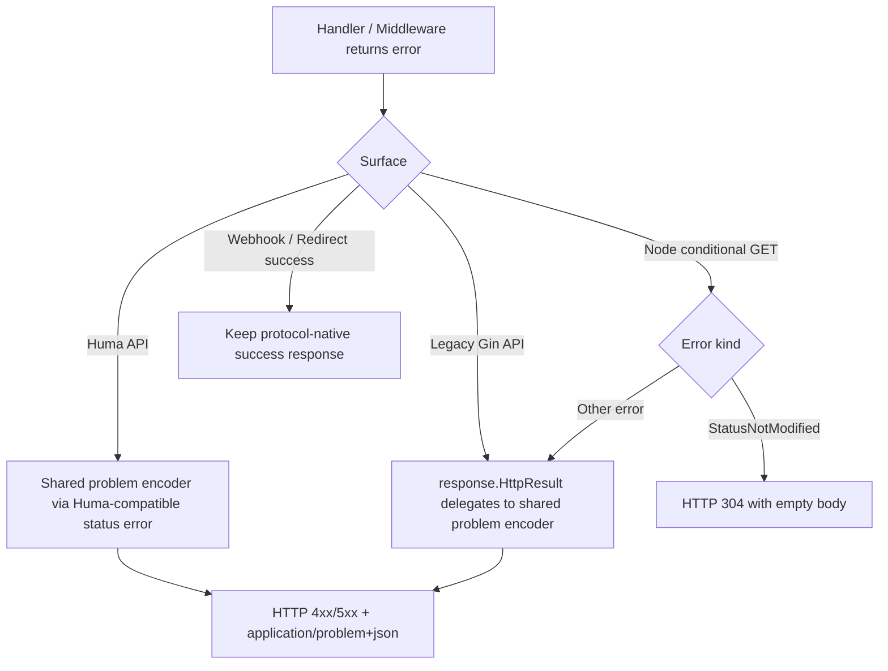

# refactor: Phase 5 error response migration

## Overview

Phase 5 migrates the server from mixed `200 + {code,msg}` error envelopes to standard HTTP status codes plus RFC 9457 problem details for first-party HTTP APIs. The work spans three existing response surfaces: Huma handlers, legacy Gin response helpers, and node-facing Gin endpoints with conditional `304 Not Modified` semantics.

This document began as the pre-implementation plan. As of `2026-04-07`, the migration described here has been implemented and verified. The original sequencing notes remain below, but the unit checkboxes and execution notes now reflect shipped behavior.

## Implementation Status

Implemented on `2026-04-07` on branch `feat/monorepo-baseline`.

Delivered surfaces:

- Shared RFC 9457 encoder and Gin seam migration in `server/routers/response/problem.go` and `server/routers/response/http_result.go`
- Huma registration-time adapter and framework error wiring in `server/routers/huma_problem.go` and `server/routers/routes*.go`
- Coarse public auth/device middleware failures in `server/routers/middleware/authMiddleware.go` and `server/routers/middleware/deviceMiddleware.go`
- Node conditional GET normalization in `server/services/node/getServerConfig.go` and `server/services/node/getServerUserList.go`
- Protocol-safe webhook and callback handling in `server/services/notify/*.go` and `server/services/telegram/telegram.go`
- Emergency Huma compatibility rollback switch via `server/config/config.go` and `ErrorCompatibilityMode`

Verification completed:

- `cd server && go build ./...`
- `cd server && go test ./... -count=1`
- `cd server && go vet ./...`
- `cd server && go run . openapi -o $(mktemp -d)`
- `bun run openapi`

Implementation notes:

- The original placeholder test targets `server/cmd/phase5_error_contract_test.go` and `server/cmd/phase5_rollout_guardrail_test.go` were folded into route-local and OpenAPI contract suites closer to the affected seams.
- Node mutation handlers kept their success shapes and inherited the new error contract through `response.HttpResult`, so this phase did not require per-handler rewrites of `pushOnlineUsers`, `serverPushStatus`, or `serverPushUserTraffic`.
- Apple callback remained protocol-native without code changes; the phase kept its existing redirect / explicit `400 {"error":"Invalid request data"}` behavior.
- `bun run openapi` succeeded and refreshed `docs/openapi/*.json` plus generated client artifacts, so the rollout gate was validated against the real monorepo pipeline rather than server-only export.

## Problem Frame

> This section preserves the original pre-implementation planning context so the shipped work can still be reviewed against its starting assumptions.

The current server has two incompatible error models in active use.

- Huma-backed APIs already honor HTTP status codes through `xerr.CodeError.GetStatus()`, but they do not yet expose a unified problem-details contract with stable extension members.
- Legacy Gin handlers and middleware still funnel failures through `server/routers/response/http_result.go`, which always returns HTTP `200` and wraps errors as `{code,msg}`.
- Node-facing endpoints in `server/services/node/` mix validation envelopes, raw `404 Not Found`, and conditional `304 Not Modified`, making them semantically different from both Huma and legacy Gin APIs.

The design doc explicitly split this work into a separate Phase 5 because it is a low-reversibility API contract change with downstream frontend and node-client impact (see origin: `docs/gstack/designs/admin-feat-monorepo-baseline-design-20260407-111312.md`).

## Requirements Trace

- R1. Replace legacy all-`200` error envelopes on first-party HTTP APIs with standard HTTP status codes.
- R2. Use RFC 9457 problem details as the canonical JSON error shape for first-party HTTP API failures.
- R3. Preserve existing success payload shapes for non-error responses unless a specific endpoint requires protocol-conformant behavior.
- R4. Preserve node conditional request behavior, including `304 Not Modified`, rather than forcing those responses through problem JSON.
- R5. Keep third-party protocol surfaces stable where their success semantics are defined externally, especially redirects and webhook acknowledgements.
- R6. Provide one shared error-mapping path so Huma and Gin do not drift into separate contracts after the migration.
- R7. Keep OpenAPI generation and downstream SDK consumption auditable after the contract change.
- R8. Do not start implementation until this plan has passed three reviews.
- R9. Define an explicit redaction policy so problem `detail` and extension fields never expose wrapped internal errors, tokens, session identifiers, or backend implementation details.
- R10. Provide an operational rollback path with explicit criteria, without turning the migration into a permanent dual-stack public contract.

## Scope Boundaries

- This plan covers server-side HTTP error contract migration only.
- This plan does not redesign business error taxonomy or replace `xerr` with a new domain error system.
- This plan does not change `xerr` business code values or message-map semantics.
- This plan does not perform the later `ServiceContext` breakup from Phase 6.
- This plan does not change successful response payload shapes for Huma or Gin handlers beyond necessary protocol corrections like empty-body `304`.
- This plan does not force webhook success acknowledgements, callback failure semantics, or browser redirects into generic problem-details payloads.
- This plan does not include frontend implementation work, but it does require frontend coordination as an execution dependency.
- This plan explicitly excludes init/bootstrap endpoints in `server/initialize/config.go`; those setup-only surfaces may be handled in a later follow-up once the runtime API migration is stable.

## Context & Research

### Relevant Code and Patterns

- `server/routers/response/http_result.go` is the current Gin error choke point for legacy `{code,msg}` envelopes.
- `server/routers/response/response.go` defines the current `ResponseSuccessBean` and `ResponseErrorBean` JSON models.
- `server/modules/infra/xerr/errors.go` already maps business codes to HTTP status codes through `GetStatus()`, which Huma can consume today.
- `server/modules/infra/xerr/errCode.go` and `server/modules/infra/xerr/errMsg.go` are the current business-code and message source of truth.
- `server/routers/routes.go` builds the Huma APIs used for runtime registration and OpenAPI export.
- `server/services/common/*.go`, `server/services/auth/*.go`, and `server/services/user/**/*.go` are representative Huma-backed handlers returning `xerr`-wrapped errors.
- `server/routers/middleware/authMiddleware.go` and `server/routers/middleware/deviceMiddleware.go` are Gin middleware still writing old envelopes.
- `server/services/node/getServerConfig.go` and `server/services/node/getServerUserList.go` are node-facing conditional GET endpoints with `ETag` and `304 Not Modified` semantics.
- `server/services/node/serverPushUserTraffic.go`, `server/services/node/serverPushStatus.go`, and `server/services/node/pushOnlineUsers.go` are node-facing mutation endpoints still using `response.HttpResult`.
- `server/services/notify/paymentNotify.go`, `server/services/notify/ePayNotify.go`, `server/services/notify/stripeNotify.go`, `server/services/notify/alipayNotify.go`, `server/services/telegram/telegram.go`, and `server/services/auth/oauth/appleLoginCallback.go` are protocol-bound surfaces with webhook/redirect semantics that should not be blindly normalized.
- `server/initialize/config.go` still emits legacy JSON envelopes on setup-only endpoints and must be explicitly excluded or separately planned.
- `server/cmd/openapi.go` depends on route registration remaining exportable after the migration.

### Institutional Learnings

- No `docs/solutions/` directory or prior solution notes exist in this repository today, so there is no durable institutional learning artifact to reuse for this phase.
- The active design document already captured the key warning that error-response migration is low-reversibility and must be reviewed independently before execution (see origin: `docs/gstack/designs/admin-feat-monorepo-baseline-design-20260407-111312.md`).

### External References

- RFC 9457, "Problem Details for HTTP APIs": [rfc-editor.org/rfc/rfc9457](https://www.rfc-editor.org/rfc/rfc9457)
- Huma response errors and RFC 9457 model: [huma.rocks/features/response-errors](https://huma.rocks/features/response-errors/)
- Huma middleware error writing guidance: [huma.rocks/features/middleware](https://huma.rocks/features/middleware/)
- Huma response output behavior: [huma.rocks/features/response-outputs](https://huma.rocks/features/response-outputs/)

## Key Technical Decisions

- **Adopt RFC 9457 as the only JSON error contract for first-party HTTP API failures.** This avoids maintaining both `{code,msg}` and problem-details models after the migration.
- **Retain `xerr` as the business-code source of truth, but demote it from transport envelope to extension metadata.** The new error body should include the business code as an extension field, not as a substitute for HTTP semantics.
- **Do not modify `xerr` business-code or message maps as part of Phase 5.** The migration should consume the existing `GetErrCode()`, `GetErrMsg()`, and `GetStatus()` interface rather than turning this into a taxonomy refactor.
- **Use one shared encoder for Huma and Gin.** The contract must be constructed in a shared response package so that legacy Gin helpers and Huma error factories emit the same fields and status mapping.
- **Standardize Huma integration on a registration-time adapter plus explicit operation error declarations.** The migration will wrap handlers at `huma.Register(...)` call sites, convert transport failures into `huma.NewErrorWithContext(...)`-compatible responses, and declare the shared RFC 9457 model through `Operation.Errors` or explicit `Responses` entries so runtime output and generated OpenAPI stay aligned.
- **Keep protocol-bound success semantics out of the migration blast radius.** Redirect flows, plain-text webhook acknowledgements, and node `304` responses should keep their protocol-conformant success behavior even if their error paths are normalized elsewhere.
- **Treat node read endpoints as first-class API consumers with special cache semantics.** `304 Not Modified` remains a transport-level response with no problem body; non-304 failures should use a coarse, non-enumerable problem contract with fixed public detail text.
- **Apply a public-detail allowlist.** Serialized problem `detail` values may come from `xerr.GetErrMsg()`, validation errors, or other explicitly allowlisted messages only; raw wrapped `err.Error()` values are log-only unless explicitly sanitized.
- **Collapse externally visible auth/device failure details.** Token/session/admin failure subtypes should remain differentiated in logs, but public responses should collapse to a smaller externally visible set such as generic `401`/`403` problem variants.
- **Keep webhook, callback, and redirect failure semantics protocol-specific.** These surfaces must define and test their non-success behavior explicitly rather than inheriting the generic problem encoder by default.
- **Use stable URI-based problem types.** `xerr`-backed errors should expose a deterministic problem `type` URI derived from business code; generic transport failures may use `about:blank` until a specific type exists.
- **Use a short-lived emergency rollback compatibility mode only for Huma-documented first-party JSON APIs, and keep it outside the shared encoder.** The shared problem encoder remains the single source of truth for redaction and auth/device/node coarse-graining; the emergency switch may only re-envelope already-sanitized problem output for Huma-backed API surfaces described by exported OpenAPI artifacts. It must not apply to auth/device middleware failures, node endpoints, protocol-bound callbacks, Telegram webhook handling, or node `304` flows.
- **Treat compatibility mode as a limited recovery aid, not a universal rollback path.** If excluded sensitive surfaces regress, the recovery path is release rollback rather than envelope compatibility mode.
- **Treat rollback as end-to-end recovery for the surfaces it covers, not runtime-only traffic shaping.** If compatibility mode is enabled after new specs or generated clients have been published, the rollback procedure must also restore or re-pin the last known-good `docs/openapi/*.json` artifacts and generated SDK outputs for those same Huma-backed surfaces so published contract artifacts match live runtime behavior.
- **Gate execution behind three reviews.** This plan assumes a review sequence of `plan-ceo-review`, `plan-eng-review`, and a contract-focused document review before implementation starts.

## Open Questions

### Resolved During Planning

- **Should this be a dual-stack migration?** No. The chosen direction is a hard cut for first-party HTTP API errors, with explicit exemptions only for protocol-bound success flows and node `304`.
- **Should `xerr.CodeError.GetStatus()` be replaced?** No. Existing status mapping remains the base HTTP-status source and is reused by the new encoder.
- **Should node `304 Not Modified` be converted into problem JSON?** No. `304` remains a cache-validation response without a problem body.
- **Should webhook acknowledgement bodies be normalized to problem-details on success?** No. Success responses that satisfy third-party protocols remain protocol-native.
- **Should `xerr` files be edited as part of this migration?** No, unless an implementation-time test proves a minimal helper is strictly required. The default plan keeps `xerr` behavior unchanged.
- **How will Huma be wired into the shared contract?** Use a registration-time wrapper around Huma handlers in `server/routers/routes_*.go`, convert transport failures through `huma.NewErrorWithContext(...)`-compatible responses, and declare shared RFC 9457 error responses via `Operation.Errors` or explicit `Responses` entries.
- **Is the init/bootstrap HTTP surface in scope?** No. `server/initialize/config.go` is explicitly excluded from Phase 5 to keep the migration focused on runtime APIs.

### Deferred to Implementation

- **Exact problem type URI namespace:** The plan requires a stable URI strategy, but the final URI base can be finalized during implementation once docs-hosting constraints are confirmed.
- **Rollback flip mechanics:** Use a config/env-driven compatibility switch with an explicit restart-based rollback procedure unless a safe live toggle already exists. The plan does not require dynamic config reloading, but it does require the flip procedure to be written down and tested before production rollout.
- **Frontend rollout choreography:** The plan requires coordination and breaking-change communication, but exact client rollout sequencing belongs to execution planning with the frontend owners.

## High-Level Technical Design

> *This illustrates the intended approach and is directional guidance for review, not implementation specification. The implementing agent should treat it as context, not code to reproduce.*

Endpoint treatment matrix:

| Surface | Success shape | Error shape after Phase 5 |
|---|---|---|
| Huma API (`admin/auth/common/public/user`) | Unchanged existing success body | RFC 9457 problem details |
| Gin first-party API (`node` push endpoints, middleware failures) | Unchanged existing success body | RFC 9457 problem details |
| Node conditional GET (`getServerConfig`, `getServerUserList`) | `200` JSON or empty `304` | Coarse RFC 9457 for non-304 failures, with fixed public detail text |
| Webhook / redirect surfaces (`paymentNotify`, `ePayNotify`, `stripeNotify`, `alipayNotify`, `telegram`, Apple callback`) | Existing protocol-native success | Provider-specific non-success handling; not forced through generic problem envelope |
| Init/bootstrap (`server/initialize/config.go`) | Unchanged existing setup responses | Explicitly out of scope for Phase 5 |

Protocol-bound non-success contract table:

| Surface | Success / ignore contract | Failure contract to preserve or make explicit in Unit 6 |
|---|---|---|
| `paymentNotify` for `EPay` / `CryptoSaaS` | `200 text/plain "success"` for successful, duplicate, or ignorable provider states | `400 text/plain "invalid notification"` for malformed or unverifiable notifications; `500 text/plain "failed"` for internal processing failures; never problem JSON |
| `paymentNotify` for `Stripe` | `200` empty-body acknowledgement with no problem JSON body | `400` empty-body acknowledgement for signature/validation failures; `500` empty-body acknowledgement for internal processing failures; never problem JSON |
| `paymentNotify` for `AlipayF2F` | `200 text/plain "success"` for successful, duplicate, or ignorable provider states | `400 text/plain "invalid notification"` for malformed notifications; `500 text/plain "failed"` for internal processing failures; never problem JSON |
| `paymentNotify` unsupported / unknown platform | No provider acknowledgement is attempted | Explicit `400 text/plain "unsupported platform"` response plus structured log entry; never problem JSON and never silent fallthrough |
| Telegram webhook | `200` empty-body acknowledgement | Secret mismatch, bind failures, and command-processing failures stay log-only with `200` empty-body acknowledgement; never generic problem JSON and never leak bot token or session detail |
| Apple login callback | Redirect remains the success path (`302`/`307` depending on flow) | Request bind failure remains explicit `400 {"error":"Invalid request data"}`; state-lookup failure remains redirect-based rather than problem JSON |

## Dependencies / Prerequisites

- Frontend and SDK owners must be available to validate the status-code and error-body contract before rollout.
- Node-side consumers must be checked for assumptions that all non-success responses are plain text or `200`.
- A rollout switch and rollback criteria must be defined before production rollout starts.
- The root OpenAPI pipeline (`bun run openapi`) must be runnable as an automated rollout gate so spec export, linting, and generated-client updates are validated together rather than server export alone.
- Review gate completed before implementation:
  - `plan-ceo-review`
  - `plan-eng-review`
  - one contract-focused document review pass on this plan

## Implementation Units

- [x] **Unit 1: Define the canonical error contract and characterization coverage**

**Goal:** Establish the new RFC 9457 contract, enumerate endpoint classes, and write characterization tests that prove current special cases before any response code changes land.

**Requirements:** R1, R2, R4, R5, R8

**Dependencies:** None

**Files:**
- Create: `server/routers/response/problem_contract_test.go`
- Create: `server/cmd/phase5_error_contract_test.go`

**Approach:**
- Write characterization tests for five categories: Huma error, legacy Gin `HttpResult`, node `304`, protocol-bound callback surfaces, and explicit init/bootstrap exclusion.
- Freeze the migration target in tests before changing production response code.
- Use explicit fixture assertions for status code, content type, and body shape so later units cannot silently regress the contract.

**Execution note:** Start characterization-first. Do not write production response code until the contract tests fail for the expected reasons.

**Patterns to follow:**
- `server/worker/phase4_worker_contract_test.go`
- `server/cmd/phase34_structure_test.go`

**Test scenarios:**
- Happy path: a representative first-party API success response still returns the existing success payload shape.
- Edge case: a node conditional request that matches `If-None-Match` returns `304` with no problem body.
- Error path: a Gin legacy path currently using `response.HttpResult` fails with a non-`200` status and problem-details body once migrated.
- Error path: an `xerr.InvalidParams` validation failure maps to the agreed HTTP status and includes the business code extension.
- Integration: protocol-bound callback failures continue to follow endpoint-specific contracts rather than generic problem bodies.
- Integration: OpenAPI export still succeeds after the new contract tests and route wiring are introduced.

**Verification:**
- There is a failing test suite that precisely describes the new error contract and current exemptions.

**Implementation result:** Completed. The characterization layer shipped through `server/routers/response/problem_contract_test.go`, `server/routers/phase5_huma_error_contract_test.go`, `server/services/node/phase5_node_contract_test.go`, `server/services/notify/phase5_protocol_surface_test.go`, and `server/cmd/phase5_openapi_contract_test.go`. The original placeholder `server/cmd/phase5_error_contract_test.go` was superseded by seam-local contract suites.

- [x] **Unit 2: Build a shared problem-details encoder around `xerr`**

**Goal:** Create one shared response-layer abstraction that converts generic errors and `xerr.CodeError` values into RFC 9457 problem details for reuse by both Huma and Gin.

**Requirements:** R1, R2, R3, R6

**Dependencies:** Unit 1

**Files:**
- Create: `server/routers/response/problem.go`
- Create: `server/routers/response/problem_test.go`
- Modify: `server/routers/response/http_result.go`
- Test: `server/routers/response/problem_test.go`

**Approach:**
- Define the canonical problem payload shape in `server/routers/response/`.
- Reuse `xerr.CodeError.GetStatus()` as the status source, and expose `xerr` code as an extension field instead of an outer transport envelope.
- Normalize generic errors to a consistent internal-server-error problem response.
- Enforce a public-detail allowlist so only sanitized validation text and approved business messages are serialized.
- Ensure the encoder can be consumed both by Gin helper functions and Huma-compatible error creation.

**Execution note:** Implement test-first against the contract cases from Unit 1.

**Technical design:** *(directional guidance, not implementation specification)*
- Shared encoder responsibilities should be: determine status, derive title/detail, populate `type`, and attach `code` / `errors` extensions only when appropriate.
- The encoder must never serialize raw wrapped backend errors by default; internal causes remain log-only unless an explicit sanitizer is present.
- The encoder should not know about individual handler packages or endpoint classes.

**Patterns to follow:**
- `server/modules/infra/xerr/errors.go`
- `server/routers/response/http_result.go`

**Test scenarios:**
- Happy path: an `xerr.CodeError` becomes a problem response with matching HTTP status and `code` extension.
- Edge case: an unknown generic error becomes a `500` problem with no misleading business code.
- Edge case: a validation error can include extension details without breaking the top-level problem shape.
- Edge case: wrapped DB/Redis/payment errors do not leak raw `err.Error()` strings into serialized `detail`.
- Error path: `ParamErrorResult` no longer returns `200`, and instead emits the agreed invalid-params status.
- Integration: both Gin helpers and Huma-facing adapters can consume the same encoder without format drift.

**Verification:**
- One shared response package can encode all supported error cases without duplicating mapping logic elsewhere.

**Implementation result:** Completed via `server/routers/response/problem.go`, `server/routers/response/problem_test.go`, and `server/routers/response/http_result.go`. The shared encoder now owns RFC 9457 problem generation, validation detail serialization, generic-error redaction, and public coarse-problem helpers used by middleware and node surfaces.

- [x] **Unit 3: Wire Huma APIs to the shared error contract**

**Goal:** Ensure Huma-backed APIs emit the same problem-details contract as the Gin layer, including stable status mapping and spec-visible error behavior.

**Requirements:** R1, R2, R6, R7

**Dependencies:** Unit 2

**Files:**
- Modify: `server/routers/routes.go`
- Modify: `server/routers/routes_admin.go`
- Modify: `server/routers/routes_auth.go`
- Modify: `server/routers/routes_common.go`
- Modify: `server/routers/routes_public.go`
- Create: `server/routers/phase5_huma_error_contract_test.go`
- Create: `server/cmd/phase5_openapi_contract_test.go`
- Test: `server/routers/phase5_huma_error_contract_test.go`
- Test: `server/cmd/phase5_openapi_contract_test.go`

**Approach:**
- Introduce a registration-time Huma wrapper path at `huma.Register(...)` call sites that uses the shared encoder contract rather than relying on default framework output.
- Replace `huma.NewError` and `huma.NewErrorWithContext` during API construction so framework-generated validation, parse, and serialization failures are forced through the same shared RFC 9457 encoder as handler-returned errors.
- Declare problem responses explicitly in `huma.Operation` through `Errors` or `Responses` so the exported spec references Huma's RFC 9457-compatible error model instead of framework defaults.
- Keep Huma route registration and OpenAPI export stable while making the runtime error shape explicit.
- Audit representative handlers returning `xerr` to confirm the response contract is unchanged semantically except for transport and shape normalization.
- Add explicit spec assertions that exported `admin`, `common`, and `user` OpenAPI artifacts describe the problem-details error contract rather than merely exporting successfully.

**Execution note:** Start with one representative Huma route from `auth` or `common`, then generalize only after the contract test is green.

**Patterns to follow:**
- `server/routers/routes.go`
- `server/services/common/getAds.go`
- `server/services/auth/userLogin.go`
- `github.com/danielgtaylor/huma/v2@v2.37.3/error.go`

**Test scenarios:**
- Happy path: a Huma route success response remains unchanged.
- Error path: a Huma route returning `xerr.UserNotExist` emits the mapped non-`200` status and problem-details body.
- Error path: a generic handler error still produces a `500` problem response, not a framework-default body that diverges from Gin.
- Error path: a Huma validation or request-parse failure goes through the shared encoder path via `huma.NewErrorWithContext`, not the stock framework error model.
- Error path: a response serialization or negotiation failure still emits the shared RFC 9457 contract.
- Integration: representative Huma operations declare their RFC 9457 error model through `Errors` or explicit `Responses`, not only through runtime wrapper behavior.
- Integration: OpenAPI export still completes for `admin.json`, `common.json`, and `user.json` after the wrapper change.
- Integration: the exported specs include the problem-details responses/components required for downstream SDK auditability.

**Verification:**
- Huma and Gin no longer disagree on the shape of first-party API error responses.

**Implementation result:** Completed via `server/routers/huma_problem.go`, `server/routers/routes.go`, and the route registration migration from `huma.Register(...)` to `registerOperation(...)` in `server/routers/routes_admin.go`, `server/routers/routes_auth.go`, `server/routers/routes_common.go`, and `server/routers/routes_public.go`. OpenAPI assertions shipped in `server/cmd/phase5_openapi_contract_test.go`.

- [x] **Unit 4: Migrate Gin first-party APIs and middleware away from legacy envelopes**

**Goal:** Convert the remaining Gin-based first-party error paths from `{code,msg}` responses to the shared problem-details contract.

**Requirements:** R1, R2, R3, R6

**Dependencies:** Unit 2

**Files:**
- Modify: `server/routers/middleware/authMiddleware.go`
- Modify: `server/routers/middleware/deviceMiddleware.go`
- Modify: `server/services/node/pushOnlineUsers.go`
- Modify: `server/services/node/serverPushStatus.go`
- Modify: `server/services/node/serverPushUserTraffic.go`
- Create: `server/routers/response/http_result_test.go`
- Test: `server/routers/response/http_result_test.go`

**Approach:**
- Treat `response.HttpResult` and `response.ParamErrorResult` as the migration seam for legacy Gin flows.
- Migrate middleware and Gin handlers in grouped batches so there is a single old/new response boundary during implementation.
- Preserve success shapes and side effects; only error transport semantics and bodies should change.
- Collapse externally visible auth/device failure variants to a smaller public set while keeping granular reasons in logs.

**Execution note:** Characterization-first for middleware, because abort flows and device encryption behavior are easy to break silently.

**Patterns to follow:**
- `server/routers/middleware/authMiddleware.go`
- `server/routers/middleware/deviceMiddleware.go`
- `server/services/node/serverPushUserTraffic.go`

**Test scenarios:**
- Happy path: middleware-authenticated requests still pass through unchanged on success.
- Edge case: device login encryption flow still wraps successful responses correctly after response error changes.
- Error path: missing, expired, invalid, or mismatched-auth token failures collapse to the agreed public auth problem variants.
- Error path: invalid ciphertext now returns the mapped status and problem body without leaking old envelope fields.
- Integration: a node push endpoint validation failure and a middleware failure both serialize through the same shared problem contract.

**Verification:**
- No remaining first-party Gin API failure path depends on `200 + {code,msg}`.

**Implementation result:** Completed. `server/routers/middleware/authMiddleware.go` and `server/routers/middleware/deviceMiddleware.go` now emit coarse public problems, and `response.HttpResult` / `response.ParamErrorResult` provide the new shared transport seam. The node mutation handlers continued to call `HttpResult`, so they inherited the new contract without direct per-handler rewrites.

- [x] **Unit 5: Migrate node conditional GET failures without breaking cache semantics**

**Goal:** Migrate node read endpoints to the new contract while preserving `ETag` and `304 Not Modified` behavior.

**Requirements:** R3, R4, R6, R9

**Dependencies:** Units 2 and 4

**Files:**
- Modify: `server/services/node/getServerConfig.go`
- Modify: `server/services/node/getServerUserList.go`
- Create: `server/services/node/phase5_node_contract_test.go`
- Test: `server/services/node/phase5_node_contract_test.go`

**Approach:**
- Normalize non-304 node failures to the shared problem contract.
- Correct `304 Not Modified` handling to remain a transport-native cache response with no body.
- Keep node failures coarse and non-enumerable, with fixed public `type`/`detail` values that do not reveal server existence, cache hits, or backend dependency failures.

**Patterns to follow:**
- `server/services/node/getServerConfig.go`
- `server/services/node/getServerUserList.go`

**Test scenarios:**
- Happy path: node config and user-list success responses keep their current JSON payload shapes and `ETag` behavior.
- Edge case: matching `If-None-Match` returns empty-body `304`.
- Error path: node cache miss or lookup failure returns the new coarse problem contract instead of plain-text `404`.
- Error path: node failures do not expose backend error text or existence-enumeration detail in `detail` or extensions.

**Verification:**
- Node cache semantics remain stable while non-success node read failures adopt the new coarse contract.

**Implementation result:** Completed via `server/services/node/getServerConfig.go`, `server/services/node/getServerUserList.go`, and `server/services/node/phase5_node_contract_test.go`. Matching `If-None-Match` now returns empty-body `304`, while non-`304` failures return the coarse `urn:perfect-panel:error:node-unavailable` contract.

- [x] **Unit 6: Preserve protocol-bound callback and redirect semantics**

**Goal:** Protect provider-facing and redirect-based surfaces from accidental generic error normalization.

**Requirements:** R3, R5, R9

**Dependencies:** Units 2 and 4

**Files:**
- Modify: `server/services/notify/paymentNotify.go`
- Modify: `server/services/notify/ePayNotify.go`
- Modify: `server/services/notify/stripeNotify.go`
- Modify: `server/services/notify/alipayNotify.go`
- Modify: `server/services/auth/oauth/appleLoginCallback.go`
- Modify: `server/services/telegram/telegram.go`
- Create: `server/services/notify/phase5_protocol_surface_test.go`
- Test: `server/services/notify/phase5_protocol_surface_test.go`

**Approach:**
- Define per-protocol non-success behavior explicitly instead of routing these surfaces through the shared generic encoder by default.
- Keep provider acknowledgements, retries, redirects, and webhook parsing semantics stable.
- Treat these surfaces as protocol adapters, not first-party JSON API endpoints.
- Use the protocol-bound contract table in this document as the source of truth for status/body expectations per provider surface.

**Patterns to follow:**
- `server/services/notify/paymentNotify.go`
- `server/services/auth/oauth/appleLoginCallback.go`
- `server/services/telegram/telegram.go`

**Test scenarios:**
- Happy path: payment webhook success acknowledgements continue to emit the provider-expected success body.
- Happy path: Apple callback success remains a redirect flow.
- Error path: `EPay` / `CryptoSaaS` malformed notifications map to `400 text/plain "invalid notification"` while duplicate or ignorable provider states still acknowledge with `200 text/plain "success"`.
- Error path: Stripe signature or parse failures map to explicit empty-body `400`/`500` acknowledgements and never emit problem JSON.
- Error path: Alipay malformed notifications map to provider-safe plain-text failures, while duplicate or ignorable states still acknowledge with `200 text/plain "success"`.
- Error path: unsupported payment platforms return explicit `400 text/plain "unsupported platform"` instead of silent fallthrough.
- Error path: Telegram webhook failures do not expose generic problem bodies, do not change upstream retry expectations, and still avoid leaking bot token or session detail.
- Integration: callback and redirect surfaces remain protocol-native even after shared encoder adoption elsewhere.

**Verification:**
- Protocol-bound callback and redirect surfaces keep their required non-success behavior and are no longer ambiguous in scope.

**Implementation result:** Completed via `server/services/notify/protocol_contract.go`, `server/services/notify/paymentNotify.go`, `server/services/notify/stripeNotify.go`, `server/services/notify/alipayNotify.go`, `server/services/telegram/telegram.go`, and `server/services/notify/phase5_protocol_surface_test.go`. Apple callback required no code change because it already matched the planned protocol-native behavior.

- [x] **Unit 7: Add rollout guardrails, compatibility-mode rollback, and contract audit**

**Goal:** Make the migration safe to roll out by adding an emergency compatibility mode for Huma-backed APIs, an explicit paired rollback procedure for runtime plus published artifacts on those same surfaces, and end-to-end contract audit checks.

**Requirements:** R7, R8, R10

**Dependencies:** Units 1-6

**Files:**
- Modify: `server/config/config.go`
- Modify: `server/routers/routes.go`
- Modify: `server/routers/phase5_huma_error_contract_test.go`
- Modify: `server/cmd/phase5_openapi_contract_test.go`
- Create: `server/cmd/phase5_rollout_guardrail_test.go`
- Test: `server/routers/phase5_huma_error_contract_test.go`
- Test: `server/cmd/phase5_openapi_contract_test.go`
- Test: `server/cmd/phase5_rollout_guardrail_test.go`

**Approach:**
- Add a short-lived server-side compatibility switch in the shared Huma adapter/wrapper path defined from `server/routers/routes.go` so exported-spec-backed APIs can temporarily restore legacy envelopes during rollout if a critical consumer breaks.
- Define explicit rollback criteria tied to Huma-surface auth failures, frontend/admin client breakage, and SDK/spec mismatches; excluded sensitive surfaces use release rollback instead.
- Keep the shared problem encoder, redaction rules, auth/device failure collapse, and node coarse-graining active because those excluded surfaces never participate in compatibility mode.
- Require a paired rollback procedure for `docs/openapi/*.json` and generated SDK artifacts if compatibility mode is enabled after artifact publication.
- Prove not only that exported OpenAPI artifacts include the problem-details contract, but also that the root `bun run openapi` pipeline completes successfully for downstream consumers.
- Treat the rollback switch as an operational safety valve, not as a permanent public compatibility mode.

**Execution note:** Keep the compatibility switch default-off and document it as temporary cleanup work after rollout stabilization. This unit is additive only after Units 2 and 3 are complete; primary ownership of the core encoder and spec contract remains with those earlier units.

**Patterns to follow:**
- `server/config/config.go`
- `server/routers/routes.go`
- `server/routers/phase5_huma_error_contract_test.go`
- `server/cmd/openapi.go`
- `package.json`

**Test scenarios:**
- Happy path: with the compatibility switch disabled, Huma-backed first-party runtime APIs emit the new contract.
- Edge case: with the compatibility switch enabled, Huma-backed first-party runtime APIs temporarily re-envelope already-sanitized problem output into the legacy envelope while auth/device middleware, node endpoints, and protocol-native surfaces remain unchanged.
- Integration: exported `admin`, `common`, and `user` specs include the problem-details responses/components expected by downstream SDK consumers.
- Integration: the root `bun run openapi` pipeline completes and regenerates downstream client artifacts without RFC 9457 schema drift.
- Integration: rollback criteria can be evaluated from contract tests, exported artifacts, and generated-client smoke rather than manual inspection alone.
- Operational: if compatibility mode is enabled after artifact publication, the rollback procedure includes restoring or re-pinning the previous published specs and generated SDK outputs.

**Verification:**
- The migration has an operational escape hatch outside the shared encoder plus explicit proof that runtime behavior, published specs, and generated SDK artifacts can be kept in sync during rollout and rollback.

**Implementation result:** Completed via `server/config/config.go`, `server/routers/response/problem.go`, `server/routers/routes.go`, `server/routers/phase5_huma_error_contract_test.go`, and `server/cmd/phase5_openapi_contract_test.go`. The compatibility switch is `ErrorCompatibilityMode`; when enabled it only re-envelopes Huma runtime errors and does not alter spec export, Gin middleware, node surfaces, or protocol-bound callbacks.

## System-Wide Impact

- **Interaction graph:** handler return values, Gin middleware abort flows, Huma runtime error generation, OpenAPI export, node polling clients, webhook consumers, and frontend SDK consumers are all touched by the contract change.
- **Error propagation:** business logic should keep returning `error` and `xerr.CodeError`; transport-layer shaping moves into the shared response encoder rather than staying in endpoint-local helpers.
- **Redaction boundary:** raw wrapped internal errors remain log-only unless they pass an explicit public-message sanitizer.
- **State lifecycle risks:** changing status codes can affect retry behavior, auth redirects, client cache invalidation, and operational alerting if those systems key off `200` today.
- **API surface parity:** `admin`, `auth`, `common`, `public`, `user`, and `node` must be audited together so error semantics do not split by router technology.
- **Integration coverage:** unit tests alone are insufficient; contract tests must cover routed HTTP responses, OpenAPI export, root generated-client pipeline smoke, node cache validation, and protocol-bound webhook/redirect surfaces.
- **Artifact parity:** published specs and generated SDK outputs must track the same contract mode as the Huma-backed runtime traffic covered by compatibility mode during rollout and rollback.
- **Unchanged invariants:** success payload bodies for Huma APIs, node JSON responses, and protocol-bound success surfaces remain intentionally unchanged except where HTTP itself requires correction, such as empty-body `304`; init/bootstrap setup endpoints are intentionally excluded from this phase.

## Alternative Approaches Considered

- **Dual-stack compatibility layer:** Rejected because it would prolong two public error contracts and make Huma/Gin parity harder to enforce.
- **Gin-only migration first:** Rejected because it would leave the repository with two first-party error standards during the rollout window.
- **Full protocol normalization including webhooks and redirects:** Rejected because these surfaces are not ordinary API consumers and are constrained by external protocols.
- **No rollback switch:** Rejected because this plan is a hard-cut contract migration and needs an emergency recovery path even though it is not adopting a long-lived dual-stack API.

## Risk Analysis & Mitigation

| Risk | Likelihood | Impact | Mitigation |
|------|-----------|--------|------------|
| Frontend clients assume every error is HTTP `200` | High | High | Characterization coverage, OpenAPI audit, and explicit rollout note before implementation |
| Node consumers mishandle non-`200` failures | Med | High | Separate node contract tests and explicit preservation of `304` semantics |
| Huma and Gin drift into different problem payloads | Med | High | Shared encoder and Huma contract test in the same phase |
| Protocol-bound endpoints are accidentally normalized | Med | High | Explicit exemption matrix plus dedicated tests for webhook/redirect failure and success behavior |
| Internal error details leak through problem payloads | Med | High | Public-detail allowlist plus redaction-focused tests |
| OpenAPI export changes silently | Med | Med | Contract test plus explicit spec-content verification and root generated-client pipeline smoke as part of rollout readiness |
| Hard cut breaks a critical consumer with no fast recovery | Med | High | Temporary rollback switch with explicit rollback criteria |

## Documentation / Operational Notes

- Implementation completed on `2026-04-07`; the remaining operational work is rollout communication, downstream consumer validation, and eventual removal of the temporary compatibility switch after stabilization.
- This migration should be announced as a breaking API contract change for first-party error responses.
- Frontend/admin consumers must validate non-`200` handling, especially for auth, validation, and rate-limit flows.
- Node-side consumers must validate non-304 failure handling separately from their normal polling success path.
- Webhook and redirect surfaces require separate protocol-level verification for both success and failure behavior.
- Rollback criteria should be documented before rollout: Huma-surface auth/client failures, provider callback anomalies, missing problem responses in exported specs, or generated-client pipeline breakage all qualify. Sensitive excluded surfaces use release rollback rather than compatibility mode.
- If compatibility mode is enabled after spec/client publication, rollback is not complete until the previously published `docs/openapi/*.json` and generated SDK artifacts are restored or re-pinned.
- The rollback switch is temporary operational scaffolding and should be removed after rollout stabilizes.
- Review gate completed before implementation:
  - `plan-ceo-review` for scope and blast-radius sanity
  - `plan-eng-review` for architecture and sequencing
  - one contract-focused document review pass before code work begins

## Sources & References

- **Origin document:** `docs/gstack/designs/admin-feat-monorepo-baseline-design-20260407-111312.md`
- Related code:
  - `server/routers/response/http_result.go`
  - `server/routers/response/response.go`
  - `server/modules/infra/xerr/errors.go`
  - `server/routers/routes.go`
  - `server/services/node/getServerConfig.go`
  - `server/services/node/getServerUserList.go`
  - `server/services/notify/paymentNotify.go`
  - `server/services/notify/ePayNotify.go`
  - `server/services/notify/stripeNotify.go`
  - `server/services/notify/alipayNotify.go`
  - `server/services/telegram/telegram.go`
  - `server/initialize/config.go`
- External docs:
  - [RFC 9457](https://www.rfc-editor.org/rfc/rfc9457)
  - [Huma Response Errors](https://huma.rocks/features/response-errors/)
  - [Huma Middleware](https://huma.rocks/features/middleware/)
