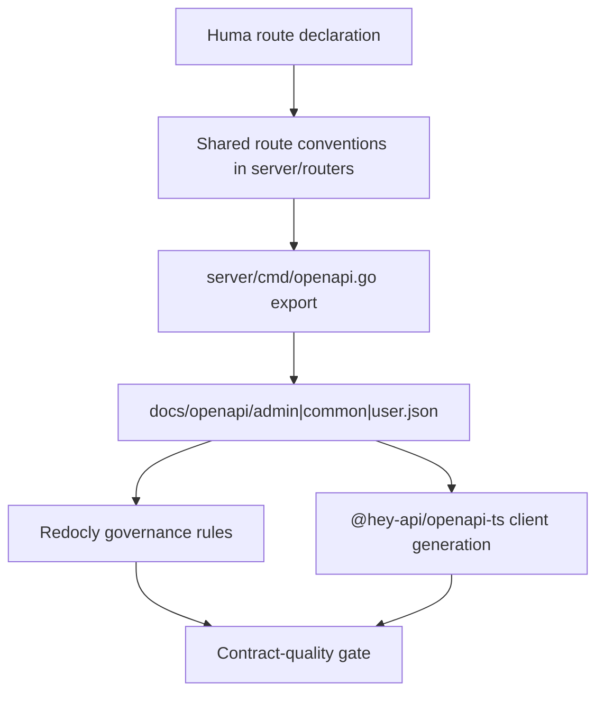

# refactor: Phase 5B server API normalization and OpenAPI governance

## Overview

Phase 5B upgrades the server API from "exportable OpenAPI plus basic lint" to a governed contract surface with stable naming, explicit metadata, stronger Redocly policy, and reproducible generated clients.

This phase is intentionally separate from Phase 5. Phase 5 defines the runtime error contract for first-party APIs. Phase 5B defines how documented server APIs should be described, linted, versioned, and consumed through OpenAPI, Redocly, and `@hey-api/openapi-ts`.

This plan does not implement the work. It defines scope, policy, sequencing, and review gates so the API normalization effort can be executed without silently changing business behavior.

## Problem Frame

The repository already has a working OpenAPI export and generated-client pipeline, but it is still closer to "specs happen to generate" than to "the API contract is actively governed."

- `server/cmd/openapi.go` exports three specs today: `docs/openapi/admin.json`, `docs/openapi/common.json`, and `docs/openapi/user.json`.
- `redocly.yaml` currently passes lint for all three specs, but several governance rules are intentionally relaxed, including `security-defined: off`, `operation-4xx-response: off`, and `tag-description: off`.
- The generated-client pipeline is already important enough to live in the root `bun run openapi` flow, which runs export, Redocly lint, and `@hey-api/openapi-ts` generation together.
- The route surface is large enough that drift is easy: current spec size is approximately `120` admin paths, `10` common paths, and `63` user paths.
- OpenAPI metadata is still authored ad hoc across `server/routers/routes_*.go`, which makes operation naming, summaries, tags, security declarations, and response declarations harder to keep consistent.

In other words, the repository has the right building blocks, but not yet a durable API governance layer.

## Requirements Trace

- R1. Normalize documented first-party server APIs around a single OpenAPI authoring standard.
- R2. Preserve Phase 5's RFC 9457 error contract as the canonical documented error model for first-party JSON APIs.
- R3. Keep the split-spec model (`admin`, `common`, `user`) stable unless a separate RFC explicitly changes it.
- R4. Use Redocly as a policy gate, not just a syntax-validity checker.
- R5. Keep `@hey-api/openapi-ts` generation auditable and reproducible for both `apps/admin` and `apps/user`.
- R6. Standardize operation metadata, especially `operationId`, tags, summaries, security declarations, and common non-2xx responses.
- R7. Improve schema and component naming so generated SDK output is more stable and readable.
- R8. Make exclusions explicit for surfaces that are not ordinary documented JSON APIs, including protocol-bound callbacks, node polling endpoints, and init/bootstrap setup routes.
- R9. Avoid business-logic rewrites and success-payload redesign while normalizing API descriptions.
- R10. Define a breaking-change workflow for spec and generated-client consumers before implementation begins.
- R11. Do not begin implementation until this plan has passed formal review.

## Scope Boundaries

- This plan covers documented first-party server API normalization, OpenAPI governance, Redocly policy, and generated-client stability.
- This plan covers the Huma-documented API surfaces exported into `docs/openapi/admin.json`, `docs/openapi/common.json`, and `docs/openapi/user.json`.
- This plan may introduce route-metadata helpers, shared OpenAPI conventions, Redocly rule changes, and generated-client guardrails.
- This plan does not redesign business logic, persistence models, or service dependencies.
- This plan does not change successful response payload shapes unless a documentation-specific fix exposes a real contract mismatch that must be resolved explicitly.
- This plan does not replace `@hey-api/openapi-ts` with another generator.
- This plan does not convert protocol-bound webhook, callback, redirect, or node `304` flows into ordinary documented JSON APIs.
- This plan does not fold node polling endpoints or init/bootstrap setup routes into the Huma export path unless a separate RFC explicitly approves that change.

## Context & Research

### Relevant Code and Patterns

- `server/cmd/openapi.go` is the current spec-export entrypoint.
- `server/routers/routes.go` assembles the spec registration flow and merges the `user` spec.
- `server/routers/routes_admin.go`, `server/routers/routes_auth.go`, `server/routers/routes_common.go`, `server/routers/routes_public.go`, and `server/routers/routes_user.go` contain the exported Huma route declarations.
- `docs/openapi/admin.json`, `docs/openapi/common.json`, and `docs/openapi/user.json` are the generated spec artifacts currently consumed by lint and client generation.
- `redocly.yaml` is the current lint-policy file.
- `package.json` defines the root `openapi` pipeline: export, lint, client generation, and formatting.
- `apps/admin/openapi-ts.config.ts`, `apps/admin/openapi-ts-common.config.ts`, and `apps/admin/openapi-ts-user.config.ts` define the admin-side generated clients.
- `apps/user/openapi-ts.config.ts` and `apps/user/openapi-ts-common.config.ts` define the user-side generated clients.
- `turbo.json` already defines `openapi` as a top-level workspace task, which is a natural hook for governance checks.

### Current Baseline

- `bun run openapi:lint` currently passes on all three exported specs.
- The current Redocly baseline is intentionally permissive:
  - `operation-operationId-unique: error`
  - `operation-operationId-url-safe: error`
  - `operation-summary: warn`
  - `security-defined: off`
  - `operation-4xx-response: off`
  - `tag-description: off`
- The current spec inventory is large enough that manual review is not a durable governance mechanism:
  - `docs/openapi/admin.json`: about `120` paths, `195` schemas
  - `docs/openapi/common.json`: about `10` paths, `28` schemas
  - `docs/openapi/user.json`: about `63` paths, `94` schemas

### Institutional Learnings

- `docs/brainstorms/2026-04-03-hey-api-openapi-ts-research.md` already established that the repository should keep separate spec inputs and separate generated outputs per API domain rather than collapsing everything into one merged SDK.
- Phase 5 established that OpenAPI export and generated-client behavior are part of the contract surface, not an afterthought (see origin: `docs/plans/2026-04-07-001-refactor-phase5-error-response-migration-plan.md`).

## Key Technical Decisions

- **Phase 5B extends Phase 5; it does not replace it.** The error-contract decisions from Phase 5 remain the base contract for first-party documented JSON APIs.
- **Treat Huma-documented APIs as the primary normalization surface.** `admin`, `auth`, `common`, `public`, and `user` routes exported through Huma are the core scope because they already feed OpenAPI and generated clients.
- **Keep the three-spec topology.** `admin`, `common`, and `user` remain separate exported artifacts and separate generator inputs for Phase 5B.
- **Use Redocly as contract governance.** Passing lint should mean more than "the JSON is valid"; it should enforce operation metadata quality, reusable contract discipline, and consumer-facing consistency.
- **Normalize metadata before chasing deep schema deduplication.** Operation IDs, tags, summaries, security declarations, and explicit error responses should be stabilized before broader schema refactoring begins.
- **Centralize route-level OpenAPI conventions.** Shared helpers or conventions in `server/routers/` should reduce per-file drift rather than relying on hundreds of hand-maintained inline declarations.
- **Prefer named request/response structs for exported APIs over anonymous or incidental schemas when naming quality affects generated clients.** SDK readability and schema stability matter more than minimizing declaration count.
- **Do not hand-edit generated spec artifacts.** `docs/openapi/*.json` remain generated outputs; governance changes must come from route declarations, shared metadata helpers, export logic, or lint policy.
- **Keep protocol-bound and setup-only surfaces explicit but excluded.** Phase 5B must document what it is not governing so the resulting API standard is strict without pretending to cover every HTTP endpoint in the repository.
- **Make generated-client compatibility part of the contract gate.** Root `bun run openapi` success and downstream generator stability are first-class acceptance criteria, not post-hoc checks.
- **Treat rule hardening as staged, not all-at-once.** Redocly rules can be promoted from `off` or `warn` to `error`, but the promotion order must be deliberate to keep the normalization effort reviewable.

## Open Questions

### Resolved During Planning

- **Should Phase 5B include webhook, redirect, and node polling APIs?** No. These surfaces are inventoried and explicitly excluded from the core OpenAPI governance pass.
- **Should the repository collapse `admin`, `common`, and `user` into one merged spec?** No. The split-spec model remains the baseline.
- **Should Phase 5B replace `@hey-api/openapi-ts`?** No. The work should improve the input specs and governance rules, not churn the generator stack.
- **Should Redocly become a hard gate?** Yes, but with staged rule promotion rather than a one-shot rules explosion.

### Deferred to Implementation

- **Exact rule-promotion schedule:** The plan defines what kinds of rules should tighten, but the exact `warn -> error` ordering can be finalized once baseline drift is measured during implementation.
- **Example coverage depth:** The plan expects representative examples where they materially improve consumer understanding, but it does not require examples on every operation in the first pass.
- **Authenticated OpenAPI security modeling detail:** The plan expects authenticated documented APIs to converge on explicit security declarations, but the final shared scheme naming can be chosen during implementation.

## High-Level Technical Design

> *This illustrates the intended direction for review. It is guidance, not implementation specification.*

Normalization targets:

| Area | Current state | Phase 5B target |
|---|---|---|
| `operationId` | Valid and unique, but authored ad hoc | Stable naming convention per domain and resource |
| Tags and summaries | Present but partially uneven | Explicit, domain-consistent taxonomy and summary style |
| Security declarations | Lint rule currently disabled | Explicit declarations for documented authenticated APIs |
| Error responses | Strengthened in Phase 5 | Reused consistently across exported operations |
| Component naming | Generated, but not always consumer-friendly | Stable named schemas for high-value request/response shapes |
| Lint policy | Mostly validity and light quality checks | Governance rules that catch real contract drift |
| Generated clients | Works today | Treated as part of the compatibility contract |

## Dependencies / Prerequisites

- Phase 5 error-contract decisions must remain the contract baseline for documented first-party JSON APIs.
- The root `bun run openapi` pipeline must remain runnable throughout the work.
- Admin and user frontend owners must be available to confirm generated-client breakage and acceptable rename churn.
- Review gate before implementation:
  - `plan-ceo-review`
  - `plan-eng-review`
  - one contract-focused document review pass

## Implementation Units

- [ ] **Unit 1: Define API governance baseline, naming policy, and exclusions**

**Goal:** Create a durable description of what Phase 5B governs, what it excludes, and how normalized documented APIs should be named and described.

**Requirements:** R1, R3, R6, R8, R10, R11

**Dependencies:** None

**Files:**
- Create: `docs/api-governance.md`
- Create: `server/cmd/phase5b_spec_baseline_test.go`
- Modify: `redocly.yaml`

**Approach:**
- Capture the canonical naming policy for operation IDs, tags, summaries, common error responses, and security declarations.
- Inventory excluded surfaces so webhook, redirect, node polling, and init/bootstrap endpoints are not ambiguously half-governed.
- Characterize the current exported specs so later units can prove improvement instead of relying on taste-only review.

**Execution note:** Start characterization-first. The baseline should describe the current contract shape before large metadata edits begin.

**Patterns to follow:**
- `docs/plans/2026-04-07-001-refactor-phase5-error-response-migration-plan.md`
- `redocly.yaml`

**Test scenarios:**
- Happy path: current exported specs are discoverable and auditable through a single baseline test entrypoint.
- Edge case: excluded surfaces are explicitly listed so later units cannot silently expand scope.
- Integration: governance baseline fails clearly when required spec artifacts are missing or renamed unexpectedly.

**Verification:**
- The repository has one durable, reviewable statement of API-governance policy and exclusions.

- [ ] **Unit 2: Introduce shared OpenAPI route conventions for Huma declarations**

**Goal:** Reduce per-route metadata drift by introducing a shared conventions layer for documented APIs.

**Requirements:** R1, R2, R6, R7

**Dependencies:** Unit 1

**Files:**
- Create: `server/routers/openapi_conventions.go`
- Create: `server/routers/openapi_conventions_test.go`
- Modify: `server/routers/routes.go`

**Approach:**
- Centralize helper patterns for operation naming, common tags, shared authenticated error responses, and security declarations.
- Keep the helper layer lightweight and declarative rather than creating a DSL that hides route intent.
- Reuse Phase 5's error-contract decisions instead of redefining error semantics in Phase 5B.

**Execution note:** Prefer explicit helper functions over generic metadata builders that are hard to audit.

**Patterns to follow:**
- `server/routers/routes.go`
- `server/routers/routes_admin.go`
- `server/routers/routes_auth.go`

**Test scenarios:**
- Happy path: a route can declare normalized metadata through the shared conventions layer without losing readability.
- Edge case: authenticated and unauthenticated routes can both use the same conventions without conflating security declarations.
- Integration: shared helpers expose Phase 5 error responses consistently to Huma operations.

**Verification:**
- Route metadata normalization no longer depends on hundreds of unrelated inline choices.

- [ ] **Unit 3: Normalize exported route metadata across admin, auth, common, public, and user APIs**

**Goal:** Apply the shared conventions to all exported Huma routes so the generated specs read as one coherent API family.

**Requirements:** R1, R2, R3, R6

**Dependencies:** Unit 2

**Files:**
- Modify: `server/routers/routes_admin.go`
- Modify: `server/routers/routes_auth.go`
- Modify: `server/routers/routes_common.go`
- Modify: `server/routers/routes_public.go`
- Modify: `server/routers/routes_user.go`
- Create: `server/routers/phase5b_route_metadata_test.go`
- Create: `server/cmd/phase5b_openapi_contract_test.go`
- Test: `server/routers/phase5b_route_metadata_test.go`
- Test: `server/cmd/phase5b_openapi_contract_test.go`

**Approach:**
- Normalize `operationId` naming, summary style, tag taxonomy, common non-2xx declarations, and security declarations across exported APIs.
- Keep route ownership local to each route file, but make conventions uniform enough that Redocly and generated-client output stop drifting.
- Prefer explicit metadata repair over invisible post-processing of generated specs.

**Execution note:** Migrate one route domain at a time so spec drift stays reviewable.

**Patterns to follow:**
- `server/routers/routes_admin.go`
- `server/routers/routes_common.go`
- `server/cmd/openapi.go`

**Test scenarios:**
- Happy path: normalized routes still export into the same `admin`, `common`, and `user` specs.
- Edge case: authenticated operations include explicit security requirements and common auth-related responses where applicable.
- Edge case: public operations do not inherit authenticated metadata accidentally.
- Integration: spec export succeeds and Redocly catches metadata regressions with clearer failures than before.

**Verification:**
- Exported operations read as one intentionally designed contract rather than a patchwork of route-local styles.

- [ ] **Unit 4: Normalize schema and component naming for generated-client readability**

**Goal:** Improve exported component naming and reuse so generated clients are more stable and understandable.

**Requirements:** R2, R5, R7, R9

**Dependencies:** Unit 3

**Files:**
- Modify: `server/types/**/*.go`
- Modify: `server/services/**/*.go`
- Modify: `server/routers/routes_*.go`
- Create: `server/cmd/phase5b_schema_naming_test.go`
- Test: `server/cmd/phase5b_schema_naming_test.go`

**Approach:**
- Identify exported request/response shapes that currently generate low-signal or unstable schema names and promote them to clearer named structs where justified.
- Reuse shared types for high-value repeated shapes instead of allowing incidental duplication to define the public contract.
- Keep the work consumer-driven: only normalize shapes that materially improve spec readability or generated SDK stability.

**Execution note:** Avoid turning this into a full DTO rewrite. Normalize the public contract, not every internal struct in the server.

**Patterns to follow:**
- `server/types/`
- `docs/brainstorms/2026-04-03-hey-api-openapi-ts-research.md`

**Test scenarios:**
- Happy path: generated component names for representative admin and user operations become stable and readable.
- Edge case: changing internal struct placement does not silently rename public schemas without a contract-test failure.
- Integration: generated clients no longer churn on low-signal component renames for normalized endpoints.

**Verification:**
- The exported spec is materially easier for humans and generated clients to consume.

- [ ] **Unit 5: Tighten Redocly policy and automate the OpenAPI governance gate**

**Goal:** Turn API normalization from a one-time cleanup into an enforceable repository policy.

**Requirements:** R4, R5, R10, R11

**Dependencies:** Units 1-4

**Files:**
- Modify: `redocly.yaml`
- Modify: `package.json`
- Modify: `turbo.json`
- Create: `.github/workflows/openapi-governance.yml`
- Create: `server/cmd/phase5b_pipeline_guardrail_test.go`
- Test: `server/cmd/phase5b_pipeline_guardrail_test.go`

**Approach:**
- Promote selected Redocly rules from `off` or `warn` to stronger enforcement where the normalized route metadata and schema policy make that realistic.
- Keep `bun run openapi` as the authoritative end-to-end gate: export, lint, client generation, and formatting.
- Add repository automation that fails clearly when exported specs or generated-client inputs drift from policy.

**Execution note:** Rule promotion should be staged and reviewable. It is acceptable to leave some rules as `warn` in the first pass if the decision is explicit.

**Patterns to follow:**
- `package.json`
- `redocly.yaml`
- `apps/admin/openapi-ts.config.ts`
- `apps/user/openapi-ts.config.ts`

**Test scenarios:**
- Happy path: the root `openapi` pipeline succeeds without manual cleanup steps.
- Edge case: a route metadata regression fails in lint before it leaks into generated-client churn.
- Edge case: generator config drift in `apps/admin` or `apps/user` is caught before merge.
- Integration: repository automation runs the same contract gate developers use locally.

**Verification:**
- OpenAPI governance becomes an enforced workflow, not a best-effort convention.

## System-Wide Impact

- **Contract surface:** documented first-party JSON APIs become more explicit and more reviewable without requiring business-logic changes.
- **Consumer impact:** generated clients in `apps/admin` and `apps/user` should become more stable, but schema and operation renames may create deliberate churn that must be reviewed as breaking or non-breaking.
- **Repository posture:** Redocly moves from permissive validation to active API-governance enforcement.
- **Scope clarity:** excluded protocol and setup surfaces become more explicit, reducing ambiguity about what the documented API standard actually covers.
- **Developer workflow:** route authorship gains stronger conventions and clearer failure modes, which should reduce silent spec drift over time.

## Alternative Approaches Considered

- **Fold all of this into Phase 5:** Rejected because it would mix runtime error-contract migration with broad API-governance work and make review harder.
- **Rely on generated JSON post-processing:** Rejected because it hides source-of-truth drift instead of fixing route declarations and exported types.
- **Replace the client generator first:** Rejected because the current bottleneck is contract quality and governance, not generator capability.
- **Normalize every HTTP endpoint in one pass:** Rejected because protocol-bound callbacks, node polling, and setup-only endpoints do not all benefit from being forced into the same OpenAPI governance model.

## Risk Analysis & Mitigation

| Risk | Likelihood | Impact | Mitigation |
|------|-----------|--------|------------|
| Rule hardening creates a flood of failures | High | Med | Stage Redocly rule promotion and characterize the baseline first |
| Metadata helpers become too magical | Med | Med | Keep conventions lightweight and auditably local to `server/routers/` |
| Schema normalization causes generated-client churn | High | High | Add contract tests and generated-client review gates before promoting broad renames |
| Excluded surfaces are implicitly treated as governed | Med | High | Publish explicit exclusions in `docs/api-governance.md` and enforce them in baseline tests |
| Developers bypass the root OpenAPI flow | Med | Med | Keep one authoritative root pipeline and wire it into automation |
| Phase 5B quietly mutates runtime behavior | Low | High | Keep success-payload and business-logic changes out of scope unless explicitly reviewed |

## Documentation / Operational Notes

- This phase should be announced as API-governance work, not as a business-feature release.
- Contract-affecting renames must be reviewed with frontend consumers even when runtime semantics are unchanged.
- Generated spec artifacts remain derived outputs; do not hand-edit `docs/openapi/*.json`.
- `docs/api-governance.md` should become the human-readable policy companion to `redocly.yaml`.
- Review gate before implementation:
  - `plan-ceo-review` for scope and ambition
  - `plan-eng-review` for architecture and rollout discipline
  - one contract-focused document review pass before code work begins

## Sources & References

- **Origin plan:** `docs/plans/2026-04-07-001-refactor-phase5-error-response-migration-plan.md`
- **Research note:** `docs/brainstorms/2026-04-03-hey-api-openapi-ts-research.md`
- Related code:
  - `server/cmd/openapi.go`
  - `server/routers/routes.go`
  - `server/routers/routes_admin.go`
  - `server/routers/routes_auth.go`
  - `server/routers/routes_common.go`
  - `server/routers/routes_public.go`
  - `server/routers/routes_user.go`
  - `redocly.yaml`
  - `package.json`
  - `turbo.json`
  - `apps/admin/openapi-ts.config.ts`
  - `apps/admin/openapi-ts-common.config.ts`
  - `apps/admin/openapi-ts-user.config.ts`
  - `apps/user/openapi-ts.config.ts`
  - `apps/user/openapi-ts-common.config.ts`
