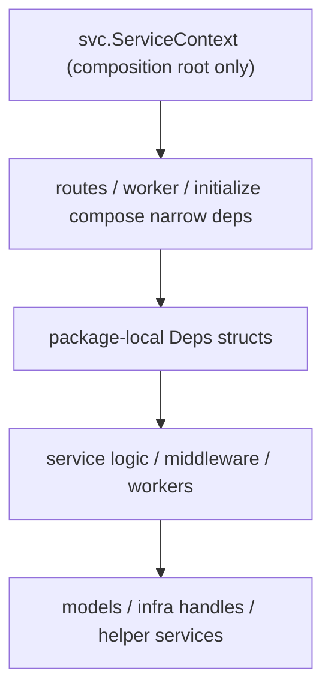

# refactor: Phase 6 ServiceContext gradual breakup

## Overview

Phase 6 breaks `server/svc/ServiceContext` out of the service layer and demotes it to a composition-root concern. The goal is not to rewrite runtime behavior. The goal is to stop passing a 20+ field god object through almost every handler, logic constructor, worker, middleware, and initializer.

This phase is intentionally separate from Phases 0-5 and Phase 5B. Those phases fixed structure, error contracts, and OpenAPI governance while deliberately preserving `ServiceContext` as a temporary compatibility shell (see origin: `docs/gstack/designs/admin-feat-monorepo-baseline-design-20260407-111312.md`).

This document is an implementation plan only. It does not start the migration.

## Problem Frame

The current codebase still treats `ServiceContext` as the universal runtime dependency bag:

- `server/svc/serviceContext.go` currently holds `26` runtime fields: infra handles (`DB`, `Redis`, `Queue`, `Config`), mutable runtime state (`ExchangeRate`), helper services (`DeviceManager`, `AuthLimiter`, `TelegramBot`, `NodeMultiplierManager`), and many model handles.
- `247` files under `server/services/` still reference `*svc.ServiceContext`.
- `15` files under `server/worker/`, `7` under `server/routers/middleware/`, and `14` under `server/initialize/` also reference it directly.
- There are `255` `New*Logic(..., svcCtx *svc.ServiceContext)` constructors and `240` service handler factories that still accept the full object.
- Hot fields are not evenly distributed:
  - `Config`: `215` references
  - `UserModel`: `185`
  - `Redis`: `68`
  - `DB`: `52`
  - `SubscribeModel`: `48`
  - `NodeModel`: `48`
- Low-frequency fields exist and are good early migration seams:
  - `GeoIP`: `2`
  - `DeviceManager`: `2`
  - `NodeMultiplierManager`: `3`
  - `Restart`: `3`

The result is that dependency ownership is obscured. A package that only needs `AdsModel` or `SystemModel` still receives database handles, Redis handles, queue clients, config, and every other model through the same object. That makes testing, reasoning, and future refactors harder than they need to be.

## Requirements Trace

- R1. Gradually remove direct `*svc.ServiceContext` usage from services, workers, middleware, and initializers.
- R2. Keep runtime behavior stable while changing dependency injection shape.
- R3. Make dependencies explicit at package boundaries, with small package-local `Deps` structs or equivalent narrow constructors.
- R4. Preserve existing route registration, OpenAPI export, worker startup, and initialization behavior throughout the migration.
- R5. Keep rollback practical by migrating bounded slices rather than performing one global constructor rewrite.
- R6. Start with low-coupling domains first and defer high-coupling purchase, auth, node, and worker flows until the pattern is proven.
- R7. Introduce a clear deprecation path for `ServiceContext` rather than deleting it abruptly.
- R8. Ensure new code added after this phase starts does not introduce fresh direct service-layer dependence on `*svc.ServiceContext`.
- R9. Maintain `go build ./...`, `go test ./... -count=1`, and `go vet ./...` throughout the migration.
- R10. Preserve Phase 5 error-contract behavior and Phase 5B OpenAPI governance behavior.
- R11. Do not fold this work into business-logic rewrites, persistence redesign, or HTTP contract changes.

## Scope Boundaries

- This plan covers dependency injection shape and constructor boundaries only.
- This plan covers `server/services/`, `server/worker/`, `server/routers/middleware/`, and `server/initialize/` consumers of `ServiceContext`.
- This plan may introduce package-local `Deps` structs, explicit constructors, migration tests, and `Deprecated` annotations on `ServiceContext` fields.
- This plan does not redesign model APIs.
- This plan does not change HTTP request or response contracts.
- This plan does not change worker task payload contracts.
- This plan does not fold node polling, payment notification, or OAuth behavior into new feature work.
- This plan does not require deleting `ServiceContext` immediately; it may survive temporarily as the composition root while direct downstream usage is removed.

## Context & Research

### Relevant Code and Patterns

- `server/svc/serviceContext.go` is the current god object and composition root.
- `server/routers/routes_*.go` and `server/routers/*.go` are the top-level composition points for HTTP services.
- `server/worker/consumer_service.go`, `server/worker/scheduler_service.go`, and `server/worker/registry/routes.go` are the worker composition points.
- `server/initialize/*.go` wires startup-time configuration and side effects.
- Representative low-coupling services:
  - `server/services/admin/ads/*.go`
  - `server/services/admin/announcement/*.go`
  - `server/services/admin/coupon/*.go`
  - `server/services/admin/document/*.go`
  - `server/services/admin/authMethod/getAuthMethodConfig.go`
- Representative high-coupling services:
  - `server/services/common/sendEmailCode.go`
  - `server/services/auth/userLogin.go`
  - `server/services/user/portal/purchase.go`
  - `server/services/node/getServerConfig.go`
  - `server/routers/middleware/authMiddleware.go`

### Dependency Clusters Observed

Low-risk single-slice domains already exist in practice:

- `admin/ads` depends almost entirely on `AdsModel`
- `admin/announcement` depends almost entirely on `AnnouncementModel`
- `admin/coupon` depends almost entirely on `CouponModel`
- `admin/document` depends almost entirely on `DocumentModel`
- `admin/order` is mostly `OrderModel`
- `common/getAds` is mostly `AdsModel`
- `common/getClient` is mostly `ClientModel`
- `user/document` is mostly `DocumentModel`
- `user/announcement` is mostly `AnnouncementModel`

Medium-risk clusters combine a few stable concerns:

- `auth/*` mixes `Config`, `UserModel`, `Redis`, `LogModel`, and sometimes `AuthModel`
- `common/*` mixes `Config`, `Redis`, `AuthLimiter`, `Queue`, and one or two models
- `user/*` frequently mixes `UserModel`, `OrderModel`, `SubscribeModel`, `PaymentModel`, `Queue`, and `Config`
- `admin/authMethod/*` mixes `AuthModel` writes with runtime re-initialization through `initialize/*`
- `admin/system/*` mixes persisted config mutation, cache eviction, and runtime reloading through `initialize/*`

High-risk clusters should be deferred until the package-local dependency pattern is proven:

- `routers/middleware/*`
- `services/node/*`
- `services/notify/*`
- `services/subscribe/*`
- `services/telegram/*`
- `worker/*`
- `initialize/*`

### Origin Guidance Carried Forward

The origin design already made three important decisions that remain valid here:

- `ServiceContext` breakup is a distinct Phase 6 effort, not something to blend into earlier structural phases (see origin: `docs/gstack/designs/admin-feat-monorepo-baseline-design-20260407-111312.md`).
- The migration should be gradual: new code uses manual injection first, fields become `Deprecated`, and domains are replaced one by one.
- One-shot replacement across all constructors is too risky for this codebase shape.

## Key Technical Decisions

- **Use package-local dependency structs as the main migration primitive.** Each service or bounded package should own a small `Deps` struct that expresses exactly what it needs, instead of importing a global dependency bag.
- **Keep `ServiceContext` as the composition root during migration.** Route registration, worker startup, and initialize wiring may still receive a `*svc.ServiceContext` temporarily, but they should immediately translate it into narrower package deps.
- **Do not create a second global container.** Replacing `ServiceContext` with another mega-struct or provider registry would move the smell without fixing it.
- **Prefer explicit construction at the edge over hidden service locators.** Route files, worker registries, and startup wiring should assemble deps directly from the composition root rather than calling a magic resolver.
- **Migrate bounded slices, not all packages of one architectural layer at once.** The correct unit of migration is the smallest set of files that can be compiled, tested, and rolled back independently.
- **Annotate `ServiceContext` fields as deprecated only after at least one real package migration exists.** Deprecation comments should follow a proven pattern, not lead it.
- **Treat mutable runtime state separately from static dependencies.** `ExchangeRate`, `Restart`, and helper managers are not the same kind of dependency as models or config, and they should not force broad package deps when only one capability is needed.

## High-Level Technical Design

> This is directional guidance for review. It is not implementation code.



Target boundary shape:

```go
// server/services/admin/ads/deps.go
type Deps struct {
    AdsModel ads.Model
}

// server/services/admin/ads/createAds.go
func CreateAdsHandler(deps Deps) func(context.Context, *CreateAdsInput) (*struct{}, error) {
    return func(ctx context.Context, input *CreateAdsInput) (*struct{}, error) {
        l := NewCreateAdsLogic(ctx, deps)
        return l.CreateAds(&input.Body)
    }
}
```

Composition remains explicit at the edge:

```go
registerOperation(apis.Admin, op, adminAds.CreateAdsHandler(adminAds.Deps{
    AdsModel: serverCtx.AdsModel,
}))
```

This is intentionally repetitive in a small way. It makes each package's real dependencies obvious and reviewable.

### Runtime Singleton Ownership Matrix

Mutable runtime capabilities still need explicit ownership even after `ServiceContext` stops being the universal dependency bag:

| Capability | Current create / refresh path | Current readers / callers | Target owner after Phase 6 |
|---|---|---|---|
| `ExchangeRate` | `server/initialize/currency.go`, `server/worker/task/rateLogic.go` | `server/services/user/portal/purchaseCheckout.go` | A currency runtime capability composed at startup and passed as a narrow read/write dependency to worker and portal flows |
| `Restart` | `server/cmd/server_service.go` | `server/services/admin/tool/restartSystem.go`, `server/services/admin/system/updateSubscribeConfig.go` | A process-control capability owned by `server/cmd` and injected as an explicit function dependency where restart is allowed |
| `TelegramBot` | `server/initialize/telegram.go` | `server/services/telegram/*.go`, `server/services/user/user/unbindTelegram.go`, `server/worker/order/*.go` | A telegram runtime client capability composed during startup and injected into telegram, user, and worker packages that actually send messages |
| `NodeMultiplierManager` | `server/initialize/node.go` | `server/services/admin/system/preViewNodeMultiplier.go`, `server/worker/traffic/trafficStatisticsLogic.go` | A node runtime multiplier capability owned by node initialization and passed as a narrow read-only dependency to request and worker flows |
| `AuthLimiter` | `server/svc/serviceContext.go` during root construction | `server/services/common/sendEmailCode.go`, `server/services/common/sendSmsCode.go` | A verification rate-limit capability composed at root construction and injected only into verification and auth-adjacent flows that consume permits |
| `DeviceManager` | `server/svc/serviceContext.go` via `NewDeviceManager` | `server/services/admin/subscribe/updateSubscribe.go`, `server/services/admin/user/kickOfflineByUserDevice.go` | A device-session control capability owned by runtime composition and injected into the admin and user flows that broadcast or revoke device state |

## Dependencies / Prerequisites

- Phase 0-5 and Phase 5B should remain the baseline before this work starts.
- The current route, worker, and initialization wiring must stay green during migration.
- OpenAPI export must continue to succeed for any unit touching Huma route wiring.
- Review gate before implementation:
  - `plan-ceo-review`
  - `plan-eng-review`
  - one focused architectural review on the migration seam and rollback plan

## Phase Exit Criteria and Stop Conditions

Phase 6 is complete only when all of the following are true:

- No package under `server/services/`, `server/worker/`, `server/routers/middleware/`, or `server/initialize/` still stores or accepts the full `*svc.ServiceContext` as its primary dependency.
- Route wiring, worker wiring, and startup wiring may still receive `*svc.ServiceContext` at the composition edge, but they immediately translate it into package-local deps or narrow runtime interfaces.
- `ServiceContext` remains only as a thin composition-root shell and is no longer treated as an injectable service-layer container.
- Mutable runtime write-back seams such as `admin/authMethod` and `admin/system` use explicit narrow capabilities for re-initialization instead of depending on the whole root object.
- Characterization tests exist for the migration seam and remain green.
- `go build ./...`, `go test ./... -count=1`, `go vet ./...`, and `go run . openapi -o <tmpdir>` remain green at the end of the phase.

The phase should pause and spin out a follow-up design review if any of the following becomes true:

- A candidate package-local `Deps` struct needs to absorb unrelated cross-domain capabilities just to preserve current behavior.
- A migration step requires business-logic rewrites, persistence redesign, or HTTP / worker contract changes to make progress.
- Runtime write-back flows cannot be expressed as explicit narrow interfaces without reworking startup ownership.
- Review feedback after the first mixed-dependency checkpoint shows the pattern is not improving readability or testability.

## Implementation Units

Shared composition files such as `server/routers/routes_admin.go`, `server/routers/routes_common.go`, and `server/routers/routes_public.go` are cumulative seams:

- Later units may update those route files only for the registrations touched by that unit.
- Later units should not reopen already-migrated package internals unless the same package is explicitly listed again.
- When a unit lists `server/services/common/*.go`, it means the remaining unmigrated files in that package, not files already migrated by an earlier checkpoint unit.

- [ ] **Unit 1: Characterize the current dependency surface and define the migration seam**

**Goal:** Add explicit characterization for the current `ServiceContext` footprint and lock the migration seam before changing constructors.

**Requirements:** R1, R5, R7, R9

**Dependencies:** None

**Files:**
- Create: `server/cmd/phase6_dependency_surface_test.go`
- Modify: `server/svc/serviceContext.go`
- Modify: `docs/plans/2026-04-07-003-refactor-phase6-servicecontext-breakup-plan.md`

**Approach:**
- Add a characterization test that documents the current direct-usage footprint and protects the intended migration trend.
- Add package or field comments in `server/svc/serviceContext.go` that explain its temporary role as composition root.
- Do not add `Deprecated` field comments yet unless the first migrated slice already exists.

**Test scenarios:**
- Happy path: the dependency-surface test can enumerate direct `ServiceContext` users in services, workers, middleware, and initialize.
- Edge case: the test fails clearly if new direct usages are introduced in already-migrated slices.
- Integration: current route and worker composition still compile with no behavior changes.

**Verification:**
- The repository has one durable test-backed statement of the migration seam.

- [ ] **Unit 2: Introduce the package-local `Deps` pattern on a low-risk pilot slice**

**Goal:** Prove the migration pattern on a bounded, single-model package before applying it broadly.

**Requirements:** R1, R2, R3, R5, R8

**Dependencies:** Unit 1

**Files:**
- Create: `server/services/admin/ads/deps.go`
- Modify: `server/services/admin/ads/*.go`
- Modify: `server/routers/routes_admin.go`
- Create: `server/services/admin/ads/phase6_deps_test.go`

**Approach:**
- Start with `admin/ads` because it is narrow, route-driven, and almost entirely `AdsModel`-backed.
- Replace `*svc.ServiceContext` with `ads.Deps` in handlers and logic constructors.
- Compose the new deps explicitly in `server/routers/routes_admin.go`.

**Test scenarios:**
- Happy path: all `admin/ads` handlers still work with explicit `AdsModel` injection.
- Edge case: route registration still exports identical OpenAPI metadata after constructor changes.
- Integration: the package no longer imports `server/svc` outside composition-only helpers, if any remain.

**Verification:**
- One real package is fully migrated and establishes the repeatable pattern.

- [ ] **Unit 3: Migrate low-risk single-slice domains in batches**

**Goal:** Remove `ServiceContext` from the most obviously over-injected service packages.

**Requirements:** R1, R2, R3, R5, R6, R8

**Dependencies:** Unit 2

**Files:**
- Create or modify:
  - `server/services/admin/announcement/*.go`
  - `server/services/admin/coupon/*.go`
  - `server/services/admin/document/*.go`
  - `server/services/admin/order/*.go`
  - `server/services/common/getAds.go`
  - `server/services/common/getClient.go`
  - `server/services/user/announcement/*.go`
  - `server/services/user/document/*.go`
  - `server/services/user/payment/getAvailablePaymentMethods.go`
  - `server/services/user/portal/getAvailablePaymentMethods.go`
- Modify:
  - `server/routers/routes_admin.go`
  - `server/routers/routes_common.go`
  - `server/routers/routes_public.go`
- Create: `server/cmd/phase6_low_risk_migration_test.go`

**Approach:**
- Migrate single-model or near-single-model packages together by domain so rollback remains easy.
- Keep each package’s `Deps` struct local, even when two packages depend on the same model type.
- Avoid prematurely abstracting “common deps” across unrelated domains.

**Test scenarios:**
- Happy path: migrated packages compile and run with explicit narrow deps.
- Edge case: shared route files can compose both migrated and unmigrated handlers safely in the same pass.
- Integration: `go run . openapi -o <tmpdir>` still succeeds for route-bearing batches.

**Verification:**
- A meaningful share of service packages stop depending on the full composition root.

- [ ] **Unit 4: Run the first mixed-dependency checkpoint on bounded verification flows**

**Goal:** Prove the pattern on a non-trivial slice that mixes config, Redis, queue, and model access before opening the broad auth and user domains.

**Requirements:** R1, R2, R3, R4, R5, R6, R8, R10

**Dependencies:** Unit 3

**Files:**
- Modify:
  - `server/services/common/sendEmailCode.go`
  - `server/services/common/sendSmsCode.go`
  - `server/services/common/checkverificationcodehandler.go`
  - `server/services/common/checkverificationcodelogic.go`
- Modify:
  - `server/routers/routes_common.go`
  - `server/routers/routes_public.go`
- Create: `server/cmd/phase6_mixed_dependency_checkpoint_test.go`

**Approach:**
- Choose the smallest realistic set of verification flows that already combine `Config`, `Redis`, `Queue`, limiter helpers, and user-facing behavior.
- Keep the package-local `Deps` structs explicit even if they repeat fields across adjacent files.
- Use this unit as the checkpoint where code review decides whether the pattern is still paying for itself before broader medium-risk migration proceeds.

**Test scenarios:**
- Happy path: verification-code send and check flows still behave correctly with explicit narrow deps.
- Edge case: queue-backed or limiter-backed flows continue to work without reintroducing the full root object.
- Integration: Phase 5 error-contract behavior and Phase 5B OpenAPI governance remain unchanged for touched endpoints.

**Verification:**
- The migration pattern is proven on one real mixed-dependency slice, not only on single-model packages.

- [ ] **Unit 5: Migrate runtime write-back seams for auth and system configuration**

**Goal:** Separate mutable config reload behavior from static dependency injection before the broad auth and initialize cleanup begins.

**Requirements:** R1, R2, R3, R4, R5, R6, R8, R9

**Dependencies:** Unit 4

**Files:**
- Modify:
  - `server/services/admin/authMethod/*.go`
  - `server/services/admin/system/*.go`
  - `server/services/admin/tool/restartSystem.go`
  - `server/initialize/*.go`
- Modify:
  - `server/routers/routes_admin.go`
- Create: `server/cmd/phase6_runtime_reload_boundary_test.go`

**Approach:**
- Treat `admin/authMethod` and `admin/system` as their own migration seam because they write persisted config and trigger runtime reloads.
- Introduce explicit narrow capabilities for config reload, restart, and cache invalidation rather than letting these packages hold the entire `ServiceContext`.
- Keep the runtime behavior identical, including reloading email, mobile, device, site, and node config where that is already expected.

**Test scenarios:**
- Happy path: auth-method and system-config updates still persist config and trigger the expected runtime reloads.
- Edge case: cache invalidation, initialize write-backs, and subscribe-path-triggered restart flows still occur without a full root-object dependency.
- Integration: startup wiring stays behavior-preserving and reviewable after the new runtime boundary is introduced.

**Verification:**
- Mutable runtime write-back flows stop blocking the rest of the migration with hidden `ServiceContext` coupling.

- [ ] **Unit 6: Migrate medium-coupling auth, common, and user account flows**

**Goal:** Apply the pattern to the first packages that combine models, config, Redis, and queue access.

**Requirements:** R1, R2, R3, R4, R6, R8, R10

**Dependencies:** Unit 5

**Files:**
- Modify:
  - `server/services/auth/*.go`
  - `server/services/auth/oauth/*.go`
  - `server/services/common/*.go` (excluding the verification-flow files already migrated in Unit 4)
  - `server/services/user/user/*.go`
  - `server/services/user/ticket/*.go`
  - `server/services/user/subscribe/*.go`
- Modify:
  - `server/routers/routes_auth.go`
  - `server/routers/routes_common.go`
  - `server/routers/routes_public.go`
- Create: `server/cmd/phase6_auth_user_contract_test.go`

**Approach:**
- Define explicit package deps for auth and common domains instead of dragging in the entire root object.
- Keep public route behavior, middleware composition, Phase 5 error semantics, and Phase 5B OpenAPI governance unchanged.
- Use characterization-first tests around auth and common request flows before changing constructor boundaries.

**Test scenarios:**
- Happy path: auth and common handlers still perform login, password reset, verification-adjacent account flows, and config reads correctly.
- Edge case: mixed `Config + Redis + UserModel + Queue` deps remain explicit and package-local.
- Integration: middleware and route wiring still produce the same HTTP behavior and exported spec.

**Verification:**
- The codebase proves the pattern survives beyond trivial single-model packages.

- [ ] **Unit 7: Migrate request-path runtime seams for node, protocol surfaces, and portal flows**

**Goal:** Remove remaining direct `ServiceContext` dependence from long-lived request-path flows that need runtime capabilities but do not own startup lifecycle.

**Requirements:** R1, R2, R4, R5, R6, R9, R10

**Dependencies:** Unit 6

**Files:**
- Modify:
  - `server/services/node/*.go`
  - `server/services/notify/*.go`
  - `server/services/subscribe/*.go`
  - `server/services/telegram/*.go`
  - `server/services/user/portal/*.go`
- Modify:
  - `server/routers/routes_server.go`
  - `server/routers/notify.go`
  - `server/routers/subscribe.go`
  - `server/routers/telegram.go`
- Create: `server/cmd/phase6_request_path_runtime_test.go`

**Approach:**
- Tackle request-path seams that consume runtime capabilities before touching worker and middleware lifecycle code.
- Separate static infra deps from mutable runtime state like `ExchangeRate` and `TelegramBot`.
- Keep payment notification, node polling, and portal checkout behavior as behavior-preserving refactors only.

**Test scenarios:**
- Happy path: node, notify, subscribe, telegram, and portal checkout flows still compose successfully with narrow deps.
- Edge case: mutable runtime capabilities remain safely shared where required without the full root object.
- Integration: Phase 5 and Phase 5B contract suites stay green while constructor wiring changes.

**Verification:**
- Request-path runtime seams no longer need the full `ServiceContext`.

- [ ] **Unit 8: Migrate middleware and worker startup seams**

**Goal:** Remove `ServiceContext` from middleware and worker lifecycle code after the request-path runtime capabilities are already explicit.

**Requirements:** R1, R2, R4, R5, R6, R9, R10

**Dependencies:** Unit 7

**Files:**
- Modify:
  - `server/routers/middleware/*.go`
  - `server/worker/**/*.go`
- Modify:
  - `server/worker/consumer_service.go`
  - `server/worker/scheduler_service.go`
  - `server/worker/registry/routes.go`
- Create: `server/cmd/phase6_worker_middleware_wiring_test.go`

**Approach:**
- Treat worker startup and middleware composition as a distinct lifecycle seam from request handlers.
- Reuse the runtime capability boundaries proven in Units 5 and 7 instead of inventing a new container for worker or middleware code.
- Keep task payloads, middleware semantics, and startup ordering unchanged.

**Test scenarios:**
- Happy path: worker startup, scheduler startup, and middleware registration still compose successfully with narrow deps.
- Edge case: auth, device, notify, and node middleware continue to enforce the same behavior without a hidden global bag.
- Integration: worker contract tests, Phase 5 suites, and Phase 5B governance tests stay green.

**Verification:**
- Worker and middleware lifecycle seams no longer depend on the full `ServiceContext`.

- [ ] **Unit 9: Deprecate the remaining shell and shrink `ServiceContext` to a true composition root**

**Goal:** Finish the migration by making `ServiceContext` a temporary edge-only shell or replacing it with a narrower runtime container if no direct consumers remain.

**Requirements:** R1, R3, R7, R8, R9

**Dependencies:** Unit 8

**Files:**
- Modify: `server/svc/serviceContext.go`
- Create: `server/svc/phase6_composition_test.go`

**Approach:**
- Add `Deprecated` field comments for any compatibility fields that still exist temporarily.
- Keep `ServiceContext` as a composition-only shell with no downstream direct consumers; renaming it is explicitly out of scope for this phase.
- Queue any contributor-doc updates as a doc-only follow-up after the code migration lands.

**Test scenarios:**
- Happy path: no service, worker, middleware, or initialize package still accepts the full `*svc.ServiceContext`.
- Edge case: composition-root wiring remains readable and explicit after the shrink.
- Integration: the full server build, tests, vet, and OpenAPI export still pass.

**Verification:**
- `ServiceContext` is no longer the universal service-layer dependency bag.

## Sequencing

Recommended order:

1. Unit 1 for characterization and migration seam definition
2. Unit 2 as the pilot
3. Unit 3 in several small PRs, grouped by low-risk package families
4. Unit 4 as the first mixed-dependency checkpoint
5. Unit 5 to isolate runtime write-back seams before broad auth or initialize work
6. Unit 6 once the checkpoint pattern is proven and code review feedback is incorporated
7. Unit 7 for request-path runtime seams
8. Unit 8 for middleware and worker lifecycle seams
9. Unit 9 as the closing pass

Recommended first migration wave (core slices from Unit 3):

- `server/services/admin/ads`
- `server/services/admin/announcement`
- `server/services/admin/coupon`
- `server/services/admin/document`
- `server/services/admin/order`

Recommended checkpoint wave (core slices from Unit 4):

- `server/services/common/sendEmailCode.go`
- `server/services/common/sendSmsCode.go`
- `server/services/common/checkverificationcodehandler.go`
- `server/services/common/checkverificationcodelogic.go`

Recommended deferred wave:

- `server/services/user/portal`
- `server/services/auth`
- `server/services/admin/authMethod`
- `server/services/admin/system`
- `server/services/node`
- `server/routers/middleware`
- `server/worker`
- `server/initialize`

## Risk Analysis & Mitigation

| Risk | Likelihood | Impact | Mitigation |
|---|---|---|---|
| Pilot pattern becomes too abstract or magical | Med | High | Keep deps package-local and explicit; do not introduce a resolver container |
| Constructor churn breaks route or worker wiring | High | Med | Migrate one bounded package at a time and verify composition seams after each batch |
| Medium-coupling packages balloon into hidden mega-deps | High | High | Force each package to own its own `Deps` shape, even if some fields repeat across packages |
| Mutable runtime state like `ExchangeRate` becomes unsafe or duplicated | Med | High | Treat mutable runtime state separately from static dependency structs |
| Migration stalls halfway and leaves mixed patterns forever | Med | High | Define explicit completion criteria, stop conditions, and checkpoint reviews before starting |
| Runtime config write-back flows hide new coupling in `admin/authMethod` or `admin/system` | High | High | Isolate runtime reload and cache invalidation capabilities in a dedicated unit before broad auth or initialize migration |
| Future code reintroduces `*svc.ServiceContext` coupling | High | Med | Add characterization tests and update contributor guidance at the end of the phase |

## Documentation / Operational Notes

- This phase should be announced internally as a dependency-injection cleanup, not a feature release.
- The migration should favor small reviewable PRs over one large branch-long rewrite.
- Package-local `Deps` structs are expected to look slightly repetitive; that is a feature, not a bug.
- After Units 2-3 land, update contributor docs so new services stop accepting `*svc.ServiceContext`.

## Sources & References

- **Origin design:** `docs/gstack/designs/admin-feat-monorepo-baseline-design-20260407-111312.md`
- Related code:
  - `server/svc/serviceContext.go`
  - `server/routers/routes.go`
  - `server/routers/routes_admin.go`
  - `server/routers/routes_auth.go`
  - `server/routers/routes_common.go`
  - `server/routers/routes_public.go`
  - `server/routers/routes_server.go`
  - `server/routers/middleware/`
  - `server/services/`
  - `server/worker/`
  - `server/initialize/`
