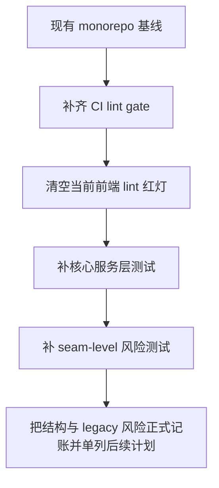

# Repo Best Practices Hardening Plan

> **For agentic workers:** 推荐使用 `executing-plans` 或 `subagent-driven-development` 按 implementation unit 执行；执行过程中保持最小 diff，先补质量门禁，再补行为性测试，最后再做结构收口。

## Overview

当前仓库已经有一套可信的 monorepo 基线：根级命令入口、OpenAPI 生成链路、边界 guardrail、Go 测试和 TypeScript 类型检查都能跑通。但它还不能被称为“最佳实践完成态”，因为几个最关键的工程事实还没有闭环：

- CI 没有把 `lint` 当成强制门禁
- 前端 lint 当前并非全绿
- 后端核心业务链路测试覆盖严重偏低，`server` 总覆盖率约 `15.8%`
- 支付、下单、工单等最贵路径缺少直接服务层测试
- 若干超大文件仍处于“迁移中但未收口”的状态
- 某些 legacy 约定，例如 HTTP `200` + body `code/msg` 错误语义，仍然是兼容现实而非最佳实践
- 管理端可配置 `custom_html` 并直接注入用户端页面，能力存在，但安全边界未被正式定义

这份计划不试图一次性重写整个系统。目标是先把“仓库能否自证质量”这件事做实，也就是先把质量门禁和关键业务测试补齐，再给更深层的结构和协议债留出明确的下一阶段入口。

## Current Execution Snapshot

截至 `2026-04-08` 当前执行状态如下：

- `Unit 1` 已完成：repo-local Go lint 工具、`make tools` / `make bootstrap`、根级 lint workflow 与 hook 口径已经打通
- `Unit 2` 已完成：admin / user web lint 已清绿，`custom_html` 已收口到唯一受审计注入点
- `Unit 3` 已部分完成：`order`、`portal` 已补首批关键分支测试，并顺手修掉若干依赖缺失即 panic 的路径
- `Unit 4` 已完成：`ticket` 与 `admin/system` 已补 seam test，配置更新链路覆盖已明显抬高
- deferred follow-up plans 已完成：结构收口与 legacy error contract 迁移都已独立建档

最新验证结果：

- `make lint` 通过
- `make typecheck` 通过
- `make test` 通过
- `bun run repo:contracts` 通过
- `cd server && go test -cover ./...` 总覆盖率为 `18.3%`，高于起始基线 `15.8%`
- 关键包覆盖率当前为：`admin/system 45.9%`、`ticket 48.0%`、`order 11.5%`、`portal 11.7%`

## Goal

把仓库从“工程化基础不错，但规则和风险没有完全闭环”推进到“质量门禁默认可信、关键业务路径有测试兜底、后续深层重构有清晰入口”的状态。

## Non-Goals

- 本计划不重写前后端业务模型
- 本计划不在本轮把全部 legacy HTTP `200` 错误语义迁移为标准 HTTP status
- 本计划不重新设计支付平台接入架构
- 本计划不做 UI 视觉重构
- 本计划不在执行批次中拆分超大文件，只要求在收尾阶段把结构拆分 follow-up 计划立清楚

## Problem Frame

仓库当前最危险的点不是“代码跑不起来”，而是“工程信号不一致”：

- `make typecheck`、`go test ./...`、`go vet ./...`、`bun run repo:contracts` 可通过，但 `make lint` 在开发机上依赖外部预装工具，且 web lint 当前直接失败
- workflow 在跑 contracts、OpenAPI 和 Docker smoke，但没有一个 workflow 在把 `make lint` 或等价 lint 流程作为正式 gate
- 核心服务层包如 `server/services/user/order`、`server/services/user/portal`、`server/services/user/ticket` 仍是 `0.0%` coverage
- 关键路径逻辑已经迁移到服务层，但测试重心还没有跟着迁移
- 文档、脚本、hook、CI 的口径还没有完全收束成“同一句话”

这会导致一个很现实的问题：团队以为仓库有规则，但机器并没有真正执行这些规则。这样的系统在项目早期还能靠熟悉度撑住，规模再上去就会开始靠运气。

## Requirements Trace

- R1. CI 必须把 lint 变成正式门禁，不能只停留在本地 hook
- R2. 修复当前前端 lint 红灯，确保默认开发入口能回到全绿
- R3. 提升核心业务链路的自动化覆盖，优先覆盖下单、结算、工单和关键配置路径
- R4. 保持根级命令入口、OpenAPI 生成链路和 monorepo 边界 guardrail 不回退
- R5. 明确 `custom_html` 注入点在本轮的处理策略，不能一边要求 lint 全绿，一边把当前告警无限后延
- R6. 对结构拆分与 legacy 协议风险给出明确 deferred plan，不允许继续处于“已知但未记账”状态
- R7. 所有改动都必须以 repo-relative 文件路径、明确验证命令和可执行测试场景记录在计划中

## What Already Exists

这些现有资产不是问题，它们是本轮硬化的支点：

- `Makefile` 已经定义了根级 `bootstrap`、`lint`、`test`、`typecheck`、`embed`、`build-all`
- `.github/workflows/repo-contracts.yml` 已经跑 `bun run repo:contracts` 和根 `Dockerfile` smoke
- `.github/workflows/monorepo-boundary-guardrail.yml` 与 `.github/scripts/check-monorepo-boundary.sh` 已经锁住 workspace 边界
- `docs/api-governance.md` 与 `bun run openapi` 已经把 OpenAPI 导出、lint、client generation 串成一条链
- `lefthook.yml` 已经表达了本地 pre-commit 的理想质量标准

结论不是“从零开始搭体系”，而是“把现有体系从半自动升级成强制闭环”。

## Context & Research

### Verified Current State

- 当前工作树包含本计划执行中的预期改动，文档状态以下述验证结果为准
- `make typecheck` 通过
- `make test` 通过
- `make lint` 通过
- `bun run repo:contracts` 通过
- `cd server && go test -cover ./...` 当前总覆盖率为 `18.3%`
- `server/services/user/order` 当前覆盖率为 `11.5%`
- `server/services/user/portal` 当前覆盖率为 `11.7%`
- `server/services/user/ticket` 当前覆盖率为 `48.0%`
- `server/services/admin/system` 当前覆盖率为 `45.9%`

### High-Risk Areas Confirmed

- `server/services/user/order/purchase.go`
- `server/services/user/portal/purchaseCheckout.go`
- `server/services/user/ticket/*.go`
- `web/apps/user/components/providers.tsx`
- `web/apps/admin/app/dashboard/system/basic-settings/*.tsx`
- `server/routers/routes_admin.go`
- `server/types/types.go`

### Existing Patterns To Preserve

- 根目录作为 canonical orchestration shell
- `docs/openapi/*.json` 与 generated clients 作为受治理产物纳入版本控制
- 通过 `repo:contracts` 串起跨子工程的合同验证
- 通过边界 guardrail 防止 `web/` workspace 回流到仓库根

## Key Decisions

- **先补门禁，再补覆盖，再拆结构。** 顺序不能反。先让机器能阻止继续变差，再去做更贵的质量补齐。
- **核心服务层覆盖优先于广撒网覆盖。** 先测用户下单、结算、工单和站点配置这几条最贵路径，而不是追求表面覆盖率数字。
- **`custom_html` 必须在本轮有明确处置。** 当前 user 端直接注入原始 HTML，且 lint 已经在这里报警，因此本轮至少要把它收口成“唯一受审计的可信注入点”，不能继续保留无约束的直接调用。
- **结构拆分与 legacy 协议改造 defer，但要单独立项。** 它们是下一阶段，不是这批 hardening 的执行主体。
- **CI 与本地命令必须说同一句话。** 最终目标是：开发者看 `README.md`、跑 `Makefile`、触发 GitHub Actions，看到的是同一套质量标准。

## Scope Boundaries

### In Scope

- 新增或调整 lint gate workflow
- 修复当前 admin/user web lint 问题
- 补核心服务层测试和必要的 seam test
- 修复当前 `custom_html` 注入点的 lint / 安全边界冲突
- 记录并排期结构拆分与 legacy API 错误语义的 follow-up 计划

### Not In Scope

- 把所有 `server/services` 和 `server/models` 覆盖率统一拉到高位
- 在本轮执行中拆分 `server/routers/routes_admin.go`、`server/types/types.go` 和多个超大表单文件
- 直接把所有 API 改成标准 HTTP error status
- 引入新的前端状态管理方案、表单框架或组件库

## Architecture / Delivery Strategy



工作流上有三条线，但顺序固定：

1. **Quality Gates 线**，让规则从“文档与 hook”升级成“CI 强制执行”
2. **Coverage 线**，把关键业务链路从“能跑”升级成“能验证”
3. **Follow-up Planning 线**，把结构拆分与 legacy 协议风险正式建档，而不是继续口头漂浮

## Verification Matrix

本计划完成后，至少要稳定通过：

```bash
make lint
make typecheck
make test
bun run repo:contracts
cd server && go test -cover ./...
```

附加验证：

```bash
cd web/apps/admin && bun run lint
cd web/apps/user && bun run lint
cd server && go test ./services/user/order/... ./services/user/portal/... ./services/user/ticket/... -count=1
```

目标验证结果：

- GitHub Actions 有正式 lint gate
- 本地与 CI 的 lint 语义一致
- `server/services/user/order`、`server/services/user/portal`、`server/services/user/ticket`、`server/services/admin/system` 都不再是 `0.0%` coverage
- `cd web/apps/admin && bun run lint` 与 `cd web/apps/user && bun run lint` 零错误
- `cd server && go test -cover ./...` 总覆盖率高于当前基线 `15.8%`

## Implementation Units

### Unit 1: 把 lint 升级为正式 CI 门禁

**Goal:** 让 lint 从“本地最好跑一下”变成“PR 不通过就不能合并”的硬门槛。

**Files:**
- Modify: `.github/workflows/repo-contracts.yml`
- Create or Modify: `.github/workflows/lint.yml`
- Modify: `Makefile`
- Modify: `README.md`
- Modify: `AGENTS.md`
- Create or Modify: `scripts/install-go-tools.sh`

**Design:**
- 明确一个权威 lint 入口，优先使用根级 `make lint`
- 本地与 CI 都通过固定脚本安装 `golangci-lint` 与 `goimports`，不能依赖 runner 或开发机预装状态
- 文档同步更新，避免 README、hook、workflow 三套口径
- 如果不适合把工具安装塞进 `make bootstrap`，则新增 `make tools`，并在 `bootstrap` 与 `README.md` 中显式串联

**Test / Verification Targets:**
- Verification: `make lint`
- Verification: `make tools` 或等价工具安装入口
- Verification: GitHub Actions workflow 在干净环境可运行

**Test Scenarios:**
- 干净环境安装依赖后，`make lint` 能完整执行 Go 与 web lint
- web lint 失败时，workflow 明确失败
- 缺少 `golangci-lint` 与 `goimports` 的问题不再依赖开发者手工猜测安装方式

### Unit 2: 清空当前 web lint 红灯

**Goal:** 把已知 lint 报错从“长期噪音”清成“真正的新问题才会响”。

**Files:**
- Modify: `web/apps/admin/app/dashboard/system/basic-settings/site-form.tsx`
- Modify: `web/apps/admin/app/dashboard/system/basic-settings/currency-form.tsx`
- Modify: `web/apps/admin/app/dashboard/system/basic-settings/privacy-policy-form.tsx`
- Modify: `web/apps/admin/app/dashboard/system/basic-settings/tos-form.tsx`
- Modify: `web/apps/admin/app/dashboard/system/user-security/invite-form.tsx`
- Modify: `web/apps/admin/app/dashboard/system/user-security/register-form.tsx`
- Modify: `web/apps/admin/app/dashboard/system/user-security/verify-code-form.tsx`
- Modify: `web/apps/admin/app/dashboard/system/user-security/verify-form.tsx`
- Modify: `web/apps/admin/app/dashboard/ticket/page.tsx`
- Modify: `web/apps/admin/app/dashboard/servers/server-form.tsx`
- Modify: `web/apps/admin/utils/setup-clients.ts`
- Modify: `web/apps/user/app/(main)/(user)/wallet/page.tsx`
- Modify: `web/apps/user/app/(main)/purchasing/page.tsx`
- Modify: `web/apps/user/components/providers.tsx`
- Create: `web/apps/user/components/trusted-custom-html.tsx`
- Modify: `web/apps/user/utils/setup-clients.ts`
- Modify: 其余仅涉及 organize imports 的 lint 文件

**Design:**
- `noRedeclare` 统一通过重命名组件导出解决，不和 generated type 冲突
- `noNonNullAssertion` 改成显式 guard，不保留 `ticketId!`
- `noExplicitAny` 优先收窄到最小可表达类型；若确实做不到，写明边界而不是静默 `any`
- `custom_html` 采用本轮明确策略：不再允许业务组件直接调用 `dangerouslySetInnerHTML`；若必须保留管理员可注入 HTML，则收口到唯一受审计的 `trusted-custom-html.tsx` 包装层，并配套 sanitizer 或明确的可信输入边界说明
- 若短期内必须保留原样注入，则唯一例外必须集中在包装层，而不是散落在业务页面

**Test / Verification Targets:**
- Verification: `cd web/apps/admin && bun run lint`
- Verification: `cd web/apps/user && bun run lint`
- Verification: `make typecheck`

**Test Scenarios:**
- admin app lint 全绿
- user app lint 全绿
- 仅整理 import 的文件不改变运行时行为
- 去掉 non-null assertion 后，参数缺失时有显式 early return 或禁用交互
- `custom_html` 只剩一个受审计注入点，不再在业务组件内裸用 `dangerouslySetInnerHTML`

### Unit 3: 给下单与结算主链路补直接测试

**Goal:** 先把最贵的业务路径测住，防止后续结构调整把支付和下单链路弄坏。

**Files:**
- Create: `server/services/user/order/purchase_test.go`
- Create: `server/services/user/portal/purchaseCheckout_test.go`
- Modify: `server/services/user/order/purchase.go`
- Modify: `server/services/user/portal/purchaseCheckout.go`
- Create or Modify: `server/services/user/order/test_helpers_test.go`
- Create or Modify: `server/services/user/portal/test_helpers_test.go`

**Design:**
- 使用 package-local fake / stub，避免把测试做成全栈集成灾难
- 先覆盖最贵决策点：数量校验、库存校验、coupon 适配、礼金抵扣、手续费上限、支付路由分发
- 优先 characterisation test，先锁现行为，再考虑提炼逻辑
- 明确 seam：`UserModel`、`SubscribeModel`、`CouponModel`、`PaymentModel`、`OrderModel`、`Queue` 都通过窄依赖替身注入；不要在这批测试里引入真实 DB、真实 Redis 或真实支付 SDK

**Test Targets:**
- `server/services/user/order/purchase_test.go`
- `server/services/user/portal/purchaseCheckout_test.go`

**Test Scenarios:**
- `Purchase` 在用户上下文缺失时返回明确错误
- `Purchase` 在 `Quantity <= 0` 时回退为 `1`
- `Purchase` 在超过 `MaxQuantity` 或 `MaxOrderAmount` 时拒绝下单
- `Purchase` 在订阅停售、库存为 `0`、quota 超限时返回正确错误
- `PurchaseCheckout` 在订单不存在、状态错误、支付方式缺失时返回正确错误
- `PurchaseCheckout` 针对 EPay / Stripe / AlipayF2F / Balance 路由到正确分支
- `PurchaseCheckout` 在余额支付用户不存在时拒绝继续
- `PurchaseCheckout` 在 payment config 解析失败、汇率查询失败、三方下单失败时返回明确错误
- `PurchaseCheckout` 在余额支付事务失败或下游写入失败时不进入成功态

### Unit 4: 给工单与站点配置路径补 seam test

**Goal:** 补齐两个典型风险点，一个是频繁交互路径，一个是高风险配置路径。

**Files:**
- Create: `server/services/user/ticket/createUserTicket_test.go`
- Create: `server/services/user/ticket/updateUserTicketStatus_test.go`
- Create: `server/services/admin/system/updateSiteConfig_test.go`
- Modify: `server/services/user/ticket/*.go`
- Modify: `server/services/admin/system/updateSiteConfig.go`

**Design:**
- 工单路径关注状态流转、非法 `ticket_id`、重复提交与内容边界
- 站点配置路径关注字段更新、Redis cache eviction 和 reload hook 调用
- 明确 seam：`TicketModel`、`SystemModel`、`Redis`、`ReloadSite` 都要有可控 fake；不要把这批测试写成依赖真实缓存和真实 reload 的半集成测试
- 对 `custom_html` 的当前语义要通过测试固定下来，不允许既保留行为又完全不写边界说明

**Test Targets:**
- `server/services/user/ticket/createUserTicket_test.go`
- `server/services/user/ticket/updateUserTicketStatus_test.go`
- `server/services/admin/system/updateSiteConfig_test.go`

**Test Scenarios:**
- 创建工单时缺少必要字段被拒绝
- 更新工单状态时非法状态被拒绝
- `UpdateSiteConfig` 成功更新所有字段后清理 `SiteConfigKey` 与 `GlobalConfigKey`
- `UpdateSiteConfig` 在事务失败时不触发 reload hook
- `UpdateSiteConfig` 在 Redis 删除失败时返回错误且不误报成功
- `UpdateSiteConfig` 在 reload hook 缺失或失败时行为可预测

## Dependencies and Sequence

1. Unit 1 必须先完成，否则后续 hardening 没有强制门禁
2. Unit 2 必须紧跟 Unit 1，否则新 lint gate 会持续红灯
3. Unit 3 与 Unit 4 可以并行，但都要在本轮结束前完成一轮最小覆盖
4. 结构拆分与 legacy 协议迁移不在本轮实现，但要在本轮收尾时转成明确 follow-up plan

## Risks

| Risk | Severity | Why it matters | Mitigation |
|---|---|---|---|
| 把 lint gate 接进 CI 后短期内大量 PR 会变红 | High | 会立刻暴露积压问题，影响节奏 | 先完成 Unit 2，再打开强制 gate |
| 服务层测试过度依赖真实 DB / Redis / Queue，导致难写难跑 | High | 会把“补测试”做成新负担 | 以窄 stub/fake 为主，优先 characterisation seam |
| `custom_html` 风险被“lint 先过再说”掩盖 | High | 这是用户端注入点，不能继续模糊处理 | Unit 2 里明确收口到唯一受审计注入点 |
| legacy API error contract 被误塞进本轮 | Med | 会把 lake 变成 ocean | 显式列为 out of scope，并在本轮收尾时单独立项 |
| lint 工具安装方式不稳定 | High | CI 和新机器都可能先撞墙 | Unit 1 写死工具 provisioning 路径与版本 |

## Rollback Posture

- Unit 1 / Unit 2 的回滚很简单，直接回退 workflow 与 lint cleanup commit
- Unit 3 / Unit 4 以“先加测试、少改行为”为原则，理论上无需回滚，只需修测试或修行为不一致
- follow-up plan 只涉及文档与后续立项，无运行时回滚压力

## Success Criteria

- `make lint`、`make typecheck`、`make test`、`bun run repo:contracts` 全绿
- GitHub Actions 存在正式 lint gate
- web admin/user lint 全绿
- `server/services/user/order`、`server/services/user/portal`、`server/services/user/ticket`、`server/services/admin/system` 不再是 `0.0%` coverage
- `cd server && go test -cover ./...` 总覆盖率高于当前 `15.8%`
- `custom_html` 只剩一个受审计注入点，业务组件内不再裸用 `dangerouslySetInnerHTML`
- 结构拆分与 legacy HTTP error contract 都有独立后续计划，不再悬空

当前判定：

- 已完成：lint gate、web lint、`custom_html` 收口、follow-up plans 建立、server 总覆盖率超过 `15.8%`
- 已完成：`server/services/user/order`、`server/services/user/portal`、`server/services/user/ticket`、`server/services/admin/system` 均已脱离 `0.0%` coverage
- 未完成：`Unit 3` 仍有一批下单 / 结算主链路特征测试尚未补齐，因此整份计划保持 `active`

## Open Questions

- `custom_html` 在本轮是采用 sanitizer + 单一包装层，还是采用明确可信输入模型 + 单点例外？
- legacy HTTP `200` 错误语义的迁移窗口，应该在本轮 hardening 之后立即做，还是等核心覆盖补齐后再做？
- 结构拆分 follow-up 是先拆 `routes_admin.go`，还是先拆 admin 端超大表单？

## Deferred Follow-up Plans

这两件事明确重要，但不放进当前 hardening 执行批次：

- **结构收口 follow-up**
  - 文档：`docs/plans/2026-04-08-004-refactor-structure-hardening-followup-plan.md`
  - 目标：拆 `server/routers/routes_admin.go`、admin 端超大表单，以及与之相关的清晰职责边界
  - 注意：`server/types/types.go` 是生成文件，后续计划不能把它作为手工编辑对象；若需要拆分，必须先找生成源或外包一层非生成包装
- **legacy error contract follow-up**
  - 文档：`docs/plans/2026-04-08-005-refactor-legacy-error-contract-migration-plan.md`
  - 目标：评估并迁移 HTTP `200` + body `code/msg` 的 legacy 错误语义
  - 注意：需要独立的兼容性、监控、客户端 SDK 与 rollout 计划

## Suggested Execution Order

- [x] Unit 1. 把 lint 升级为正式 CI 门禁
- [x] Unit 2. 清空当前 web lint 红灯
- [ ] Unit 3. 给下单与结算主链路补直接测试
- [x] Unit 4. 给工单与站点配置路径补 seam test
- [x] 收尾：为结构收口与 legacy error contract 各自建立 follow-up plan

## Remaining Work

若继续执行当前主计划，唯一未完成的大项是 `Unit 3`。更具体地说，还剩：

- `queryPurchaseOrder` 的临时订单业务分支测试：缓存 JSON 损坏、订单号不匹配、邮箱校验失败、session token happy path
- `preCreateOrder` 的金额预览特征测试：coupon / 礼金 / 手续费组合计算
- `purchaseCheckout` 的更深余额支付失败路径：事务失败、队列 / 下游写入失败、不进入成功态
