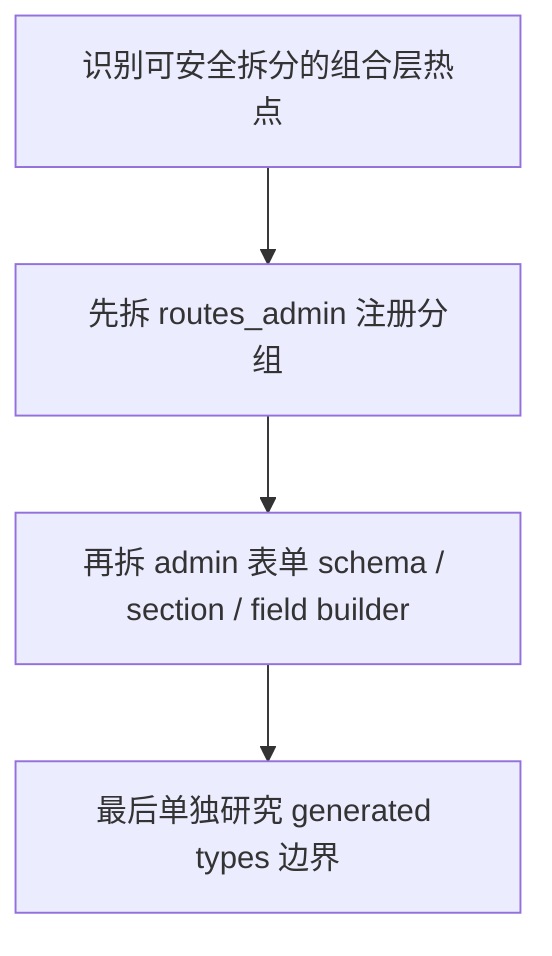

# Structure Hardening Follow-up Plan

> **For agentic workers:** 这是一份 follow-up plan，不是当前 hardening 主批次的一部分。执行时优先保持小步提交，按单域拆分，不要把“结构收口”演变成新一轮框架重写。

**Goal:** 把当前最影响维护效率的超大文件和耦合注册点收口成更清晰的边界，同时不引入契约漂移、生成文件冲突或过度抽象。

**Architecture:** 这次 follow-up 不碰业务语义，只收口结构。优先拆 `server/routers/routes_admin.go` 和 admin 端超大表单；`server/types/types.go` 因为是生成文件，不能作为手工重构对象，必须先找到生成源或在生成层之外包一层非生成结构。

**Tech Stack:** Go 1.25、Gin、Huma、Next.js 15、TypeScript、Bun、Turbo、OpenAPI codegen

---

## Problem Frame

当前仓库已经通过 monorepo baseline 和质量硬化主计划把“能跑、能验、能守门”这件事放到了更稳的位置，但结构层面仍然存在几个持续拉高认知成本的热点：

- `server/routers/routes_admin.go` 约 `1523` 行，承担了过多注册、依赖拼装和域边界职责
- `web/apps/admin/app/dashboard/product/subscribe-form.tsx` 约 `947` 行
- `web/apps/admin/app/dashboard/subscribe/protocol-form.tsx` 约 `737` 行
- `web/apps/admin/app/dashboard/servers/server-form.tsx` 约 `708` 行
- `server/types/types.go` 约 `2789` 行，但它是 `goctl` 生成文件，文件头明确写了 `DO NOT EDIT`

这些文件的问题不是“代码一定错”，而是：

- 评审时很难定位风险点
- 小改动容易碰到不相关逻辑
- 复用、测试、生成边界容易互相污染
- 新人进入这些文件时几乎没有“自然切口”

## Scope Check

这份计划只处理结构收口，不处理：

- 业务逻辑重写
- legacy HTTP error contract 迁移
- OpenAPI 契约设计变更
- 前端视觉改版或交互重做
- 组件库替换

## Key Constraints

1. **不得手改生成文件 `server/types/types.go`**
   - 任何“拆它”的方案都必须先回答生成源在哪里，或者改为在生成层之外包一层非生成结构
2. **OpenAPI 契约不能漂**
   - 路由拆分和类型边界调整都不能造成 `docs/openapi/*.json` 与 generated clients 的无意变化
3. **按单域推进**
   - 一次只拆一个热点，不搞全仓大扫除
4. **优先拆组合层，不先拆业务核心**
   - 先从注册文件、表单 section、schema builder 这种边界层切

## What Already Exists

- `bun run openapi` 已经是根级权威契约链路
- `repo:contracts` 已经能验证跨子工程合同
- admin 表单当前已经有 schema / field / section 的自然拆分机会
- 主计划已经把“结构收口”从质量门禁与关键测试里独立出来

## File Structure

### Target Files

- `server/routers/routes_admin.go`
- `web/apps/admin/app/dashboard/product/subscribe-form.tsx`
- `web/apps/admin/app/dashboard/subscribe/protocol-form.tsx`
- `web/apps/admin/app/dashboard/servers/server-form.tsx`

### Special Case

- `server/types/types.go`
  - 只能作为“生成边界研究对象”，不能直接列入手工编辑实现清单

### Expected New Files

- `server/routers/admin_routes_*.go`
- `web/apps/admin/app/dashboard/product/subscribe-form/*`
- `web/apps/admin/app/dashboard/subscribe/protocol-form/*`
- `web/apps/admin/app/dashboard/servers/server-form/*`
- 可选：生成边界说明文档，例如 `docs/brainstorms/*types-generation*.md` 或后续 plan 附录

## Implementation Strategy



顺序不能反。原因很简单：

- 路由注册和前端表单拆分是“纯结构收益”最高、风险可控的点
- `server/types/types.go` 涉及生成边界，必须在完成前两类明显收益项后，再独立决策

## Verification Matrix

每个结构单元完成后至少执行：

```bash
make test
make typecheck
cd web && bun run lint
bun run openapi
git diff -- docs/openapi web/apps/admin/services web/apps/user/services
```

额外验证：

```bash
cd server && go vet ./...
```

## Implementation Units

### Unit 1: 拆 `server/routers/routes_admin.go`

**Goal:** 把 admin 路由注册从单一大文件拆成按域分组的注册文件，同时不改变运行时行为和 OpenAPI 导出结果。

**Files:**
- Modify: `server/routers/routes_admin.go`
- Create: `server/routers/admin_routes_*.go`
- Modify: `server/routers/routes.go` 或相关聚合入口

**Design:**
- 只拆注册和依赖拼装，不改 handler 行为
- 每个域一个注册文件，例如 ads、user、system、ticket
- 共享 helper 保持在现有包内，不引入新的全局容器

**Test Targets:**
- `bun run openapi`
- `make test`

**Test Scenarios:**
- 路由拆分后 `docs/openapi/*.json` 不出现非预期漂移
- 相关 generated clients 只在有意变更时发生差异
- 现有 server 测试和 openapi 导出都继续通过

### Unit 2: 拆 admin 端超大表单

**Goal:** 把 admin 端超大表单拆成 schema、section、field builder 和容器组件，降低单文件认知负担。

**Files:**
- Modify: `web/apps/admin/app/dashboard/product/subscribe-form.tsx`
- Modify: `web/apps/admin/app/dashboard/subscribe/protocol-form.tsx`
- Modify: `web/apps/admin/app/dashboard/servers/server-form.tsx`
- Create: 对应目录下的 `schema.ts`、`sections/*.tsx`、`fields/*.tsx`、`helpers.ts`

**Design:**
- 容器组件保留提交与查询职责
- schema 独立
- section component 只关心视图与字段组合
- 避免引入新的表单框架或状态层

**Test Targets:**
- `cd web/apps/admin && bun run lint`
- `make typecheck`

**Test Scenarios:**
- 表单拆分后 lint / typecheck 继续通过
- 提交逻辑和已有 API 调用路径不变
- 仅结构变化，不引入用户可见回归

### Unit 3: 研究 generated types 边界，决定 `server/types/types.go` 的后续处理

**Goal:** 明确 `server/types/types.go` 的真实生成源和可维护边界，为之后可能的拆分提供正确入口。

**Files:**
- Read / Investigate: `server/types/types.go`
- Read / Investigate: 相关 goctl / spec / generator 输入源
- Create: 后续调查记录或补充计划文档

**Design:**
- 先回答“谁生成它”
- 再回答“是否能按源拆分”
- 如果不能，就建立非生成包装层，而不是直接改生成产物

**Test Targets:**
- `bun run openapi`
- `make test`

**Test Scenarios:**
- 能确认生成源与重生成路径
- 后续重构方案不再把 `types.go` 当作手工编辑对象

## Risks

| Risk | Severity | Why it matters | Mitigation |
|---|---|---|---|
| 把结构收口做成大规模重写 | High | 会把 reviewable refactor 变成高风险迁移 | 按 unit 拆，单域提交 |
| 误改生成文件 | High | 下一次生成会覆盖，白做且危险 | `server/types/types.go` 只研究，不手改 |
| 路由拆分导致契约漂移 | High | 会影响 generated clients 和下游前端 | 每次都跑 `bun run openapi` + diff |
| 前端表单拆分引入状态回归 | Med | 结构变化可能碰到表单提交与联动 | 保持容器职责不变，先拆 section |

## Success Criteria

- `server/routers/routes_admin.go` 不再承担单文件全部 admin 注册职责
- 三个 admin 超大表单至少有两个完成结构拆分
- `server/types/types.go` 的生成边界被明确记录
- `bun run openapi` 与 generated client diff 可解释、可审查

## Open Questions

- `routes_admin.go` 应该按业务域拆，还是按认证 / 工具 / 配置等技术域拆？
- admin 表单里最先拆哪一个，收益最大且风险最低？
- `server/types/types.go` 的生成源是否足够细粒度，支持按源拆分？

## Suggested Execution Order

- [ ] Unit 1. 拆 `server/routers/routes_admin.go`
- [ ] Unit 2. 拆 admin 端超大表单
- [ ] Unit 3. 研究 generated types 边界并补充后续决策
