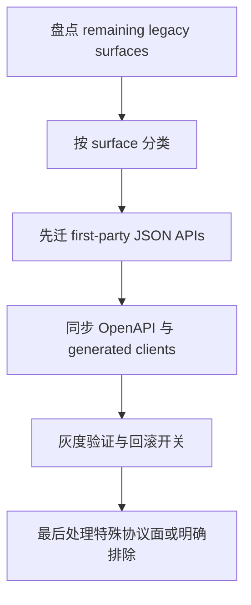

# Legacy Error Contract Migration Follow-up Plan

> **For agentic workers:** 这是一份独立 follow-up plan，不是当前质量硬化主批次的一部分。执行时必须把兼容性、rollout 和回滚放在实现前面，不能把它当普通重构。

**Goal:** 评估并逐步迁移当前仍保留的 HTTP `200` + body `{code,msg}` legacy 错误语义，统一到更现代、可监控、可缓存、可消费的错误传输模型，同时控制前后端兼容风险。

**Architecture:** 这不是“改几个 helper”的活。它会影响后端 response layer、前端 SDK、监控语义、代理行为、回滚开关和发布节奏。必须按 surface 分类迁移，而不是全仓一把梭。

**Tech Stack:** Go 1.25、Gin、Huma、OpenAPI、generated clients、Next.js 15

---

## Problem Frame

仓库中仍然存在一条 legacy 约定：很多错误响应虽然业务上是失败，但 HTTP transport 仍然返回 `200`，再通过 body 里的 `code` / `msg` 告诉客户端这是个错误。

这套做法的问题不是“能不能用”，而是它在现代系统里会持续制造额外成本：

- HTTP 监控语义失真
- 代理、缓存和网关行为不自然
- SDK / generated client 需要额外包一层 transport 特判
- 前后端都容易把“业务失败”和“transport 成功”混在一起
- 新接口容易继续沿用旧模型，债会越滚越大

当前仓库已经做过一轮 Phase 5 error response migration，但主 hardening 计划没有把剩余 legacy 面一次性吃完，这是合理的。现在需要一份独立计划，把这件事当成 API 兼容项目而不是局部重构来做。

## Scope Check

这份计划处理：

- legacy error contract 盘点
- surface 分类
- 兼容策略
- rollout / rollback
- OpenAPI 与 generated client 协同

这份计划不处理：

- 结构拆分
- UI 视觉问题
- lint 红灯修复
- 业务逻辑重写

## Surfaces To Classify

迁移前先按 surface 分四类：

1. **可直接迁移的 first-party JSON APIs**
2. **需要兼容期的已被前端消费接口**
3. **协议特殊面**
   - webhook
   - callback
   - redirect
   - node conditional request
4. **应明确排除的非标准面**
   - init / bootstrap
   - 纯文本 ack
   - 第三方规定成功语义的 surface

## Key Decisions

1. **先盘点，再迁移**
   - 先知道哪些地方还在返回 HTTP `200` 错误，再决定怎么切
2. **按 surface 分级，不做一刀切**
   - first-party JSON API 和 webhook/callback 不能用同一个策略
3. **OpenAPI 与 generated clients 必须同步**
   - transport 语义变化不允许只改 server 不改契约
4. **保留显式 rollback 能力**
   - 这类迁移必须能在出问题时退回 compatibility mode

## What Already Exists

- `server/routers/response/http_result.go`
- `server/routers/response/problem.go`
- `server/modules/infra/xerr/*`
- 已完成的 [2026-04-07-001-refactor-phase5-error-response-migration-plan.md](/Users/admin/Codes/ProxyCode/perfect-panel/docs/plans/2026-04-07-001-refactor-phase5-error-response-migration-plan.md)
- 根级 `bun run openapi` 与 generated client 链路

这意味着 follow-up 不是从头设计，而是在已有迁移成果之上把剩余 legacy surface 收口。

## Migration Strategy



## Verification Matrix

```bash
cd server && go test ./... -count=1
cd server && go vet ./...
bun run openapi
bun run repo:contracts
```

补充验证：

```bash
rg -n 'http.StatusOK|Status: http.StatusOK|Code: 200, Msg' server
git diff -- docs/openapi web/apps/admin/services web/apps/user/services
```

## Implementation Units

### Unit 1: 盘点 remaining legacy surfaces

**Goal:** 找出仓库里仍然保留 HTTP `200` 错误语义的真实 surface，而不是靠印象推进。

**Files:**
- Read / Modify: `server/routers/response/http_result.go`
- Read / Modify: `server/routers/response/problem.go`
- Read / Investigate: `server/services/**`
- Create: 盘点清单文档或附录

**Test Scenarios:**
- 明确列出 remaining legacy surfaces
- 区分 first-party JSON API、特殊协议面、明确排除面

### Unit 2: 为 first-party JSON APIs 定义目标传输模型

**Goal:** 明确哪些接口应该从 `200 + {code,msg}` 迁到标准 HTTP status，并确定 body 形状与错误码扩展字段策略。

**Files:**
- Modify: `server/routers/response/*`
- Modify: `server/modules/infra/xerr/*`
- Modify: `docs/api-governance.md`

**Design:**
- transport 用标准 HTTP status
- business code 若保留，降级为扩展字段，而不是 transport 替身
- 不能破坏现有 OpenAPI 导出链路

**Test Scenarios:**
- first-party JSON API 错误响应能被 OpenAPI 正确表达
- transport status 与 body 语义一致

### Unit 3: 协调 frontend / generated clients compatibility

**Goal:** 确保 transport 语义变化不会把 admin/user 前端直接打挂。

**Files:**
- Modify: `docs/openapi/*.json`
- Modify: `web/apps/admin/services/*`
- Modify: `web/apps/user/services/*`
- Modify: `web/apps/admin/utils/setup-clients.ts`
- Modify: `web/apps/user/utils/setup-clients.ts`

**Design:**
- 所有契约变化都通过 `bun run openapi` 驱动
- 拦截器和客户端错误处理逻辑要和新的 transport 语义对齐

**Test Scenarios:**
- generated clients 更新后 typecheck 通过
- 典型错误路径在 admin/user 端都能被正确处理

### Unit 4: 设计 rollout / rollback

**Goal:** 把迁移做成可回滚的发布，而不是一次不可逆切换。

**Files:**
- Modify: `server/config/*`
- Modify: `server/routers/response/*`
- Modify: `README.md` 或运维说明文档

**Design:**
- 显式 compatibility flag 或 rollout switch
- 明确何时开、何时关、何时回滚

**Test Scenarios:**
- compatibility mode 开关能恢复旧行为
- rollout 前后都有可观测信号

## Risks

| Risk | Severity | Why it matters | Mitigation |
|---|---|---|---|
| 前端客户端假定错误也是 HTTP 200 | High | 一改就会炸消费端 | 先盘点 client assumptions，再迁 server |
| OpenAPI 与 generated clients 不同步 | High | 会出现 server/client 双漂移 | 强制 `bun run openapi` |
| 把 webhook / callback 一起误改 | High | 可能直接破坏外部协议 | 特殊协议面单独分类，默认排除 |
| 迁移后难以回滚 | High | API contract 改动回滚成本高 | 保留 compatibility mode |

## Success Criteria

- remaining legacy surfaces 被完整盘点
- first-party JSON API 的目标错误传输模型被明确写死
- OpenAPI 与 generated clients 有同步迁移方案
- rollout / rollback 策略清晰且可执行

## Open Questions

- 哪些 remaining surface 仍然需要长期保留 compatibility mode？
- business code 在新模型里是否继续作为公开字段暴露？
- 前端当前有哪些逻辑硬编码依赖“错误也返回 200”？

## Suggested Execution Order

- [ ] Unit 1. 盘点 remaining legacy surfaces
- [ ] Unit 2. 为 first-party JSON APIs 定义目标传输模型
- [ ] Unit 3. 协调 frontend / generated clients compatibility
- [ ] Unit 4. 设计 rollout / rollback
