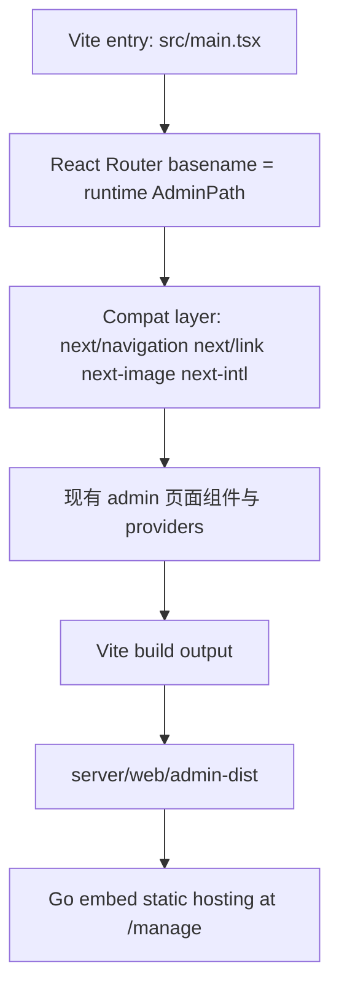

# Admin Next.js to Vite Migration Plan

> **For agentic workers:** 这是一次单子系统迁移，不是全仓前端重写。优先做兼容性 spike 和构建骨架，再迁路由与入口，最后才清理 Next 依赖。不要把 `user` 端一起卷进来。

**Goal:** 把 `web/apps/admin` 从 `Next.js 16 + static export` 迁移为 `Vite + React SPA`，同时保持现有 `/manage` 部署、后台登录、深链访问、OpenAPI client、i18n、主题、Go 嵌入式静态托管能力不回退。

**Architecture:** 管理端改成 Vite 构建的单页应用，继续输出静态资源并复制到 `server/web/admin-dist`，由 Go 服务嵌入托管。迁移采用“兼容层优先”策略：先用 router / link / image / i18n 兼容模块托住现有页面，再逐步切走 Next 专有入口，避免一次性重写全部后台页面。

**Tech Stack:** Vite、React 19、TypeScript、Bun、Turbo、React Router、`use-intl` 兼容层、`@tanstack/react-query`、`zustand`、Go embed static hosting

---

## Overview

当前管理端已经出现一个非常明确的架构信号：它虽然运行在 Next.js 上，但真正使用的 Next 能力非常少，代价却在持续上升。

已经确认的事实：

- `web/apps/admin/next.config.ts` 使用 `output: "export"`，说明管理端本质上是静态导出应用，而不是依赖 Next server 的 SSR / RSC 应用
- `web/apps/admin/app/layout.tsx` 只是把内容交给 `components/client-root.tsx`，而 `client-root.tsx` 本身完全是客户端 provider 壳
- `web/apps/admin/app` 下当前约 `29` 个 `page.tsx` 中，约 `26` 个是 `"use client"` 页面，后台主体已经是客户端界面
- `server/web/static.go` 并不依赖 Next runtime，只依赖静态文件目录 `admin-dist` 与 `index.html`
- 最近 `/admin` / `/manage`、`basePath`、语言闪烁、静态资源路径等问题，都是“静态 SPA 被放进 Next App Router + compile-time basePath”后带来的额外复杂度

换句话说，管理端现在并没有享受 Next 的主要收益，却已经开始承担它的路径语义、构建语义和运行时假设成本。

这份计划不讨论“前端全仓都换成 Vite”。它只处理最划算的一步：先把 `admin` 端迁出去，把 `user` 端保留在现状，等后台迁移完成并稳定后，再决定用户站是否跟进。

## Problem Frame

当前管理端的核心问题不是“Next 不能用”，而是“Next 对这个子系统来说已经不够合身”。

### Why Next Is a Burden Here

- **静态导出 + 运行时变更路径冲突**
  - `web/apps/admin/next.config.ts` 里的 `basePath: "/admin"` 是编译时固定语义，但实际部署路径来自运行时配置 `AdminPath`
  - 这直接导致 `/admin` 与 `/manage` 的双轨问题，需要在 Go 层和前端层双重修补

- **客户端应用被迫承受 App Router 约束**
  - 后台大量页面只是表格、表单、筛选、查询参数驱动界面，并不需要服务端渲染能力
  - 但它们仍然要围绕 `next/navigation`、`next/link`、`next/image`、layout 约定和导出目录结构组织

- **部署链路实际只需要静态资源**
  - 根 `Dockerfile` 和 `Makefile` 当前只是把 `web/apps/admin/out/*` 复制进 `server/web/admin-dist`
  - 这说明部署目标并不是“跑一个 Next 服务”，而是“得到稳定的静态构建产物”

- **运行时补丁越来越多**
  - 当前已经存在 admin path 规范化、HTML base-path 重写、legacy `/admin/*` 跳转兼容等修补逻辑
  - 这些逻辑不是业务能力，而是为了和 Next 的编译假设和运行现实对齐

### Why Not Migrate `user` At The Same Time

- `user` 端既有面板，也有更接近站点的页面，如首页、认证、文档、条款、隐私政策
- `user` 端未来是否需要 SEO、内容页或首屏优化，暂时仍有保留 Next 的理由
- `admin` 端是纯后台，价值闭环更清晰，更适合作为第一阶段迁移对象

## Scope Boundaries

### In Scope

- 将 `web/apps/admin` 从 Next.js 构建迁移到 Vite
- 用 React Router 替换 App Router 的路由入口
- 建立 Next 兼容层，减少页面级重写面
- 保留并复用现有 `components/`、`config/`、`services/`、`store/`、`locales/`
- 调整 `Makefile`、`Dockerfile`、`server/web/static.go` 以消费新的 admin 静态产物
- 补充迁移 smoke test，确保 `/manage` 登录与后台导航不回退

### Not In Scope

- `web/apps/user` 迁移到 Vite
- 重写 UI 设计或后台信息架构
- 更换 React Query、Zustand、OpenAPI client、Tailwind
- 在本轮重做所有目录结构
- 一次性消灭全部 `next/*` import；第一阶段允许通过兼容层过渡

## Current Evidence

### Verified Current State

- `web/apps/admin/next.config.ts` 使用 `output: "export"` 与 `basePath: "/admin"`
- `web/apps/admin/package.json` 当前脚本仍然是 `next dev` / `next build`
- `web/apps/admin/tsconfig.json` 继承 `@workspace/typescript-config/nextjs.json` 且启用了 Next TypeScript plugin
- `web/apps/admin/app` 约 `29` 个页面文件，其中约 `26` 个是客户端页面
- `server/web/static.go` 当前通过 `admin-dist` 和 `index.html` 提供嵌入式静态服务
- `Makefile` 的 `embed-admin` 当前复制的是 `web/apps/admin/out/*`
- 管理端主问题已经验证过：浏览器地址栏与可见 `href` 受编译期 `basePath` 影响，需要额外兼容逻辑才能维持 `/manage`

### Migration Implications

- 这不是 SSR 到 CSR 的迁移，因为当前管理端已经接近 CSR
- 这不是后端部署模型重写，因为 Go 侧本来就只吃静态产物
- 真正的工作量主要集中在：
  - 构建系统
  - 路由系统
  - Next 专有 import 的兼容替换
  - 嵌入式静态资源目录的衔接

## Key Decisions

- **只迁 admin，不碰 user。**
  - 先收缩范围，避免一次性做成“前端双应用重写”

- **选择 React Router，而不是继续维持文件系统路由。**
  - 后台是典型管理面板，路由结构稳定、层级明确，手写 route tree 成本可控
  - 目标是把编译期文件路由换成运行时可控 `basename`

- **引入兼容层，而不是第一天就改完所有页面 import。**
  - 用 alias 托住 `next/navigation`、`next/link`、`next/image`、`next/legacy/image`、`next-intl`
  - 这样第一阶段迁移重点放在“跑起来”，不是“清理所有调用点”

- **保留现有 `app/` 目录作为功能源，新增 `src/` 作为 Vite 入口层。**
  - 先不大规模搬动页面文件
  - `src/` 只负责入口、路由、兼容层和启动逻辑

- **Admin 静态资源继续通过 Go embed 发布。**
  - 不引入额外前端托管服务
  - 根 `Dockerfile`、`make embed-admin` 继续是 canonical release path

- **后台路径语义改成运行时第一，编译时第二。**
  - Router `basename` 读取 `window.__ENV.NEXT_PUBLIC_ADMIN_PATH`
  - 浏览器显示路径必须直接是 `/manage/...`
  - 不再接受依赖 Next `basePath` 才能成立的内部链接语义

## File Structure

### Existing Files To Modify

- `web/apps/admin/package.json`
- `web/apps/admin/tsconfig.json`
- `web/apps/admin/postcss.config.mjs`
- `web/apps/admin/app/(auth)/page.tsx`
- `web/apps/admin/components/client-root.tsx`
- `web/apps/admin/components/providers.tsx`
- `web/apps/admin/utils/admin-path.ts`
- `web/apps/admin/README.md`
- `web/apps/admin/README.zh-CN.md`
- `web/package.json`
- `Makefile`
- `Dockerfile`
- `server/web/static.go`
- `server/web/static_routing_test.go`
- `server/web/route_resolution_test.go`

### Existing Files Likely To Be Deleted At Final Cleanup

- `web/apps/admin/next.config.ts`
- `web/apps/admin/next-env.d.ts`

### New Files To Create

- `web/apps/admin/index.html`
- `web/apps/admin/vite.config.ts`
- `web/apps/admin/src/main.tsx`
- `web/apps/admin/src/router.tsx`
- `web/apps/admin/src/routes.tsx`
- `web/apps/admin/src/compat/next-navigation.ts`
- `web/apps/admin/src/compat/next-link.tsx`
- `web/apps/admin/src/compat/next-image.tsx`
- `web/apps/admin/src/compat/next-intl.tsx`
- `web/apps/admin/src/compat/router-top-loader.tsx`
- `web/apps/admin/src/env.ts`
- `web/apps/admin/src/app-shell.tsx`
- `web/tests/admin-vite-smoke.test.ts` 或等价浏览器 smoke 用例

### Existing Directories To Preserve

- `web/apps/admin/components/`
- `web/apps/admin/config/`
- `web/apps/admin/locales/`
- `web/apps/admin/services/`
- `web/apps/admin/store/`
- `web/apps/admin/utils/`
- `web/apps/admin/app/`

## Target Architecture



### Runtime Model

- Vite 负责：
  - 本地开发
  - TypeScript bundling
  - 产出静态资源

- React Router 负责：
  - 后台登录页
  - dashboard 嵌套路由
  - query string / params / pathname 读取

- Go server 负责：
  - 注入 `window.__ENV`
  - 挂载 `/manage`
  - 历史兼容 `/admin -> /manage`
  - SPA fallback 和静态资源缓存头

### Path Strategy

- 运行时真实路径以 `window.__ENV.NEXT_PUBLIC_ADMIN_PATH` 为准
- Router `basename` 与自定义 `AdminLink` 都以运行时 admin path 生成 URL
- 服务端只负责“挂载在哪”，前端不再使用 Next `basePath` 语义做路由决策

## Verification Matrix

迁移过程中每个单元完成后至少执行：

```bash
cd web/apps/admin && bun run lint
cd web/apps/admin && bun run check-types
cd web/apps/admin && bun run build
cd web && bun run lint
cd web && bun run typecheck
make embed-admin
make test
```

联调验证：

```bash
docker compose up -d --build ppanel
curl -I http://localhost:8080/manage
curl -I http://localhost:8080/manage/dashboard
```

浏览器 smoke：

- 打开 `/manage`
- 用默认管理员账号登录
- 登录后 URL 保持在 `/manage/dashboard`
- 点击侧边栏进入 `/manage/dashboard/servers`
- 刷新 `/manage/dashboard/servers` 不返回登录页或首页壳子
- 页面内可见链接右键复制时不再出现 `/admin/...`

## Execution Status

截至 `2026-04-08`，当前执行状态如下：

- `Unit 1` 已完成：Vite 入口、compat layer、`/manage` 登录与 dashboard 壳已跑通
- `Unit 2` 已完成：admin 路由树、深链访问、`/manage` 运行时路径已接入 React Router
- `Unit 3` 已完成：语言切换改为运行时更新，菜单跳转不再触发整页重载
- `Unit 4` 已完成：admin 构建产物切到 `dist/`，`embed-admin`、根级 lint/typecheck/test 已通过
- `Unit 5` 已完成：Go 静态托管已支持 Vite `assets/` 与 hashed static asset 的长期缓存语义
- `Unit 6` 已完成：admin `tsconfig` 已切出 Next tooling，`next.config.ts` 与 `next-env.d.ts` 已删除

当前已拿到的验证证据：

- `cd web/apps/admin && bun run lint` 通过
- `cd web/apps/admin && bun run check-types` 通过
- `cd web/apps/admin && bun run build` 通过
- `cd web && bun test tests/admin-build-chain.test.ts tests/admin-path.test.ts tests/admin-routes.test.ts tests/admin-locale-runtime.test.ts` 通过
- `make embed-admin` 通过
- `make lint` 通过
- `make typecheck` 通过
- `make test` 通过

当前唯一未拿到的新鲜证据是本机 `docker compose up -d --build ppanel`。在这台机器的 Colima / Docker 环境里，构建会卡在 `RUN bun install --frozen-lockfile`，进程长期 `0.0% CPU`，镜像时间戳不更新。现有代码链路已改成锁文件安装，但这一步仍表现为环境侧阻塞，而不是仓库内 lint / typecheck / build 回归。

## Implementation Units

### Unit 1: 做一个兼容性 Spike，先证明 Vite 能托起登录页和后台壳

**Goal:** 在不替换全部页面的前提下，证明 Vite + compat layer 能跑起管理端最小闭环。

**Files:**
- Create: `web/apps/admin/index.html`
- Create: `web/apps/admin/vite.config.ts`
- Create: `web/apps/admin/src/main.tsx`
- Create: `web/apps/admin/src/router.tsx`
- Create: `web/apps/admin/src/compat/next-navigation.ts`
- Create: `web/apps/admin/src/compat/next-link.tsx`
- Create: `web/apps/admin/src/compat/next-image.tsx`
- Create: `web/apps/admin/src/env.ts`
- Modify: `web/apps/admin/package.json`
- Modify: `web/apps/admin/tsconfig.json`

**Design:**
- 先让 Vite dev/build 跑起来
- 先接登录页 `/` 与 dashboard 壳 `/dashboard`
- 不要求第一阶段所有子页面都已路由化
- 重点验证 alias 后的 `next/navigation` / `next/link` / `next/legacy/image` 能被现有页面消费

**Go / No-Go Gate:**

如果下面 4 条无法同时满足，就不要继续全量迁移，先补技术 spike 结论：

- `bun run build` 能产出 admin 静态构建
- `/manage` 登录页在 Vite 产物下可打开
- 登录后能进入 dashboard 壳
- 侧边栏点击后仍是 SPA 跳转

### Unit 2: 建立完整的 admin 路由树，并把现有页面接到 React Router

**Goal:** 用 Vite + React Router 承接现有管理端全部页面路径。

**Files:**
- Create: `web/apps/admin/src/routes.tsx`
- Modify: `web/apps/admin/src/router.tsx`
- Modify: `web/apps/admin/app/dashboard/layout.tsx`
- Modify: `web/apps/admin/components/sidebar-left.tsx`
- Modify: `web/apps/admin/components/header.tsx`
- Modify: `web/apps/admin/components/admin-link.tsx`
- Modify: `web/apps/admin/utils/admin-path.ts`

**Design:**
- 保持现有 URL 结构：
  - `/manage`
  - `/manage/dashboard`
  - `/manage/dashboard/servers`
  - `/manage/dashboard/log/*`
- 先复用 `app/**/page.tsx` 默认导出组件，不强迫它们立即换目录
- 将 dashboard 级 layout 放入 React Router 嵌套布局
- 确保 query params 驱动页面继续工作，例如订单、用户、日志筛选

**Acceptance Criteria:**

- 所有现有后台菜单路径都有对应 route
- 深链访问不依赖 Next 文件路由
- `usePathname` / `useSearchParams` / `useParams` 通过兼容层仍可工作

### Unit 3: 替换 Next 国际化与顶部进度条壳，但尽量不改业务文案调用

**Goal:** 去掉后台对 Next runtime 的国际化和页面切换依赖。

**Files:**
- Create: `web/apps/admin/src/compat/next-intl.tsx`
- Create: `web/apps/admin/src/compat/router-top-loader.tsx`
- Modify: `web/apps/admin/components/client-root.tsx`
- Modify: `web/apps/admin/components/providers.tsx`
- Modify: `web/apps/admin/locales/client.ts`
- Modify: `web/apps/admin/locales/utils.ts`

**Design:**
- 保持现有 `useTranslations`、`useLocale` 调用形式尽量不变
- `NextIntlClientProvider` 由兼容实现对外暴露，内部可基于 `use-intl` 或等价 runtime 实现
- `nextjs-toploader` 改为路由感知进度条，不再绑定 Next navigation lifecycle
- 语言来源继续使用 cookie / 浏览器语言 / 本地存储的现有逻辑

**Acceptance Criteria:**

- 中英文切换行为不回退
- 后台菜单点击不再出现“整页重载后再语言回切”的体验
- 页面切换时的 loading 指示继续存在或有等价替代

### Unit 4: 切断 admin 的 Next 构建依赖，改写 embed 发布链

**Goal:** 让 repo 正式把 admin 视为 Vite 应用，而不是 Next 导出应用。

**Files:**
- Modify: `web/apps/admin/package.json`
- Modify: `web/package.json`
- Modify: `Makefile`
- Modify: `Dockerfile`
- Modify: `web/apps/admin/README.md`
- Modify: `web/apps/admin/README.zh-CN.md`

**Design:**
- admin 脚本切换为：
  - `dev` -> `vite`
  - `build` -> `vite build`
  - `preview` -> `vite preview`
- 根 `embed-admin` 不再复制 `out/*`，改为复制 `dist/*`
- `Dockerfile` 改为从 admin `dist` 复制到 `server/web/admin-dist`
- 根文档与开发指令同步更新

**Acceptance Criteria:**

- `make embed-admin` 在本地通过
- 根 `Dockerfile` 能成功构建并启动
- 新贡献者不再需要理解 admin 的 Next 输出目录语义

### Unit 5: 调整 Go 静态托管逻辑，使其从“理解 Next 导出”退回到“理解通用 SPA 构建”

**Goal:** 让后端托管逻辑只关心静态资源与 HTML 页面，不再携带 Next 特定假设。

**Files:**
- Modify: `server/web/static.go`
- Modify: `server/web/static_routing_test.go`
- Modify: `server/web/route_resolution_test.go`

**Design:**
- 保留：
  - `window.__ENV` 注入
  - `/admin -> /manage` legacy redirect
  - `admin-dist` 挂载
- 收口：
  - 不再只对 `_next/static/` 特判缓存
  - 改为对 Vite `assets/` 及带 hash 的静态资源给长期缓存
- 容忍 admin 构建目录从 Next 风格切到通用 SPA 风格

**Acceptance Criteria:**

- `/manage` 与 `/manage/dashboard/*` 都能回到正确 HTML
- `assets/*` 有正确缓存头
- `/admin/*` 仍能跳转到 `/manage/*`

### Unit 6: 清理遗留 Next 依赖并收尾

**Goal:** 把 admin 迁移从“能运行”收口到“依赖语义清晰”。

**Files:**
- Modify: `web/apps/admin/package.json`
- Modify: `web/package.json`
- Delete: `web/apps/admin/next.config.ts`
- Delete: `web/apps/admin/next-env.d.ts`
- Modify: `docs/plans/2026-04-08-006-refactor-admin-next-to-vite-migration-plan.md`

**Design:**
- 删除 admin 子应用不再需要的 Next 构建依赖
- 保留 root workspace 对 user app 仍需要的 Next 依赖
- 回写本计划文档中的执行状态和验证结果

**Acceptance Criteria:**

- admin 子应用已经不再依赖 Next build/dev 命令
- 计划文档记录最终差异、风险和后续 user follow-up 建议

## Risks

| Risk | Severity | Why it matters | Mitigation |
|---|---|---|---|
| `next-intl` 替换成本被低估 | High | 后台大量页面依赖 `useTranslations` | 先做 compat layer，不做全量调用点替换 |
| 路由迁移导致深链失效 | High | 后台很多页面靠 query string 驱动 | 在 Unit 2 明确覆盖 `/dashboard/*` 与日志页 smoke |
| 静态资源 base 路径处理错误 | High | `/manage` 不是编译期固定路径 | 先做 spike，再把 server rewrite 和 router basename 一起验证 |
| 兼容层变成永久债务 | Med | 会留下“看起来像 Next，实际上不是”的心智负担 | 在 Unit 6 明确清理策略，只保留必要薄层 |
| 一次性迁移过多页面导致 diff 失控 | Med | 后台页面多、表单重 | 先迁入口与壳层，再复用现有页面组件 |

## Success Criteria

- `web/apps/admin` 本地开发与构建已完全基于 Vite
- 管理端继续通过 Go embed 在 `/manage` 提供服务
- 后台登录、侧边栏、深链刷新、页面内链接都不再依赖 Next `basePath`
- `make embed-admin`、`docker compose up -d --build ppanel`、后台 smoke test 全部通过
- 管理端迁移完成后，仓库对 Next 的依赖仅服务于 `user` 端

## Deferred Follow-up

本计划完成后，再决定是否需要单独建立：

- `user` 端从 Next 迁移到 Vite 的 follow-up plan
- admin 兼容层清理计划
- `next-intl` 兼容层完全替换计划

## Suggested Execution Order

- [x] Unit 1. 做兼容性 spike，验证 Vite 能托起登录页和 dashboard 壳
- [x] Unit 2. 建立完整 admin 路由树
- [x] Unit 3. 替换 i18n 与顶部进度条壳
- [x] Unit 4. 改写 admin 构建与 embed 发布链
- [x] Unit 5. 调整 Go 静态托管逻辑
- [x] Unit 6. 清理遗留 Next 依赖并回写文档

## Recommendation

这份迁移计划默认按“先证明、再替换、最后清理”的顺序执行。不要跳过 Unit 1 直接大规模改文件；真正该先回答的问题不是“能不能写完”，而是“路径、i18n 和静态资源这 3 个兼容点能不能一起成立”。
