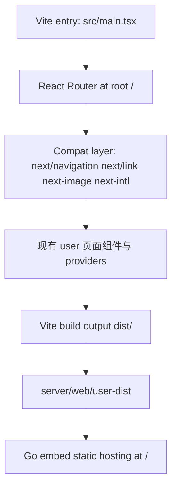

# 用户端从 Next.js 迁移到 Vite 实施计划

> **For agentic workers:** REQUIRED SUB-SKILL: Use superpowers:subagent-driven-development（推荐）或 superpowers:executing-plans 来逐任务执行这份计划。步骤使用 checkbox（`- [ ]`）语法追踪。

**Goal:** 把 `web/apps/user` 从 `Next.js 16 + static export` 迁移为 `Vite + React SPA`，同时保持现有首页、认证、购买、用户面板、OAuth / bind 页面、i18n、主题、OpenAPI client 和 Go embed 静态托管能力不回退。

**Architecture:** 用户端改为 Vite 构建的单页应用，继续输出静态资源并复制到 `server/web/user-dist`，由 Go 服务嵌入托管。迁移采用“兼容层优先、路由优先、发布链最后收口”的策略，先用 `next/*` / `next-intl` 兼容层托住现有页面，再把 build、embed 和 workspace 语义从 Next 清理出去。

**Tech Stack:** Vite、React 19、TypeScript、Bun、Turbo、React Router、`next-intl` compat layer、`@tanstack/react-query`、`zustand`、Go embed static hosting

---

## 概览

`user` 端现在已经和迁移前的 `admin` 很像：名义上跑在 Next.js 上，实际上更接近静态导出后的客户端应用。

已经确认的事实：

- `web/apps/user/next.config.ts` 使用 `output: "export"`，说明用户端当前也是静态导出，而不是依赖 Next server 的 SSR / RSC
- `web/apps/user/package.json` 仍然使用 `next dev` / `next build` / `next start`
- `web/apps/user/app` 当前有 `18` 个 `page.tsx`，其中 `14` 个文件以 `"use client"` 开头
- 当前只发现 `2` 个 `generateStaticParams`，分别在 `bind/[platform]` 与 `oauth/[platform]`，没有 `route.ts`、`middleware.ts`、`next/headers`、`next/server`
- `web/apps/user/components/client-root.tsx` 只是一个客户端 provider 壳，内部仍用 `NextIntlClientProvider` 与 `nextjs-toploader`
- `web/apps/user/components/language-switch.tsx` 仍通过 `router.refresh()` 完成语言切换
- `web/apps/user/utils/setup-clients.ts` 已经是纯客户端 API 初始化逻辑，没有依赖 Next runtime
- `web/apps/user/utils/tutorial.ts` 读取的是远程 Markdown（CDN + `gray-matter`），不是本地文件系统内容，因此不是迁移阻塞点
- 根发布链里 `embed-user` 和 `Dockerfile` 仍复制 `web/apps/user/out/*` 到 `server/web/user-dist`

所以这轮迁移的真实目标不是“把 SSR 改成 CSR”，而是把一个已经高度客户端化的静态站点，从 Next 的编译与路由语义里解耦出来。

## 问题框定

### 为什么 `user` 端现在也适合迁移

- **构建收益和运行时现实不匹配**
  - 当前 `user` 端几乎没有在用 Next 最值钱的服务端能力
  - 却仍然要承受 `next/navigation`、`next/link`、`next/image`、`next-intl`、`.next` / `out` 等一整套 Next 语义

- **当前部署目标本来就是静态产物**
  - `Makefile` 的 `embed-user` 只是把 `out/*` 复制进 `server/web/user-dist`
  - 根 `Dockerfile` 也只是复制静态产物，不跑独立的 Next 服务

- **认证、购买、用户面板本质都是客户端交互**
  - 首页会在客户端检查 token 后决定是否跳到 `/dashboard`
  - 认证页、购买页、用户侧 dashboard 绝大多数行为都依赖 React Query、OpenAPI client 与浏览器状态

- **完成这轮后，仓库才能真正完成“前端脱离 Next”**
  - `admin` 已经迁到 Vite
  - 如果 `user` 不动，仓库仍然要继续保留 Next 的工具链、文档心智和构建兼容层

### 为什么这轮比 `admin` 更需要谨慎

- `user` 端是公开入口，包含首页、认证页、条款页、隐私政策页和购买页
- 它直接承载注册、登录、购买、工单、文档等用户价值路径
- 即使当前并没有真正的 SSR 优势，这些页面的回归代价仍然比后台高

所以这份计划默认遵守两个原则：

- 不在本轮重做视觉设计或信息架构
- 不在本轮顺便做 SEO / 首屏性能再设计，只做“语义等价迁移”

## 作用域边界

### 在范围内（In Scope）

- 将 `web/apps/user` 从 Next.js 构建迁移到 Vite
- 用 React Router 承接现有用户端全部页面路径
- 建立 `next/navigation`、`next/link`、`next/image`、`next/legacy/image`、`next-intl` 兼容层
- 保留并复用现有 `components/`、`config/`、`locales/`、`services/`、`utils/`
- 保持首页、认证、购买、OAuth / bind、dashboard、文档、工单等路径语义不变
- 调整 `Makefile`、`Dockerfile`、必要的 `server/web/*` 测试，使根发布链消费新的 `user` 静态产物
- 在这轮结束后清理 `user` 端遗留的 Next tooling

### 不在范围内（Not In Scope）

- 重写用户端 UI 设计或文案体系
- 增加 SSR、RSC、ISR 或其他新的服务端渲染能力
- 引入新的状态管理方案或改写 OpenAPI client
- 这轮不顺便做 SEO / Lighthouse 优化工程
- 不把 `admin` 和 `user` 的 compat layer 抽成共享 package；这可以留到 follow-up

## 当前证据

### 已验证的现状

- `web/apps/user/package.json` 当前脚本仍然是 `next dev --turbopack`、`next build --webpack`、`next start`
- `web/apps/user/next.config.ts` 使用 `output: "export"`
- `web/apps/user/tsconfig.json` 仍继承 `@workspace/typescript-config/nextjs.json`
- `web/apps/user/components/client-root.tsx` 仍使用 `NextIntlClientProvider` 和 `NextTopLoader`
- `web/apps/user/components/language-switch.tsx` 使用 `router.refresh()` 完成语言切换
- `web/apps/user/app/(main)/page.tsx` 会在客户端检查登录态并将已登录用户跳转到 `/dashboard`
- `web/apps/user/app/bind/[platform]/page.tsx` 与 `web/apps/user/app/oauth/[platform]/page.tsx` 是当前仅有的动态平台参数静态导出点
- `web/apps/user/utils/tutorial.ts` 通过远程 `fetch` 拉取 Markdown，再用 `gray-matter` 解析，不依赖 Next server 文件读取
- `Makefile` 的 `embed-user` 当前复制 `web/apps/user/out/*`
- 根 `Dockerfile` 当前复制 `/app/web/apps/user/out`

### 对迁移的含义

- 这不是 SSR 降级，因为当前用户端并没有真正依赖 SSR
- 这也不是后端托管重写，因为 Go 侧一直只吃静态资源
- 真正的工作量主要集中在：
  - Vite 入口与兼容层
  - 路由树与 params / search params
  - i18n 与顶部进度条运行时
  - 用户端构建与 embed 发布链
  - 最终的 Next tooling 清理

## 关键决策

- **只迁 `user`，不回头重做 `admin`。**
  - `admin` 已完成迁移，这轮只复用经验，不重新组织后台方案。

- **用 React Router，而不是继续依赖文件系统路由。**
  - 用户端路径固定而清晰：`/`、`/auth`、`/purchasing`、`/dashboard`、`/bind/:platform`、`/oauth/:platform`。

- **保留现有 `app/` 页面组件作为功能源，新增 `src/` 作为 Vite 入口层。**
  - 这样可以减少页面级重写，先让运行时托起来，再逐步清理调用点。

- **优先复制 `admin` 的 compat 思路，而不是一开始抽共享库。**
  - 共享抽象可以做，但不应该阻塞这轮迁移。
  - 先用 app-local compat file 把 `user` 跑稳，再决定是否抽公共层。

- **保持用户侧 URL 不变，不引入 `basename` 复杂度。**
  - 和 `admin` 不同，`user` 端挂在根路径 `/`，不需要运行时 basePath。
  - 这会让 Vite 迁移比后台更简单，但要更注意 public deep link。

- **不改变当前首页登录后跳转和语言切换语义。**
  - `/` 登录后仍应跳到 `/dashboard`
  - 语言切换仍应生效，但不能继续依赖整页 `refresh`

- **这轮完成后允许开始移除仓库中的 Next 运行时依赖。**
  - 因为届时 `admin` 与 `user` 都已经迁出 Next

## 文件结构

### 现有文件需要修改

- `web/apps/user/package.json`
- `web/apps/user/tsconfig.json`
- `web/apps/user/app/layout.tsx`
- `web/apps/user/app/(main)/page.tsx`
- `web/apps/user/app/(main)/(user)/layout.tsx`
- `web/apps/user/app/auth/page.tsx`
- `web/apps/user/components/client-root.tsx`
- `web/apps/user/components/providers.tsx`
- `web/apps/user/components/language-switch.tsx`
- `web/apps/user/locales/client.ts`
- `web/apps/user/locales/utils.ts`
- `web/apps/user/utils/common.ts`
- `web/apps/user/utils/setup-clients.ts`
- `web/apps/user/README.md`
- `web/apps/user/README.zh-CN.md`
- `web/package.json`
- `web/turbo.json`
- `Makefile`
- `Dockerfile`
- `server/web/static.go`
- `server/web/static_routing_test.go`

### 最终清理阶段可能删除

- `web/apps/user/next.config.ts`
- `web/apps/user/next-env.d.ts`

### 需要新增的文件

- `web/apps/user/index.html`
- `web/apps/user/vite.config.ts`
- `web/apps/user/src/main.tsx`
- `web/apps/user/src/router.tsx`
- `web/apps/user/src/routes.tsx`
- `web/apps/user/src/env.ts`
- `web/apps/user/src/app-shell.tsx`
- `web/apps/user/src/compat/next-navigation.ts`
- `web/apps/user/src/compat/next-link.tsx`
- `web/apps/user/src/compat/next-image.tsx`
- `web/apps/user/src/compat/next-intl.tsx`
- `web/apps/user/src/compat/router-top-loader.tsx`
- `web/tests/user-build-chain.test.ts`
- `web/tests/user-routes.test.ts`
- `web/tests/user-locale-runtime.test.ts`
- `web/tests/user-vite-smoke.test.ts` 或等价浏览器 smoke 用例

### 现有目录应保留

- `web/apps/user/app/`
- `web/apps/user/components/`
- `web/apps/user/config/`
- `web/apps/user/locales/`
- `web/apps/user/services/`
- `web/apps/user/utils/`

## 目标架构



### 路由策略

- 根路径：
  - `/`
  - `/auth`
  - `/privacy-policy`
  - `/tos`
  - `/purchasing`
  - `/purchasing/order`
  - `/bind/:platform`
  - `/oauth/:platform`
- 已登录用户面板路径：
  - `/dashboard`
  - `/announcement`
  - `/document`
  - `/order`
  - `/payment`
  - `/profile`
  - `/subscribe`
  - `/ticket`
  - `/wallet`
  - `/affiliate`

### 运行时策略

- Vite 负责开发、打包与产出静态资源
- React Router 负责 pathname / params / search params
- Go server 继续负责：
  - `window.__ENV` 注入
  - `/api/*` 与错误 API 路径不回退成 HTML
  - `user-dist` 静态托管
  - SPA fallback 与静态资源缓存头

## 验证矩阵

每个单元完成后至少执行：

```bash
cd web/apps/user && bun run lint
cd web/apps/user && bun run check-types
cd web/apps/user && bun run build
cd web && bun run lint
cd web && bun run typecheck
make embed-user
make lint
make test
```

联调验证：

```bash
docker compose up -d --build ppanel
curl -I http://localhost:8080/
curl -I http://localhost:8080/auth
curl -I http://localhost:8080/dashboard
curl -I http://localhost:8080/api/v1/common/site/config
```

浏览器 smoke：

- 打开 `/`，首页正常渲染 hero / stats / product showcase
- 打开 `/auth`，认证页正常渲染，Logo、语言切换、主题切换正常
- 用 `NEXT_PUBLIC_DEFAULT_USER_EMAIL` / `NEXT_PUBLIC_DEFAULT_USER_PASSWORD` 指向的默认测试用户登录
- 登录后保持在 `/dashboard`
- 从 `/dashboard` 侧边栏进入 `/subscribe`、`/order`、`/ticket`，保持 SPA 跳转
- 打开 `/purchasing?subscribe_id=...`，查询参数不丢失
- 打开 `/bind/google` 与 `/oauth/google`，动态平台页按参数渲染
- 切换语言后页面更新为目标语言，不触发整页重载
- `/v1/common/site/config` 返回 JSON `404`，而不是 HTML 壳

## 实施单元

### Unit 1：做 `user` 端兼容性 Spike，先证明 Vite 能托起首页、认证页和 dashboard 壳

**Goal:** 在不重写全部页面的前提下，证明 Vite + compat layer 能跑起用户端最小闭环。

**Files:**
- Create: `web/apps/user/index.html`
- Create: `web/apps/user/vite.config.ts`
- Create: `web/apps/user/src/main.tsx`
- Create: `web/apps/user/src/router.tsx`
- Create: `web/apps/user/src/routes.tsx`
- Create: `web/apps/user/src/env.ts`
- Create: `web/apps/user/src/compat/next-navigation.ts`
- Create: `web/apps/user/src/compat/next-link.tsx`
- Create: `web/apps/user/src/compat/next-image.tsx`
- Modify: `web/apps/user/package.json`
- Modify: `web/apps/user/tsconfig.json`

**Design:**
- 先接 3 条关键路径：
  - `/`
  - `/auth`
  - `/dashboard`
- 复用 `app/**/page.tsx` 默认导出组件，不要求第一阶段全部路由都已接入
- 重点验证 `next/navigation`、`next/link`、`next/legacy/image`、`next/image` alias 后仍能被现有页面消费

**Go / No-Go Gate:**

下面 4 条必须同时满足，否则暂停全量迁移，先补 Spike 结论：

- `bun run build` 能产出 `user` 静态构建
- `/` 首页在 Vite 产物下可打开
- `/auth` 可打开且表单可见
- 登录后能进入 dashboard 壳

### Unit 2：建立完整的 `user` 路由树，覆盖 public、auth、purchasing、dashboard 和动态平台页

**Goal:** 用 React Router 承接现有用户端全部页面路径。

**Files:**
- Create: `web/apps/user/src/routes.tsx`
- Modify: `web/apps/user/src/router.tsx`
- Modify: `web/apps/user/app/(main)/(user)/layout.tsx`
- Modify: `web/apps/user/components/header.tsx`
- Modify: `web/apps/user/components/footer.tsx`
- Modify: `web/apps/user/app/(main)/(user)/sidebar-left.tsx`
- Modify: `web/apps/user/components/user-nav.tsx`

**Design:**
- 保持现有 URL 语义不变
- 使用 React Router 的 nested layout 承接：
  - public 主站 layout
  - auth layout
  - dashboard / user layout
- 将 `bind/:platform` 和 `oauth/:platform` 从 `generateStaticParams` 改为运行时动态 params
- 保持 `useSearchParams`、`useParams`、`useRouter` 的 compat 语义可用

**Acceptance Criteria:**

- 当前所有用户侧菜单和入口路径都有对应 route
- `purchasing`、`bind/:platform`、`oauth/:platform` 的 query / params 行为不回退
- public deep link 与 dashboard deep link 刷新后都回到正确 HTML

### Unit 3：替换 `next-intl` 运行时壳和 `nextjs-toploader`，消除语言切换整页刷新

**Goal:** 去掉用户端对 Next runtime 国际化和路由 loading 生命周期的依赖。

**Files:**
- Create: `web/apps/user/src/compat/next-intl.tsx`
- Create: `web/apps/user/src/compat/router-top-loader.tsx`
- Create: `web/apps/user/src/app-shell.tsx`
- Modify: `web/apps/user/components/client-root.tsx`
- Modify: `web/apps/user/components/language-switch.tsx`
- Modify: `web/apps/user/locales/client.ts`
- Modify: `web/apps/user/locales/utils.ts`
- Modify: `web/apps/user/utils/common.ts`

**Design:**
- 保持 `useTranslations`、`useLocale` 的现有调用形式尽量不变
- 语言切换继续使用 cookie / localStorage / 浏览器语言来源
- `router.refresh()` 改为运行时 locale 更新，不再依赖整页刷新
- 顶部进度条改成 React Router 感知版本

**Acceptance Criteria:**

- 中英文切换行为不回退
- 点击页面内链接后不再出现“先英文后中文”的闪烁体验
- 页面切换仍有 loading 指示，或有等价替代

### Unit 4：收口用户端运行时行为，覆盖首页登录跳转、购买、OAuth / bind 和文档教程

**Goal:** 把 `user` 端最关键的用户流在 Vite 路由下跑通，而不是只停留在页面能打开。

**Files:**
- Modify: `web/apps/user/components/providers.tsx`
- Modify: `web/apps/user/app/(main)/page.tsx`
- Modify: `web/apps/user/app/auth/page.tsx`
- Modify: `web/apps/user/app/(main)/purchasing/page.tsx`
- Modify: `web/apps/user/app/(main)/purchasing/content.tsx`
- Modify: `web/apps/user/app/bind/[platform]/bind-content.tsx`
- Modify: `web/apps/user/app/oauth/[platform]/oauth-content.tsx`
- Modify: `web/apps/user/app/(main)/(user)/document/page.tsx`
- Modify: `web/apps/user/app/(main)/(user)/document/tutorial-button.tsx`
- Modify: `web/apps/user/utils/tutorial.ts`
- Test: `web/tests/user-routes.test.ts`
- Test: `web/tests/user-vite-smoke.test.ts`

**Design:**
- 保持当前首页“已登录则跳 `/dashboard`，未登录则显示 landing”的语义
- 保持 `Providers` 里的全局配置加载、用户信息加载、`custom_html` 注入与 invite 参数缓存行为
- 验证购买路径的 query string 行为
- 验证 `bind` / `oauth` 平台参数行为
- 验证文档页和教程页在 Vite 打包下仍能工作

**Acceptance Criteria:**

- 首页登录跳转与未登录落地页行为不回退
- OAuth / bind 页面参数驱动行为正确
- 文档页教程列表和教程内容可正常加载
- 用户侧常见操作仍然是 SPA 跳转

### Unit 5：切断 `user` 的 Next 构建依赖，改写 embed 发布链

**Goal:** 让仓库正式把 `user` 视为 Vite 应用，而不是 Next 导出应用。

**Files:**
- Modify: `web/apps/user/package.json`
- Modify: `web/package.json`
- Modify: `Makefile`
- Modify: `Dockerfile`
- Modify: `web/apps/user/README.md`
- Modify: `web/apps/user/README.zh-CN.md`
- Test: `web/tests/user-build-chain.test.ts`

**Design:**
- `user` 脚本切换为：
  - `dev` -> `vite`
  - `build` -> `vite build`
  - `preview` -> `vite preview`
- 根 `embed-user` 改为复制 `dist/*`
- 根 `Dockerfile` 改为从 `user dist` 复制到 `server/web/user-dist`
- workspace 文档与开发命令同步更新

**Acceptance Criteria:**

- `make embed-user` 在本地通过
- 根 `Dockerfile` 能消费新的 `user dist`
- 新贡献者不再需要理解 `user` 的 `out/` 目录语义

### Unit 6：清理用户端遗留 Next tooling，并完成仓库级收尾

**Goal:** 把仓库从“两个 app 都不跑 Next，但还残留 Next 工具语义”收口为真正的 Vite workspace。

**Files:**
- Modify: `web/apps/user/tsconfig.json`
- Modify: `web/apps/user/app/layout.tsx`
- Delete: `web/apps/user/next.config.ts`
- Delete: `web/apps/user/next-env.d.ts`
- Modify: `web/package.json`
- Modify: `web/turbo.json`
- Modify: `web/.gitignore`
- Modify: `Makefile`
- Modify: `docs/plans/2026-04-08-007-refactor-user-next-to-vite-migration-plan.md`

**Design:**
- 将 `user` 的 TypeScript 配置切出 Next plugin / Next types
- 删除用户端不再需要的 Next tooling 文件
- 更新 workspace clean / build output 语义，逐步去掉 `.next` / `out` 的心智
- 如果此时仓库已无任何 app 依赖 `next`，可在本单元补做依赖清理

**Acceptance Criteria:**

- `user` 子应用已不再依赖 Next build/dev 命令
- 仓库对 Next 的依赖已经只剩历史痕迹，不再剩活跃构建入口
- 计划文档回写最终状态、风险和后续建议

## 风险

| 风险 | 严重度 | 为什么重要 | 缓解方式 |
|---|---|---|---|
| 首页 / 认证页回归 | High | 这是用户第一触点，回归直接影响注册与登录 | Unit 1 先锁首页与 `/auth`，再扩路由 |
| `bind` / `oauth` 动态参数失效 | High | 这两条目前依赖 `generateStaticParams` | Unit 2 明确转为 React Router params，并加 smoke |
| `language-switch` 继续整页刷新 | High | 体验会倒退，且容易再出现语言闪烁 | Unit 3 单独处理 runtime locale update |
| 购买流程 query string 丢失 | High | 会直接影响下单链路 | Unit 4 对 `/purchasing` 做专项回归验证 |
| 文档教程页运行时行为变化 | Med | 教程依赖远程 Markdown 拉取与解析 | Unit 4 明确把 tutorial 流纳入回归 |
| public 页面 SEO / 首屏体验变化 | Med | 虽然当前也不是 SSR，但毕竟是公开页 | 本轮只做语义等价迁移，迁后单独做 SEO / 性能审查 |
| 最终 workspace 仍残留 Next 心智 | Med | 会让仓库长期保持“双语义构建” | Unit 6 负责最后清理 |

## 成功标准

- `web/apps/user` 本地开发与构建已完全基于 Vite
- 用户端继续通过 Go embed 在 `/` 提供服务
- 首页、认证、购买、OAuth / bind、dashboard、文档教程路径都不再依赖 Next 文件路由
- `make embed-user`、`make lint`、`make typecheck`、`make test` 全部通过
- `docker compose up -d --build ppanel` 可以消费新的 `user dist`
- 迁移完成后，仓库不再有活跃的 Next app 构建入口

## Deferred Follow-up

本计划完成后，再决定是否需要单独建立：

- `admin` 与 `user` compat layer 的共享抽取计划
- 用户端 SEO / Lighthouse / bundle performance follow-up
- 文档教程加载与缓存优化计划

## 建议执行顺序

- [ ] Unit 1. 做 `user` 端兼容性 spike，验证 Vite 能托起首页、认证页和 dashboard 壳
- [ ] Unit 2. 建立完整的 `user` 路由树
- [ ] Unit 3. 替换 i18n 与顶部进度条壳
- [ ] Unit 4. 收口首页登录跳转、购买、OAuth / bind 和文档教程
- [ ] Unit 5. 改写 `user` 构建与 embed 发布链
- [ ] Unit 6. 清理遗留 Next tooling，并完成仓库级收尾

## 建议

这份计划默认遵守“先证明、再扩路由、最后改发布链”的顺序。`user` 端虽然技术上也适合迁移，但它比 `admin` 更接近真实用户价值路径，所以最重要的不是尽快删掉 `next.config.ts`，而是先确保首页、认证、购买和 dashboard 这 4 条主链在 Vite 下同时成立。
