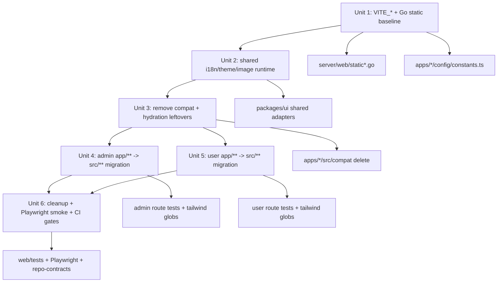

# refactor: web 前端彻底 Vite 化

## Overview

这份计划把 `web/` 收敛为真正的纯 Vite 前端工作区：删除 Next 运行时、兼容层和目录语义，统一使用 React Router、`VITE_*` 运行时注入，以及 Go 嵌入的 `dist` 静态产物。

它是面向整个 `web/` 的统一实施计划，取代此前分别针对单端迁移的 `docs/plans/2026-04-08-006-refactor-admin-next-to-vite-migration-plan.md` 和 `docs/plans/2026-04-08-007-refactor-user-next-to-vite-migration-plan.md`。那两份文档记录了当时的 app-local、compat-first 过渡思路，后续实现应以本计划和 origin spec 为准。

## Problem Frame

当前仓库已经以 Vite 作为实际入口，但源码、依赖、测试和静态托管链仍保留明显的 Next 语义：

- `web/apps/admin/app/**` 与 `web/apps/user/app/**` 仍是主要页面源
- `web/apps/*/src/compat/**` 继续为 `next/link`、`next/navigation`、`next/image`、`next-intl` 提供过渡别名
- `web/apps/admin/components/providers.tsx` 与 `web/apps/user/components/providers.tsx` 仍带有 `next-themes`、`ReactQueryStreamedHydration` 等 Next / hydration 残留
- `web/apps/*/config/constants.ts`、`server/web/static.go`、`server/web/static_test.go` 仍使用 `NEXT_PUBLIC_*` 与 `_next` 语义
- `web/packages/ui/tailwind.config.ts` 仍主要扫描 `app/**` 与 `components/**`

这使得仓库处于“Vite 负责启动，Next 继续主导实现细节”的半迁移状态。根据 origin spec（见 `docs/superpowers/specs/2026-04-08-web-vite-only-design.md`），这轮工作要把这种混合状态彻底收口，但不改变外部 URL、Go 嵌入发布方式和后端 API 合同。

## Requirements Trace

- R1. `web/` 内不再依赖 `next`、`next-intl`、`next-themes`、`@tanstack/react-query-next-experimental` 等 Next 运行时能力。
- R2. `web/apps/admin` 与 `web/apps/user` 继续由 Vite 构建出 `dist`，并维持 `server/web/admin-dist`、`server/web/user-dist` 的嵌入发布链。
- R3. 前端公开环境变量与 Go 注入统一从 `NEXT_PUBLIC_*` 迁移到 `VITE_*`，同时保持 admin runtime path、API base URL、默认 locale 行为稳定。
- R4. 目标运行时明确为纯客户端 SPA，不保留 hydration / SSR 兼容层。
- R5. i18n、theme、图片等通用浏览器基础设施优先收敛到共享层，避免 `admin` / `user` 各自复制一套。
- R6. `app/ -> src/` 页面迁移后，既有路由图、路由级懒加载和 Tailwind 样式产出不能回退。
- R7. 回归保护必须覆盖 `bun:test`、`go test`、最小 Playwright smoke 与现有 CI gate，而不是只靠手工验证。

## Scope Boundaries

- 不修改后端 API 合同或响应格式。
- 不改变管理端 `/admin/*`、自定义 admin path、用户端现有公开 URL 结构。
- 不在本轮重做 UI 设计、信息架构或业务逻辑。
- 不把这次迁移扩展成新的 SSR、RSC、SEO 或内容站优化项目。
- 不再继续沿用 app-local compat-first 作为最终状态；compat 只允许作为过渡实现，不允许成为迁移后落地形态。

## Context & Research

### Relevant Code and Patterns

- `web/apps/admin/src/router.tsx`、`web/apps/admin/src/routes.tsx`：现有 admin Vite + React Router 主链与懒加载模式。
- `web/apps/user/src/router.tsx`、`web/apps/user/src/routes.tsx`：现有 user Vite + React Router 主链与懒加载模式。
- `web/apps/admin/config/constants.ts`、`web/apps/user/config/constants.ts`：当前 `window.__ENV` / `process.env` 双读取入口。
- `web/apps/admin/components/providers.tsx`、`web/apps/user/components/providers.tsx`：当前 query/theme/hydration provider 形态。
- `web/apps/admin/src/compat/next-intl.tsx`、`web/apps/user/src/compat/next-intl.tsx`：现有 locale runtime 事件与薄兼容心智。
- `web/apps/admin/utils/common.ts`、`web/apps/user/utils/common.ts`：locale 持久化、授权与重定向逻辑。
- `web/tests/admin-path.test.ts`、`web/tests/admin-routes.test.ts`、`web/tests/user-routes.test.ts`：现有路由与 admin path 合同测试模式。
- `web/tests/admin-build-chain.test.ts`、`web/tests/user-build-chain.test.ts`：现有构建链断言入口。
- `server/web/static.go`、`server/web/static_test.go`、`server/web/static_routing_test.go`：当前嵌入静态资源注入、fallback、缓存和 admin path 重写模式。
- `web/packages/ui/tailwind.config.ts`、`web/packages/ui/src/components/sonner.tsx`：共享样式扫描和主题联动现状。

### Institutional Learnings

- 当前未发现可直接复用的 `docs/solutions/` 记录；本计划以仓库现有实现和审过的 origin spec 为主要依据。

### External References

- 无。当前仓库在 Vite、React Router、Go embed、Bun test 这些层面已有足够直接的本地模式，外部资料不会显著提高这份计划的质量。

## System-Wide Impact

- 终端用户：管理端与用户端的 URL、刷新、主题、语言切换、静态资源加载必须保持稳定。
- 开发者：环境变量命名、共享前端运行时、测试入口和依赖清单会变化，需要新的默认心智。
- 运维与发布：`make embed`、根 `Dockerfile`、`server/web/*-dist`、`.github/workflows/repo-contracts.yml` 会成为迁移回归的核心 gate。

## Key Technical Decisions

- 使用一份统一计划推进整个 `web/`，而不是继续维护 admin/user 两份迁移计划。
  - 原因：env、共享 runtime、Go 静态层、测试与 CI 都是跨 app 的；拆成两份会把关键决策打散。

- 将共享运行时能力落在 `web/packages/ui`，而不是新建 `packages/runtime` 一类新包。
  - 原因：`@workspace/ui` 已经承载共享 hooks、`sonner`、Tailwind 和浏览器侧通用能力，是最小增量的共享落点。

- i18n 底座选用 `i18next` + `react-i18next`，对外保留薄适配接口。
  - 原因：它能直接复用 JSON 资源、支持 provider/hook 组合，也最容易映射当前 `useTranslations` / `useLocale` 心智。

- theme 采用共享浏览器适配层，替换 `next-themes`，并同步改造 `web/packages/ui/src/components/sonner.tsx`。
  - 原因：当前主题使用面主要集中在 DOM class 和 toast，没必要再保留 Next 依赖。

- admin 静态资源继续以 `/admin/` 作为编译期基准，由 Go 在返回 HTML 时重写绝对链接到运行时 admin path。
  - 原因：这兼容了当前 `/manage` 等运行时路径需求，又不需要重做一套新的资产寻址机制。

- 最小浏览器 smoke 使用 Playwright，并接入现有 `repo-contracts` workflow。
  - 原因：这次最脆弱的回归面是实际浏览器里的路径、刷新、静态资源请求和 basename；浏览器级验证是最便宜且最可靠的护栏。

## Open Questions

### Resolved During Planning

- 是否继续沿用旧的 `006/007` 分拆计划：
  - 结论：否，统一为一份跨 app 计划，旧计划只作历史参考。

- 浏览器 smoke 用什么实现：
  - 结论：引入最小 Playwright，只覆盖 `/admin`、自定义 admin path 刷新、`/auth`、`/dashboard` 这四条关键路径。

- 共享 i18n/theme 适配层放在哪里：
  - 结论：放到 `web/packages/ui`，应用内只保留 locale 资源装配与业务特定 glue。

- admin 资产路径策略采用哪一种：
  - 结论：保留 `/admin/` 编译期基准，由 Go 重写 HTML 中的绝对资源链接。

### Deferred to Implementation

- `app/**` 中每个页面最终落在 `src/pages/**`、`src/features/**` 还是 `src/layouts/**` 的精确位置。
  - 原因：这取决于实际模块边界和迁移噪音，需要在保持最小 diff 的前提下逐步落位。

- Playwright smoke 在 CI 中通过启动 canonical image 还是通过本地进程启动服务。
  - 原因：计划要求它接入现有 workflow gate，但最终以哪种进程编排方式接入，可以在实现时根据 CI 易用性选择最小方案。

## High-Level Technical Design

> *这部分用于说明整体方案形状，是给评审看的方向性设计，不是实现代码模板。*

## Risk Analysis & Mitigation

- 静默样式回退：
  - 通过把 Tailwind content globs 更新纳入迁移单元、构建断言和验收标准，避免 `src/**` 页面没有被扫描。

- admin 自定义路径下的资产 404：
  - 通过固定 `/admin/` 编译基准 + HTML 重写策略，并把 JS/CSS 请求成功纳入 smoke。

- user SPA fallback 吞掉 API 404：
  - 在 Unit 1 先锁住 `server/web/static_routing_test.go` 的边界，再进入高噪音的前端迁移。

- locale / theme 替换后无报错但用户感知异常：
  - 把行为测试写在 runtime 迁移单元里，而不是迁完后再补。

- 目录迁移把大量页面卷入首屏：
  - 先加固路由测试，再迁页面；保留 `lazy()` 入口，并把构建断言写进回归测试。

## Implementation Units

- [ ] **Unit 1: 建立 `VITE_*` 与 Go 静态托管新基线**

**Goal:** 先把环境变量、静态资源注入、admin runtime path 和 user fallback 边界固定到纯 Vite 语义，为后续高噪音迁移提供稳定地基。

**Requirements:** R2, R3, R7

**Dependencies:** None

**Files:**
- Modify: `web/apps/admin/config/constants.ts`
- Modify: `web/apps/user/config/constants.ts`
- Modify: `web/apps/admin/vite.config.ts`
- Modify: `web/apps/user/vite.config.ts`
- Modify: `server/cmd/server_service.go`
- Modify: `server/web/static.go`
- Modify: `server/web/static_test.go`
- Modify: `server/web/static_routing_test.go`
- Modify: `web/tests/api-base.test.ts`
- Modify: `web/tests/client-baseurl.test.ts`
- Modify: `web/tests/admin-path.test.ts`

**Approach:**
- 统一 `window.__ENV.VITE_*` 优先、`import.meta.env.VITE_*` 兜底的读取顺序。
- 删除 `vite.config.ts` 中对 `process.env.NEXT_PUBLIC_*` 的显式暴露，改为 `VITE_*` 集合。
- 将 `server/cmd/server_service.go` 生成的前端 env map 同步改为 `VITE_*`。
- 在 `server/web/static.go` 中移除 `_next` 特判，改为只认 Vite `assets/` 与哈希文件缓存规则。
- 保留 admin `/admin/` 编译基准和运行时 HTML 重写策略，先锁住 `/manage` 等自定义路径不回退。
- 同步修正现有 Go/Bun 测试，使 user API 404 / HTML fallback 边界也在本单元被保护。

**Execution note:** 先扩展并修正现有测试，再改实现；这一单元的核心价值是把回归面锁住。

**Patterns to follow:**
- `web/apps/admin/config/constants.ts`
- `web/apps/user/config/constants.ts`
- `server/web/static.go`
- `web/tests/admin-path.test.ts`

**Test scenarios:**
- `window.__ENV` 注入脚本包含 `VITE_API_URL`、`VITE_SITE_URL` 等新键名，且不再包含 `NEXT_PUBLIC_*`。
- admin `toAdminPath()`、`canonicalizeAdminBrowserPath()` 和默认 redirect 在 `VITE_ADMIN_PATH=/manage` 下仍返回正确结果。
- user `/api/*`、`/v1/*` 请求仍返回 API 404，而不是被 SPA fallback 吞掉。
- user `/auth`、`/dashboard`、未知页面仍能按现有规则返回 HTML 页面或 index fallback。
- `shouldUseImmutableAssetCache()` 对 `assets/*.js`、`assets/*.css`、哈希资源返回 immutable，对 HTML 和普通图片不误判。
- user 前端注入内容不包含 admin 凭据类 env。

**Verification:**
- 现有 Go/Bun 合同测试已经全部切到 `VITE_*`，并能证明 admin path、user fallback、immutable cache 规则在不依赖 Next 语义时仍成立。

- [ ] **Unit 2: 用共享运行时替换 i18n、theme 和图片底座**

**Goal:** 把 locale、theme、图片这些浏览器运行时能力收敛到共享层，先去掉 `next-intl` / `next-themes` 的根依赖，再给 app 迁移提供稳定接口。

**Requirements:** R1, R4, R5, R7

**Dependencies:** Unit 1

**Files:**
- Modify: `web/packages/ui/package.json`
- Create: `web/packages/ui/src/lib/i18n/index.tsx`
- Create: `web/packages/ui/src/lib/i18n/runtime.ts`
- Create: `web/packages/ui/src/lib/theme/index.tsx`
- Create: `web/packages/ui/src/components/app-image.tsx`
- Modify: `web/packages/ui/src/components/sonner.tsx`
- Modify: `web/apps/admin/locales/client.ts`
- Modify: `web/apps/admin/locales/utils.ts`
- Modify: `web/apps/admin/utils/common.ts`
- Modify: `web/apps/admin/components/providers.tsx`
- Modify: `web/apps/user/locales/client.ts`
- Modify: `web/apps/user/locales/utils.ts`
- Modify: `web/apps/user/utils/common.ts`
- Modify: `web/apps/user/components/providers.tsx`
- Modify: `web/apps/user/components/language-switch.tsx`
- Modify: `web/tests/admin-locale-runtime.test.ts`
- Modify: `web/tests/user-locale-runtime.test.ts`
- Create: `web/tests/theme-runtime.test.ts`

**Approach:**
- 在 `@workspace/ui` 中新增共享 i18n provider / hook / runtime adapter，并以 `i18next` + `react-i18next` 为底座。
- 保留当前应用层 `locales/**` JSON 和 `getLocale()` / `setLocale()` 心智，只把底层事件分发、provider 和翻译 hook 收口到共享接口。
- 用共享 theme provider 替换 `next-themes`，只保留浏览器侧职责：持久化、系统主题跟随、`document.documentElement` class 同步。
- 将 `web/packages/ui/src/components/sonner.tsx` 改为依赖共享 theme context，而不是 `next-themes`。
- 对图片统一改成原生 `img` 或共享 `AppImage`，但只提供轻量行为，不重建 Next Image 的 API。

**Patterns to follow:**
- `web/apps/admin/src/compat/next-intl.tsx`
- `web/apps/user/src/compat/next-intl.tsx`
- `web/apps/admin/locales/client.ts`
- `web/apps/user/locales/client.ts`
- `web/packages/ui/src/components/sonner.tsx`

**Test scenarios:**
- admin `setLocale("zh-CN")` 后，locale 读取结果、运行时事件与持久化状态同步更新。
- user `setLocale("zh-CN")` 后，locale 读取结果、运行时事件与持久化状态同步更新。
- theme provider 切换 `light` / `dark` / `system` 时，`document.documentElement` class 与共享 `useTheme()` 返回值同步变化。
- `sonner` 渲染的 toast 主题跟随共享 theme 上下文变化，而不是固定在初始主题。
- 共享 i18n / theme 代码只存在一套，admin / user 只保留资源装配或业务 glue。

**Verification:**
- admin 和 user 的 locale/theme 行为测试都能在不依赖 `next-intl` / `next-themes` 的情况下通过，且共享层成为唯一运行时底座。

- [ ] **Unit 3: 清理 compat 层并固定纯客户端 SPA 运行时**

**Goal:** 在仍可接受的源码噪音下先清掉 `next/*` alias、hydration 残留和 provider 中的 Next 运行时假设，让后续目录迁移只剩搬家，不再夹杂运行时替换。

**Requirements:** R1, R4, R5, R7

**Dependencies:** Unit 2

**Files:**
- Modify: `web/apps/admin/components/providers.tsx`
- Modify: `web/apps/user/components/providers.tsx`
- Modify: `web/apps/admin/src/router.tsx`
- Modify: `web/apps/user/src/router.tsx`
- Modify: `web/apps/admin/src/routes.tsx`
- Modify: `web/apps/user/src/routes.tsx`
- Modify: `web/apps/admin/app/**`
- Modify: `web/apps/user/app/**`
- Modify: `web/apps/admin/components/**`
- Modify: `web/apps/user/components/**`
- Delete: `web/apps/admin/src/compat/next-image.tsx`
- Delete: `web/apps/admin/src/compat/next-link.tsx`
- Delete: `web/apps/admin/src/compat/next-navigation.ts`
- Delete: `web/apps/admin/src/compat/next-intl.tsx`
- Delete: `web/apps/user/src/compat/next-image.tsx`
- Delete: `web/apps/user/src/compat/next-link.tsx`
- Delete: `web/apps/user/src/compat/next-navigation.ts`
- Delete: `web/apps/user/src/compat/next-intl.tsx`
- Modify: `web/tests/admin-routes.test.ts`
- Modify: `web/tests/user-routes.test.ts`

**Approach:**
- 先在仍位于 `app/**`、`components/**` 的源码中完成 `next/link`、`next/navigation`、`next/image`、`next-intl` import 替换。
- 将 admin/user providers 明确收敛为纯客户端初始化壳，删除 `ReactQueryStreamedHydration` 和 `next-themes` 使用。
- 让 `src/routes.tsx` 继续作为唯一正式路由图，但不再通过 compat alias 懒加载旧页面。
- 先让“无需 compat alias 也能构建”成立，再删除 `src/compat/**`。

**Execution note:** 这是一个典型的 characterization-first 单元；先保住路由图和启动方式，再删 alias。

**Patterns to follow:**
- `web/apps/admin/src/router.tsx`
- `web/apps/user/src/router.tsx`
- `web/apps/admin/src/routes.tsx`
- `web/apps/user/src/routes.tsx`

**Test scenarios:**
- admin 和 user 的 route config 仍覆盖现有页面入口，不因 import 替换而丢失路径。
- provider 启动后不再依赖 hydration 组件，仍能初始化 query client、全局配置和登录态。
- 源码不再出现 `next/*` import，删除 compat alias 后仍可完成类型检查与构建。
- 最小路由 smoke 所需的 `/admin`、`/auth`、`/dashboard` 页面在纯客户端启动链下可渲染。

**Verification:**
- 两端源码在目录尚未完全迁移前，已经不再依赖 `src/compat/**` 或任何 `next/*` alias 才能运行和构建。

- [ ] **Unit 4: 先加固 admin 路由测试，再迁移 admin 页面源到 `src/**`**

**Goal:** 把 admin 的正式页面源从 `app/**` 搬到 `src/**`，同时保持 runtime admin path、路由级懒加载和样式产出不回退。

**Requirements:** R2, R6, R7

**Dependencies:** Unit 3

**Files:**
- Modify: `web/tests/admin-routes.test.ts`
- Modify: `web/tests/admin-build-chain.test.ts`
- Modify: `web/packages/ui/tailwind.config.ts`
- Modify: `web/apps/admin/tailwind.config.ts`
- Create: `web/apps/admin/src/pages/**`
- Create: `web/apps/admin/src/layouts/**`
- Create: `web/apps/admin/src/features/**`
- Modify: `web/apps/admin/src/routes.tsx`
- Modify: `web/apps/admin/src/app-shell.tsx`
- Modify: `web/apps/admin/utils/admin-path.ts`
- Move/Modify: `web/apps/admin/app/**` -> `web/apps/admin/src/**`
- Delete: `web/apps/admin/app/**`

**Approach:**
- 先扩展 `admin-routes` 测试，把当前预期路由图锁死，再迁页面文件。
- 迁移时优先保持现有业务边界与命名，不把业务组件强行拆碎到新目录。
- 保留 `lazy()` 入口，但把懒加载目标改成 `src/pages/**` 的正式页面模块。
- 同步更新 `web/packages/ui/tailwind.config.ts`，确保新落点的类名继续被扫描。
- 用 `admin-build-chain` 测试锁住“只认 Vite 输出”“Tailwind 扫描新目录”“不再存在 admin app 源目录”的合同。

**Execution note:** 先写/扩 route coverage，再开始物理迁移文件。

**Patterns to follow:**
- `web/apps/admin/src/routes.tsx`
- `web/tests/admin-routes.test.ts`
- `web/tests/admin-build-chain.test.ts`

**Test scenarios:**
- admin 既有 dashboard 子路由、日志路由和工作台入口在迁移前后保持一致。
- admin 页面仍通过 `lazy()` 从 `src/pages/**` 加载，而不是被静态导入到首屏。
- 自定义 admin path 下的内部导航和 refresh 仍正确指向 runtime path。
- 迁移后的 `src/pages/**`、`src/features/**` 类名能在构建结果中生成样式。
- 删除 `web/apps/admin/app/**` 后，构建链测试能明确证明 admin 只剩 Vite 页面源。

**Verification:**
- admin 页面源码已完全移入 `src/**`，路由和样式合同测试都通过，且不存在首屏包被整体卷大的明显回退。

- [ ] **Unit 5: 先加固 user 路由测试，再迁移 user 页面源到 `src/**`**

**Goal:** 把 user 的正式页面源从 `app/**` 搬到 `src/**`，保持公开路由、动态平台参数页、文档页和用户面板行为稳定。

**Requirements:** R2, R6, R7

**Dependencies:** Unit 3

**Files:**
- Modify: `web/tests/user-routes.test.ts`
- Modify: `web/tests/user-build-chain.test.ts`
- Modify: `web/tests/user-document-page.test.ts`
- Modify: `web/packages/ui/tailwind.config.ts`
- Modify: `web/apps/user/tailwind.config.ts`
- Create: `web/apps/user/src/pages/**`
- Create: `web/apps/user/src/layouts/**`
- Create: `web/apps/user/src/features/**`
- Modify: `web/apps/user/src/routes.tsx`
- Modify: `web/apps/user/src/app-shell.tsx`
- Move/Modify: `web/apps/user/app/**` -> `web/apps/user/src/**`
- Delete: `web/apps/user/app/**`

**Approach:**
- 先锁住 user 路由图，尤其是 `/`、`/auth`、`/purchasing`、`/dashboard`、`/bind/:platform`、`/oauth/:platform`。
- 保留现有 main/dashboard layout 关系，但从 `src/layouts/**` 暴露，而不再依赖 App Router 目录语义。
- 维持公开入口和用户面板的懒加载方式，避免首页或 dashboard 成为单个大包。
- 用 `user-document-page` 继续保护“文档页不依赖 bundled tutorials”这一已存在行为。

**Execution note:** 和 admin 一样，先强化路由 coverage，再做目录级移动。

**Patterns to follow:**
- `web/apps/user/src/routes.tsx`
- `web/tests/user-routes.test.ts`
- `web/tests/user-build-chain.test.ts`
- `web/tests/user-document-page.test.ts`

**Test scenarios:**
- `/`、`/auth`、`/privacy-policy`、`/tos`、`/purchasing`、`/dashboard`、`/bind/:platform`、`/oauth/:platform` 在迁移后仍存在。
- user dashboard 相关页面仍通过 `lazy()` 加载，不被首屏静态打包。
- 新 `src/**` 页面和布局中的样式类名仍能产出。
- 文档页继续只展示后台管理的文档来源，不因目录迁移重新依赖打包内教程。
- 删除 `web/apps/user/app/**` 后，构建链测试能明确证明 user 只剩 Vite 页面源。

**Verification:**
- user 页面源码已完全移入 `src/**`，公开路由、用户面板和文档页合同都被测试锁住，且没有回到 Next 目录语义。

- [ ] **Unit 6: 清理依赖与构建残留，接入 Playwright smoke 和持续回归 gate**

**Goal:** 完成最终收口：删除剩余 Next 依赖和配置，建立能长期阻止回归的 Bun / Go / Playwright / CI 组合护栏。

**Requirements:** R1, R2, R4, R7

**Dependencies:** Unit 4, Unit 5

**Files:**
- Modify: `web/package.json`
- Modify: `package.json`
- Modify: `web/apps/admin/package.json`
- Modify: `web/apps/user/package.json`
- Modify: `web/packages/ui/package.json`
- Delete: `web/packages/typescript-config/nextjs.json`
- Modify: `web/apps/admin/tsconfig.json`
- Modify: `web/apps/user/tsconfig.json`
- Modify: `web/turbo.json`
- Modify: `Makefile`
- Modify: `Dockerfile`
- Create: `web/playwright.config.ts`
- Create: `web/tests/smoke/admin-user-smoke.spec.ts`
- Modify: `.github/workflows/repo-contracts.yml`
- Modify: `web/tests/admin-build-chain.test.ts`
- Modify: `web/tests/user-build-chain.test.ts`
- Modify: `README.md`
- Modify: `web/apps/admin/README.md`
- Modify: `web/apps/user/README.md`

**Approach:**
- 从 app/package/ui/workspace 依赖中删除所有 Next 运行时包和 Next 专用配置文件。
- 确认 `web/apps/admin/next.config.ts`、`web/apps/admin/next-env.d.ts`、`web/apps/user/next.config.ts`、`web/apps/user/next-env.d.ts` 继续保持不存在，并把相关断言保留在构建链测试里。
- 更新 build-chain 测试，让它们只承认 Vite 输出、`src/**` 页面源、Tailwind 新扫描边界和 `VITE_*` 语义。
- 在 `web/` 根层引入最小 Playwright 配置，只覆盖四条关键 smoke：
  - `/admin`
  - 自定义 admin path 刷新
  - `/auth`
  - `/dashboard`
- 将 Playwright smoke 接入现有 `repo-contracts` workflow，使 canonical image / embed 链与浏览器级路径验证一起成为持续 gate。
- 把“持续回归监控”限定为最小但持久的合同集合：build-chain、静态缓存规则、关键浏览器 smoke，而不是一次性人工 benchmark。

**Patterns to follow:**
- `web/tests/admin-build-chain.test.ts`
- `web/tests/user-build-chain.test.ts`
- `.github/workflows/repo-contracts.yml`
- `Dockerfile`

**Test scenarios:**
- package manifests、tsconfig 和 turbo 输出中不再出现 `next`、`.next`、`out`、`next-env.d.ts`、Next TypeScript plugin。
- `admin-build-chain` 与 `user-build-chain` 断言只认 Vite `dist`、`src/**` 页面源、`VITE_*` env 和 Tailwind 新扫描边界。
- Playwright 在浏览器中验证 `/admin` 可打开、自定义 admin path 刷新后仍可打开、`/auth` 和 `/dashboard` 首屏可达。
- admin 自定义路径下至少一个 JS 和一个 CSS 资源请求成功，且 HTML 中没有泄露 `/admin/assets/` 绝对路径。
- CI workflow 真正运行 Bun / Go / Playwright 回归护栏，而不是只构建镜像不验证页面。

**Verification:**
- 仓库中已无 Next 运行时或配置残留；关键回归断言被 Bun、Go 和 Playwright 自动化覆盖，并进入现有 CI gate 持续执行。

## Success Metrics

- `web/` 内不再存在 Next 运行时依赖、compat 目录和 `app/**` 页面源目录。
- `make embed` 与根 `Dockerfile` 继续产出可用的嵌入式 admin/user 前端。
- admin runtime path、自定义刷新、user `/auth` 与 `/dashboard` 的最小浏览器 smoke 稳定通过。
- 路由级懒加载、Tailwind 样式扫描和 immutable asset cache 合同都有自动化护栏。

## Documentation Plan

- 更新根 `README.md` 中关于前端构建、环境变量和合同验证的描述。
- 更新 `web/apps/admin/README.md` 与 `web/apps/user/README.md`，删除 Next 术语，统一为 Vite + React Router + Go embed 描述。
- 若实现过程中新增了稳定可复用的迁移经验，再补充到 `docs/solutions/`，但这不阻塞本计划落地。
