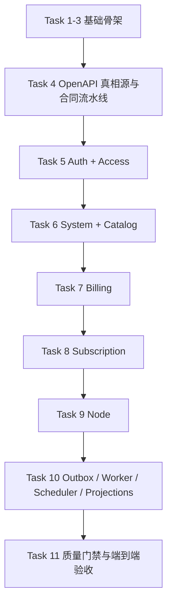

# Server-V2 Implementation Plan

> **For agentic workers:** REQUIRED SUB-SKILL: Use superpowers:subagent-driven-development (recommended) or superpowers:executing-plans to implement this plan task-by-task. Steps use checkbox (`- [ ]`) syntax for tracking.

**Goal:** 从零搭建一个可运行、可迁移、可导出 OpenAPI、可执行商业主链的 `server-v2`，覆盖目录规范、数据库规范、HTTP 规范和运行时规范定义的第一版能力。

**Architecture:** `server-v2` 采用单一 Go module、单一 `cmd/server` 入口、多角色运行模式。业务真相通过 PostgreSQL 持久化，HTTP 契约以 OpenAPI 3.1 单一真相源维护，事务内写不可替代事实并同步写入 `outbox_events`，worker 再异步重建 `entitlements`、`node_assignments`、`subscription_output_snapshots` 和缓存失效。

**Tech Stack:** Go 1.25、Cobra、Huma v2、Gin、GORM、PostgreSQL、Redis、Asynq、Redocly、`@hey-api/openapi-ts`、Testcontainers-Go

---

## Scope Check

这是一份单一子项目实施计划，不再拆成多个独立产品计划。  
虽然它覆盖目录、数据库、HTTP 和运行时 4 条规范，但它们都服务于同一个新项目：`server-v2`。拆成多份计划反而会让：

- 模块骨架
- 数据模型
- HTTP 合同
- 运行时工作流

失去同步推进的上下文。

这份计划因此采用**分阶段、按依赖顺序推进**的方式，而不是按文档种类拆分。

## 目录与责任锁定

### 核心目录

- `server-v2/go.mod`
  - 责任：定义独立 Go module 和依赖边界
- `server-v2/cmd/server/*.go`
  - 责任：唯一 CLI 入口和运行模式装配
- `server-v2/internal/app/{bootstrap,runtime,routing,wiring}/`
  - 责任：应用装配、角色启动、生命周期管理
- `server-v2/internal/platform/{config,db,http,observability,queue,cache,support}/`
  - 责任：基础设施实现
- `server-v2/internal/domains/{auth,access,catalog,billing,subscription,node,system}/`
  - 责任：领域模型、store、usecase、api、policy、jobs
- `server-v2/openapi/`
  - 责任：OpenAPI 3.1 真相源、Redocly bundle、客户端生成输入
- `server-v2/tests/{app,platform,domains,integration,contract,smoke,fixtures}/`
  - 责任：包外测试、集成测试、合同测试、冒烟测试
- `server-v2/docs/specs/`
  - 责任：设计规范，不在实现任务中随意漂移

### 关键文件约束

- `server-v2/cmd/server/main.go`
  - 只能委托到 root command，不承载业务逻辑
- `server-v2/internal/platform/http`
  - 只放通用 HTTP 原语和路由装配，不吞领域 DTO 语义
- `server-v2/internal/platform/db`
  - 只放数据库连接、事务和 migration/seed 执行基础，不写领域 store 语义
- `server-v2/internal/platform/queue`
  - 只放异步任务基础设施，不放业务重建规则
- `server-v2/internal/domains/*/jobs`
  - 只放该领域自己的任务 payload、消费者编排和重建规则

## 实施策略



推进顺序不能反。原因是：

- 没有 CLI、配置、数据库和 OpenAPI 骨架，后面的领域实现都会漂
- 没有 `auth/access`，`user/admin/node` 三个有状态调用面无法成立
- 没有 `billing`，就不能正确驱动 `subscription`
- 没有 `subscription` 和 `node`，就无法落 `outbox` 驱动的投影链

## 全局验证矩阵

每个任务完成后至少执行：

```bash
cd /Users/admin/Codes/ProxyCode/perfect-panel/server-v2
go test ./...
```

涉及 OpenAPI 的任务额外执行：

```bash
cd /Users/admin/Codes/ProxyCode/perfect-panel/server-v2
make contract
```

涉及 PostgreSQL 的任务额外执行：

```bash
cd /Users/admin/Codes/ProxyCode/perfect-panel/server-v2
go test ./tests/integration/... -count=1
```

端到端验收阶段执行：

```bash
cd /Users/admin/Codes/ProxyCode/perfect-panel/server-v2
go test ./... -count=1
go test ./... -race
```

## Task 1: 建立 Go Module 与 CLI 骨架

**Files:**
- Create: `server-v2/go.mod`
- Create: `server-v2/cmd/server/main.go`
- Create: `server-v2/cmd/server/root.go`
- Create: `server-v2/cmd/server/serve_api.go`
- Create: `server-v2/cmd/server/serve_worker.go`
- Create: `server-v2/cmd/server/serve_scheduler.go`
- Create: `server-v2/cmd/server/migrate.go`
- Create: `server-v2/cmd/server/seed_required.go`
- Create: `server-v2/cmd/server/seed_demo.go`
- Create: `server-v2/internal/app/runtime/modes.go`
- Test: `server-v2/tests/smoke/cli_bootstrap_test.go`

- [ ] **Step 1: 写 CLI 骨架冒烟测试**

```go
package smoke_test

import (
	"os"
	"os/exec"
	"path/filepath"
	"testing"
)

func TestCliBootstrapFilesExist(t *testing.T) {
	targets := []string{
		filepath.Join("..", "..", "cmd", "server", "main.go"),
		filepath.Join("..", "..", "cmd", "server", "root.go"),
		filepath.Join("..", "..", "internal", "app", "runtime", "modes.go"),
	}
	for _, target := range targets {
		if _, err := os.Stat(target); err != nil {
			t.Fatalf("expected %s to exist: %v", target, err)
		}
	}
}

func TestCliHelpBoots(t *testing.T) {
	cmd := exec.Command("go", "run", "./cmd/server", "--help")
	cmd.Dir = filepath.Join("..", "..")
	if out, err := cmd.CombinedOutput(); err != nil {
		t.Fatalf("expected help command to succeed, got %v, output=%s", err, string(out))
	}
}
```

- [ ] **Step 2: 运行测试并确认先失败**

Run: `cd /Users/admin/Codes/ProxyCode/perfect-panel/server-v2 && go test ./tests/smoke -run 'TestCliBootstrapFilesExist|TestCliHelpBoots' -count=1`  
Expected: FAIL，提示缺少 `go.mod`、`cmd/server/main.go` 或 `internal/app/runtime/modes.go`

- [ ] **Step 3: 创建 module 和 CLI 最小骨架**

```go
// server-v2/go.mod
module github.com/perfect-panel/server-v2

go 1.25.0

require github.com/spf13/cobra v1.10.2
```

```go
// server-v2/cmd/server/main.go
package main

func main() {
	Execute()
}
```

```go
// server-v2/cmd/server/root.go
package main

import "github.com/spf13/cobra"

func Execute() {
	root := &cobra.Command{
		Use: "server",
	}
	root.AddCommand(newServeAPICommand())
	root.AddCommand(newServeWorkerCommand())
	root.AddCommand(newServeSchedulerCommand())
	root.AddCommand(newMigrateCommand())
	root.AddCommand(newSeedRequiredCommand())
	root.AddCommand(newSeedDemoCommand())
	_ = root.Execute()
}
```

- [ ] **Step 4: 补齐运行模式桩实现并回跑测试**

```go
// server-v2/internal/app/runtime/modes.go
package runtime

type Mode string

const (
	ModeServeAPI       Mode = "serve-api"
	ModeServeWorker    Mode = "serve-worker"
	ModeServeScheduler Mode = "serve-scheduler"
	ModeMigrate        Mode = "migrate"
	ModeSeedRequired   Mode = "seed-required"
	ModeSeedDemo       Mode = "seed-demo"
)
```

Run: `cd /Users/admin/Codes/ProxyCode/perfect-panel/server-v2 && go test ./tests/smoke -run 'TestCliBootstrapFilesExist|TestCliHelpBoots' -count=1`  
Expected: PASS

- [ ] **Step 5: 提交 CLI 骨架检查点**

```bash
git add server-v2/go.mod server-v2/cmd/server server-v2/internal/app/runtime server-v2/tests/smoke/cli_bootstrap_test.go
git commit -m "feat(server-v2): scaffold module and cli skeleton"
```

## Task 2: 建立测试支架、配置、装配、日志与健康检查基础

**Files:**
- Create: `server-v2/tests/support/{db.go,services.go,runtime.go,e2e.go,fixtures.go}`
- Create: `server-v2/internal/platform/config/config.go`
- Create: `server-v2/internal/platform/config/load.go`
- Create: `server-v2/internal/platform/observability/logger.go`
- Create: `server-v2/internal/app/wiring/container.go`
- Create: `server-v2/internal/app/bootstrap/bootstrap.go`
- Create: `server-v2/internal/platform/http/health/handler.go`
- Test: `server-v2/tests/app/bootstrap/config_precedence_test.go`
- Test: `server-v2/tests/smoke/health_handler_test.go`

- [ ] **Step 1: 写配置优先级测试**

```go
package bootstrap_test

import (
	"testing"

	"github.com/perfect-panel/server-v2/internal/platform/config"
)

func TestLoadPrefersCLIOverEnvAndFile(t *testing.T) {
	cfg, err := config.Load(config.LoadOptions{
		CLIValues:  map[string]string{"APP_NAME": "from-cli"},
		FileValues: map[string]string{"APP_NAME": "from-file"},
		EnvValues:  map[string]string{"APP_NAME": "from-env"},
	})
	if err != nil {
		t.Fatalf("load config: %v", err)
	}
	if cfg.AppName != "from-cli" {
		t.Fatalf("expected cli to win, got %q", cfg.AppName)
	}
}
```

- [ ] **Step 2: 运行测试并确认先失败**

Run: `cd /Users/admin/Codes/ProxyCode/perfect-panel/server-v2 && go test ./tests/app/bootstrap -run TestLoadPrefersCLIOverEnvAndFile -count=1`  
Expected: FAIL，提示 `internal/platform/config` 不存在或 `Load` 未定义

- [ ] **Step 3: 先落共享测试支架，再实现配置加载、容器和日志基础**

```go
// server-v2/internal/platform/config/config.go
package config

type Config struct {
	AppName string
	HTTP    HTTPConfig
	DB      DBConfig
	Redis   RedisConfig
}

type LoadOptions struct {
	CLIValues  map[string]string
	FileValues map[string]string
	EnvValues  map[string]string
}
```

```go
// server-v2/tests/support/services.go
package support

import "testing"

type Services struct{}

func NewAuthService(t *testing.T) *Services {
	t.Helper()
	return &Services{}
}
```

```go
// server-v2/internal/app/wiring/container.go
package wiring

import (
	"go.uber.org/zap"

	"github.com/perfect-panel/server-v2/internal/platform/config"
)

type Container struct {
	Config config.Config
	Logger *zap.Logger
}
```

```go
// server-v2/internal/platform/http/health/handler.go
package health

import "net/http"

func Handler(w http.ResponseWriter, _ *http.Request) {
	w.Header().Set("Content-Type", "application/json")
	w.WriteHeader(http.StatusOK)
	_, _ = w.Write([]byte(`{"data":{"status":"ok"},"meta":{}}`))
}
```

- [ ] **Step 4: 回跑配置与健康检查测试**

Run: `cd /Users/admin/Codes/ProxyCode/perfect-panel/server-v2 && go test ./tests/app/bootstrap ./tests/smoke -run 'TestLoadPrefersCLIOverEnvAndFile|TestHealthHandlerReturnsEnvelope' -count=1`  
Expected: PASS

- [ ] **Step 5: 提交装配基础检查点**

```bash
git add server-v2/tests/support server-v2/internal/platform/config server-v2/internal/platform/observability server-v2/internal/app/wiring server-v2/internal/app/bootstrap server-v2/internal/platform/http/health server-v2/tests/app/bootstrap server-v2/tests/smoke/health_handler_test.go
git commit -m "feat(server-v2): add config and bootstrap foundation"
```

## Task 3: 建立数据库运行基座、baseline migration 与 seed 链基础

**Files:**
- Create: `server-v2/internal/platform/db/connect.go`
- Create: `server-v2/internal/platform/db/transaction.go`
- Create: `server-v2/internal/platform/db/migrate.go`
- Create: `server-v2/internal/platform/db/schema_version.go`
- Create: `server-v2/internal/platform/db/seeds/required.go`
- Create: `server-v2/internal/platform/db/seeds/demo.go`
- Create: `server-v2/internal/platform/db/migrations/0001_baseline.sql`
- Modify: `server-v2/internal/app/bootstrap/bootstrap.go`
- Modify: `server-v2/cmd/server/migrate.go`
- Modify: `server-v2/cmd/server/seed_required.go`
- Modify: `server-v2/cmd/server/seed_demo.go`
- Test: `server-v2/tests/integration/db/migrate_baseline_test.go`
- Test: `server-v2/tests/integration/db/schema_gate_test.go`

- [ ] **Step 1: 写 baseline migration 集成测试**

```go
package db_test

import "testing"

func TestMigrateAppliesBaselineTables(t *testing.T) {
	db := openTestPostgres(t)
	runMigrate(t, db)
	assertTableExists(t, db, "users")
	assertTableExists(t, db, "roles")
	assertTableExists(t, db, "system_settings")
	assertTableExists(t, db, "outbox_events")
}

func TestServeFailsWhenSchemaVersionMismatches(t *testing.T) {
	env := openRuntimeEnv(t)
	writeSchemaRevision(t, env.DB, "0000_old")
	err := bootAPI(t, env)
	if err == nil {
		t.Fatalf("expected serve-api to fail when schema version mismatches")
	}
}
```

- [ ] **Step 2: 运行测试并确认先失败**

Run: `cd /Users/admin/Codes/ProxyCode/perfect-panel/server-v2 && go test ./tests/integration/db -run 'TestMigrateAppliesBaselineTables|TestServeFailsWhenSchemaVersionMismatches' -count=1`  
Expected: FAIL，提示数据库连接、migration runner 或 baseline SQL 缺失

- [ ] **Step 3: 实现数据库连接、事务包装和 baseline schema**

```go
// server-v2/internal/platform/db/connect.go
package db

import (
	"gorm.io/driver/postgres"
	"gorm.io/gorm"
)

func Open(dsn string) (*gorm.DB, error) {
	return gorm.Open(postgres.Open(dsn), &gorm.Config{})
}
```

```sql
-- server-v2/internal/platform/db/migrations/0001_baseline.sql
CREATE TABLE users (
    id uuid PRIMARY KEY,
    status text NOT NULL,
    created_at timestamptz NOT NULL,
    updated_at timestamptz NOT NULL
);

CREATE TABLE roles (
    id uuid PRIMARY KEY,
    code text NOT NULL UNIQUE,
    name text NOT NULL
);

CREATE TABLE system_settings (
    id uuid PRIMARY KEY,
    scope text NOT NULL,
    key text NOT NULL,
    value_json jsonb NOT NULL,
    updated_at timestamptz NOT NULL,
    UNIQUE (scope, key)
);

CREATE TABLE outbox_events (
    id uuid PRIMARY KEY,
    topic text NOT NULL,
    status text NOT NULL,
    aggregate_type text NOT NULL,
    aggregate_id uuid NOT NULL,
    payload jsonb NOT NULL,
    created_at timestamptz NOT NULL
);

CREATE TABLE schema_revisions (
    version text PRIMARY KEY,
    applied_at timestamptz NOT NULL
);
```

- [ ] **Step 4: 实现 migrate / required seed 命令并回跑测试**

```go
// server-v2/internal/platform/db/seeds/required.go
package seeds

func RequiredStatements() []string {
	return []string{
		`INSERT INTO roles (id, code, name) VALUES (gen_random_uuid(), 'admin', '管理员') ON CONFLICT (code) DO NOTHING`,
		`INSERT INTO roles (id, code, name) VALUES (gen_random_uuid(), 'user', '用户') ON CONFLICT (code) DO NOTHING`,
		`INSERT INTO system_settings (id, scope, key, value_json, updated_at) VALUES (gen_random_uuid(), 'site', 'app_name', '"server-v2"', now()) ON CONFLICT (scope, key) DO NOTHING`,
	}
}
```

这里的 `required seed` 先只负责 baseline 可用对象：

- 基础角色
- 必需系统配置初值
- 启动所需最小运行前置

`permissions`、`role_permissions`、认证默认项和后台能力种子会在 `Task 5` 随 `auth/access` 表落地后补齐，并继续复用同一个 `seed_required` 命令。

同时必须补上 schema version 门禁：

- `migrate` 成功后写入 `schema_revisions`
- `serve-api`、`serve-worker`、`serve-scheduler` 启动前检查目标版本
- 版本不满足时明确失败，不允许静默启动

Run: `cd /Users/admin/Codes/ProxyCode/perfect-panel/server-v2 && go test ./tests/integration/db -run 'TestMigrateAppliesBaselineTables|TestServeFailsWhenSchemaVersionMismatches' -count=1`  
Expected: PASS

- [ ] **Step 5: 提交数据库基座检查点**

```bash
git add server-v2/internal/platform/db server-v2/cmd/server/migrate.go server-v2/cmd/server/seed_required.go server-v2/cmd/server/seed_demo.go server-v2/tests/integration/db
git commit -m "feat(server-v2): add migration and seed foundation"
```

## Task 4: 建立 OpenAPI 真相源与合同流水线

**Files:**
- Create: `server-v2/Makefile`
- Create: `server-v2/openapi/openapi.yaml`
- Create: `server-v2/openapi/paths/public/sessions.yaml`
- Create: `server-v2/openapi/paths/public/verification_tokens.yaml`
- Create: `server-v2/openapi/paths/public/password_reset_requests.yaml`
- Create: `server-v2/openapi/paths/public/password_resets.yaml`
- Create: `server-v2/openapi/paths/user/me_sessions.yaml`
- Create: `server-v2/openapi/paths/admin/users.yaml`
- Create: `server-v2/openapi/paths/node/usage_reports.yaml`
- Create: `server-v2/openapi/components/parameters/{page.yaml,page_size.yaml,q.yaml,sort.yaml,order.yaml}`
- Create: `server-v2/openapi/components/schemas/common/problem.yaml`
- Create: `server-v2/openapi/components/schemas/common/validation_problem.yaml`
- Create: `server-v2/openapi/components/schemas/common/pagination_meta.yaml`
- Create: `server-v2/openapi/components/schemas/common/money.yaml`
- Create: `server-v2/openapi/components/headers/{idempotency_key.yaml,node_key_id.yaml,node_timestamp.yaml,node_nonce.yaml,node_signature.yaml}`
- Create: `server-v2/openapi/components/security/security.yaml`
- Create: `server-v2/openapi/redocly.yaml`
- Create: `server-v2/openapi/dist/.gitkeep`
- Create: `server-v2/openapi/generated/.gitkeep`
- Test: `server-v2/tests/contract/openapi_bundle_test.go`
- Test: `server-v2/tests/contract/openapi_operation_id_test.go`

- [ ] **Step 1: 写 OpenAPI bundle 合同测试**

```go
package contract_test

import (
	"os/exec"
	"path/filepath"
	"testing"
)

func TestContractPipelinePasses(t *testing.T) {
	cmd := exec.Command("make", "contract")
	cmd.Dir = filepath.Join("..", "..")
	if out, err := cmd.CombinedOutput(); err != nil {
		t.Fatalf("contract pipeline failed: %v, output=%s", err, string(out))
	}
}
```

- [ ] **Step 2: 运行测试并确认先失败**

Run: `cd /Users/admin/Codes/ProxyCode/perfect-panel/server-v2 && go test ./tests/contract -run 'TestContractPipelinePasses|TestOperationIDsAreExplicit' -count=1`  
Expected: FAIL，提示 `Makefile`、`openapi/openapi.yaml` 或相关 `$ref` 文件不存在

- [ ] **Step 3: 创建 OpenAPI 3.1 源码组织与公共组件**

```yaml
# server-v2/openapi/openapi.yaml
openapi: 3.1.0
info:
  title: Server-V2 API
  version: v1
paths:
  /api/v1/public/sessions:
    $ref: ./paths/public/sessions.yaml
  /api/v1/public/verification-tokens:
    $ref: ./paths/public/verification_tokens.yaml
  /api/v1/public/password-reset-requests:
    $ref: ./paths/public/password_reset_requests.yaml
  /api/v1/public/password-resets:
    $ref: ./paths/public/password_resets.yaml
  /api/v1/user/me/sessions:
    $ref: ./paths/user/me_sessions.yaml
components:
  schemas:
    Problem:
      $ref: ./components/schemas/common/problem.yaml
    ValidationProblem:
      $ref: ./components/schemas/common/validation_problem.yaml
    PaginationMeta:
      $ref: ./components/schemas/common/pagination_meta.yaml
    Money:
      $ref: ./components/schemas/common/money.yaml
  securitySchemes:
    sessionAuth:
      $ref: ./components/security/security.yaml#/sessionAuth
    nodeAuth:
      $ref: ./components/security/security.yaml#/nodeAuth
```

```yaml
# server-v2/openapi/components/security/security.yaml
sessionAuth:
  type: http
  scheme: bearer
nodeAuth:
  type: apiKey
  in: header
  name: X-Node-Key-Id
```

`nodeAuth` 在实现上必须同时落地以下公共头与验签逻辑：

- `X-Node-Key-Id`
- `X-Node-Timestamp`
- `X-Node-Nonce`
- `X-Node-Signature`

所有 operation 在这一阶段就必须显式写出：

- 全局唯一 `operationId`
- 操作级成功响应 schema 名
- 统一分页与校验错误公共组件引用

```makefile
# server-v2/Makefile
contract:
	bunx @redocly/cli lint --config openapi/redocly.yaml openapi/openapi.yaml
	bunx @redocly/cli bundle --config openapi/redocly.yaml openapi/openapi.yaml -o openapi/dist/openapi.json
	bunx @hey-api/openapi-ts -i openapi/dist/openapi.json -o openapi/generated/ts

generate-openapi: contract
```

- [ ] **Step 4: 运行 Redocly lint、bundle 和 `openapi-ts` 生成**

Run: `cd /Users/admin/Codes/ProxyCode/perfect-panel/server-v2 && make contract`  
Expected: PASS，产出 `server-v2/openapi/dist/openapi.json` 和 `server-v2/openapi/generated/ts`

- [ ] **Step 5: 提交 OpenAPI 合同基座**

```bash
git add server-v2/Makefile server-v2/openapi server-v2/tests/contract/openapi_bundle_test.go
git commit -m "feat(server-v2): add openapi source and contract pipeline"
```

## Task 5: 实现 `auth` 与 `access` 主链

**Files:**
- Create: `server-v2/internal/domains/auth/model/{user.go,identity.go,session.go,verification_token.go,auth_event.go}`
- Create: `server-v2/internal/domains/auth/store/{user_store.go,session_store.go,verification_store.go,auth_event_store.go}`
- Create: `server-v2/internal/domains/auth/usecase/{sign_in.go,sign_out.go,issue_verification.go,request_password_reset.go,reset_password.go}`
- Create: `server-v2/internal/domains/auth/api/{public_sessions.go,user_sessions.go,verification_tokens.go,password_reset_requests.go,password_resets.go}`
- Create: `server-v2/internal/domains/access/model/{role.go,permission.go,user_role.go,role_permission.go}`
- Create: `server-v2/internal/domains/access/store/{role_store.go,permission_store.go}`
- Create: `server-v2/internal/domains/access/usecase/{assign_role.go,authorize_request.go,seed_permissions.go}`
- Create: `server-v2/internal/platform/http/middleware/{session_auth.go,access_guard.go}`
- Modify: `server-v2/internal/app/routing/public.go`
- Modify: `server-v2/internal/app/routing/user.go`
- Modify: `server-v2/internal/app/routing/admin.go`
- Modify: `server-v2/cmd/server/seed_required.go`
- Modify: `server-v2/internal/platform/db/seeds/required.go`
- Modify: `server-v2/internal/platform/db/migrations/0002_auth_access.sql`
- Modify: `server-v2/openapi/openapi.yaml`
- Modify: `server-v2/openapi/paths/public/sessions.yaml`
- Modify: `server-v2/openapi/paths/public/verification_tokens.yaml`
- Modify: `server-v2/openapi/paths/public/password_reset_requests.yaml`
- Modify: `server-v2/openapi/paths/public/password_resets.yaml`
- Modify: `server-v2/openapi/paths/user/me_sessions.yaml`
- Test: `server-v2/tests/domains/auth/usecase/sign_in_test.go`
- Test: `server-v2/tests/domains/auth/usecase/password_reset_test.go`
- Test: `server-v2/tests/contract/auth_api_contract_test.go`

- [ ] **Step 1: 写登录与会话测试**

```go
package usecase_test

import "testing"

func TestSignInCreatesSession(t *testing.T) {
	svc := newAuthService(t)
	session, err := svc.SignIn("alice@example.com", "secret")
	if err != nil {
		t.Fatalf("sign in: %v", err)
	}
	if session.ID == "" {
		t.Fatalf("expected session id to be populated")
	}
}

func TestResetPasswordConsumesVerificationTokenOnce(t *testing.T) {
	svc := newAuthService(t)
	token := issuePasswordResetToken(t, svc, "alice@example.com")
	if err := svc.ResetPassword(token, "new-secret"); err != nil {
		t.Fatalf("reset password: %v", err)
	}
	if err := svc.ResetPassword(token, "another-secret"); err == nil {
		t.Fatalf("expected second consumption to fail")
	}
}
```

- [ ] **Step 2: 运行测试并确认先失败**

Run: `cd /Users/admin/Codes/ProxyCode/perfect-panel/server-v2 && go test ./tests/domains/auth/usecase -run 'TestSignInCreatesSession|TestResetPasswordConsumesVerificationTokenOnce' -count=1`  
Expected: FAIL，提示 `newAuthService`、`SignIn`、密码重置或会话模型未定义

- [ ] **Step 3: 落 `auth` / `access` 领域模型和基础用例**

```go
// server-v2/internal/domains/auth/usecase/sign_in.go
package usecase

type SignInInput struct {
	Email    string
	Password string
	IP       string
}

type SignInOutput struct {
	SessionID string
	UserID    string
}
```

```go
// server-v2/internal/domains/auth/model/auth_event.go
package model

type AuthEvent struct {
	ID        string
	UserID    string
	EventType string
	IPAddress string
	CreatedAt string
}
```

```go
// server-v2/internal/platform/http/middleware/session_auth.go
package middleware

import "net/http"

func RequireSession(next http.Handler) http.Handler {
	return http.HandlerFunc(func(w http.ResponseWriter, r *http.Request) {
		token := r.Header.Get("Authorization")
		if token == "" || !isActiveSessionToken(token) {
			w.WriteHeader(http.StatusUnauthorized)
			return
		}
		next.ServeHTTP(w, r)
	})
}
```

```go
// server-v2/internal/platform/http/middleware/access_guard.go
package middleware

import "net/http"

func RequirePermissions(required ...string) func(http.Handler) http.Handler {
	return func(next http.Handler) http.Handler {
		return http.HandlerFunc(func(w http.ResponseWriter, r *http.Request) {
			if !requestHasPermissions(r.Context(), required...) {
				w.WriteHeader(http.StatusForbidden)
				return
			}
			next.ServeHTTP(w, r)
		})
	}
}
```

```sql
-- seed_required 在 auth/access 表落地后扩展
INSERT INTO permissions (id, code, name) VALUES
  (gen_random_uuid(), 'admin.users.read', '读取用户'),
  (gen_random_uuid(), 'admin.users.write', '修改用户')
ON CONFLICT (code) DO NOTHING;
```

同时必须把下面 3 条写成实现约束：

- `verification_tokens` 只存哈希，不存明文 token / code
- `ResetPassword` 与验证码消费必须是原子单次消费
- `admin` 路由在 `RequireSession` 之后必须继续经过 `RequirePermissions`

- [ ] **Step 4: 补接口路由、required seed 扩展、根 OpenAPI 入口引用和回跑测试**

Run: `cd /Users/admin/Codes/ProxyCode/perfect-panel/server-v2 && go test ./tests/domains/auth/usecase ./tests/contract -run 'TestSignInCreatesSession|TestResetPasswordConsumesVerificationTokenOnce|TestPublicSessionsContract|TestPasswordResetContract' -count=1`  
Expected: PASS

- [ ] **Step 5: 提交认证与权限基础**

```bash
git add server-v2/internal/domains/auth server-v2/internal/domains/access server-v2/internal/platform/http/middleware server-v2/internal/app/routing server-v2/internal/platform/db/migrations/0002_auth_access.sql server-v2/internal/platform/db/seeds/required.go server-v2/cmd/server/seed_required.go server-v2/openapi/openapi.yaml server-v2/openapi/paths/public/sessions.yaml server-v2/openapi/paths/public/verification_tokens.yaml server-v2/openapi/paths/public/password_reset_requests.yaml server-v2/openapi/paths/public/password_resets.yaml server-v2/openapi/paths/user/me_sessions.yaml server-v2/tests/domains/auth/usecase server-v2/tests/contract/auth_api_contract_test.go
git commit -m "feat(server-v2): implement auth and access foundation"
```

## Task 6: 实现 `system` 与 `catalog` 主链

**Files:**
- Create: `server-v2/internal/domains/system/model/{system_setting.go,admin_operation_log.go}`
- Create: `server-v2/internal/domains/system/store/{system_setting_store.go,admin_operation_log_store.go}`
- Create: `server-v2/internal/domains/system/usecase/{get_settings.go,update_settings.go,record_admin_operation.go}`
- Create: `server-v2/internal/domains/system/api/admin_settings.go`
- Create: `server-v2/internal/domains/catalog/model/{plan.go,plan_variant.go,plan_addon.go}`
- Create: `server-v2/internal/domains/catalog/store/{plan_store.go,variant_store.go,addon_store.go}`
- Create: `server-v2/internal/domains/catalog/usecase/{list_public_plans.go,upsert_plan.go}`
- Create: `server-v2/internal/domains/catalog/api/{public_plans.go,admin_plans.go}`
- Modify: `server-v2/internal/platform/db/migrations/0003_system_catalog.sql`
- Modify: `server-v2/openapi/openapi.yaml`
- Modify: `server-v2/openapi/paths/public/plans.yaml`
- Modify: `server-v2/openapi/paths/admin/plans.yaml`
- Test: `server-v2/tests/domains/catalog/usecase/list_public_plans_test.go`
- Test: `server-v2/tests/domains/system/usecase/admin_operation_log_test.go`
- Test: `server-v2/tests/contract/catalog_api_contract_test.go`

- [ ] **Step 1: 写公开套餐列表测试**

```go
package usecase_test

import "testing"

func TestListPublicPlansReturnsActiveVariants(t *testing.T) {
	svc := newCatalogService(t)
	items, err := svc.ListPublicPlans()
	if err != nil {
		t.Fatalf("list plans: %v", err)
	}
	if len(items) == 0 {
		t.Fatalf("expected at least one public plan item")
	}
}

func TestUpdateSettingsRecordsAdminOperationLog(t *testing.T) {
	svc := newSystemService(t)
	if err := svc.UpdateSettings(sampleAdminContext(), sampleSettingsPayload()); err != nil {
		t.Fatalf("update settings: %v", err)
	}
	assertAdminOperationRecorded(t, svc, "system.settings.update")
}
```

- [ ] **Step 2: 运行测试并确认先失败**

Run: `cd /Users/admin/Codes/ProxyCode/perfect-panel/server-v2 && go test ./tests/domains/catalog/usecase -run TestListPublicPlansReturnsActiveVariants -count=1`  
Expected: FAIL，提示 `ListPublicPlans` 链路未定义

- [ ] **Step 3: 落 system settings 与 catalog 模型**

```go
// server-v2/internal/domains/system/model/system_setting.go
package model

type SystemSetting struct {
	ID        string
	Scope     string
	Key       string
	ValueJSON []byte
}
```

```go
// server-v2/internal/domains/system/model/admin_operation_log.go
package model

type AdminOperationLog struct {
	ID           string
	AdminUserID  string
	SessionID    string
	Action       string
	TargetType   string
	TargetID     string
	IPAddress    string
	Summary      string
	OccurredAt   string
}
```

```go
// server-v2/internal/domains/catalog/model/plan_variant.go
package model

type PlanVariant struct {
	ID              string
	PlanID          string
	Name            string
	Cycle           string
	TrafficLimitB   int64
	ConcurrentLimit int
	PriceAmount     int64
	Currency        string
	Status          string
}
```

- [ ] **Step 4: 补公开与后台接口、根 OpenAPI 入口引用，并回跑测试**

Run: `cd /Users/admin/Codes/ProxyCode/perfect-panel/server-v2 && go test ./tests/domains/catalog/usecase ./tests/domains/system/usecase ./tests/contract -run 'TestListPublicPlansReturnsActiveVariants|TestUpdateSettingsRecordsAdminOperationLog|TestPublicPlansContract|TestAdminPlansContract' -count=1`  
Expected: PASS

这一阶段要把规则写死：所有 `admin` mutation handler 都必须经过 `record_admin_operation`，不允许“有审计表但部分写接口漏记审计”。

- [ ] **Step 5: 提交 system 与 catalog 主链**

```bash
git add server-v2/internal/domains/system server-v2/internal/domains/catalog server-v2/internal/platform/db/migrations/0003_system_catalog.sql server-v2/openapi/openapi.yaml server-v2/openapi/paths/public/plans.yaml server-v2/openapi/paths/admin/plans.yaml server-v2/tests/domains/catalog/usecase server-v2/tests/domains/system/usecase server-v2/tests/contract/catalog_api_contract_test.go
git commit -m "feat(server-v2): implement system and catalog domains"
```

## Task 7: 实现 `billing` 交易主链

**Files:**
- Create: `server-v2/internal/domains/billing/model/{order.go,order_item.go,payment.go,payment_event.go,refund.go,refund_item.go}`
- Create: `server-v2/internal/domains/billing/store/{order_store.go,payment_store.go,refund_store.go,idempotency_store.go}`
- Create: `server-v2/internal/domains/billing/usecase/{create_order.go,record_payment.go,record_payment_callback.go,create_refund.go}`
- Create: `server-v2/internal/domains/billing/api/{user_orders.go,admin_orders.go,payments.go,payment_callbacks.go,refunds.go}`
- Create: `server-v2/internal/platform/http/idempotency/guard.go`
- Modify: `server-v2/internal/platform/db/migrations/0004_billing.sql`
- Modify: `server-v2/openapi/openapi.yaml`
- Modify: `server-v2/openapi/paths/user/orders.yaml`
- Modify: `server-v2/openapi/paths/public/payment_callbacks.yaml`
- Modify: `server-v2/openapi/paths/admin/refunds.yaml`
- Test: `server-v2/tests/domains/billing/usecase/create_order_test.go`
- Test: `server-v2/tests/domains/billing/usecase/idempotency_test.go`
- Test: `server-v2/tests/domains/billing/usecase/payment_callback_test.go`
- Test: `server-v2/tests/contract/billing_api_contract_test.go`

- [ ] **Step 1: 写创建订单与幂等测试**

```go
package usecase_test

import "testing"

func TestCreateOrderPersistsItemSnapshots(t *testing.T) {
	svc := newBillingService(t)
	order, err := svc.CreateOrder(sampleCreateOrderInput())
	if err != nil {
		t.Fatalf("create order: %v", err)
	}
	if len(order.Items) == 0 || order.Items[0].UnitAmount == 0 {
		t.Fatalf("expected order item snapshot to be persisted")
	}
}
```

```go
func TestCreateOrderRejectsIdempotencyKeyWithDifferentPayload(t *testing.T) {
	svc := newBillingService(t)
	_, _ = svc.CreateOrder(sampleCreateOrderInputWithKey("idem-1"))
	_, err := svc.CreateOrder(sampleCreateOrderInputWithDifferentPayload("idem-1"))
	if err == nil {
		t.Fatalf("expected idempotency conflict")
	}
}

func TestRecordPaymentCallbackDeduplicatesProviderEvent(t *testing.T) {
	svc := newBillingService(t)
	if err := svc.RecordPaymentCallback(sampleCallback("evt-1")); err != nil {
		t.Fatalf("first callback: %v", err)
	}
	if err := svc.RecordPaymentCallback(sampleCallback("evt-1")); err != nil {
		t.Fatalf("duplicate callback should be ignored, got %v", err)
	}
}

func TestRecordPaymentCallbackRejectsInvalidSignature(t *testing.T) {
	svc := newBillingService(t)
	if err := svc.RecordPaymentCallback(sampleInvalidSignatureCallback("evt-bad")); err == nil {
		t.Fatalf("expected invalid callback signature to be rejected")
	}
}
```

- [ ] **Step 2: 运行测试并确认先失败**

Run: `cd /Users/admin/Codes/ProxyCode/perfect-panel/server-v2 && go test ./tests/domains/billing/usecase -run 'TestCreateOrderPersistsItemSnapshots|TestCreateOrderRejectsIdempotencyKeyWithDifferentPayload|TestRecordPaymentCallbackDeduplicatesProviderEvent' -count=1`  
Expected: FAIL，提示订单、幂等或价格快照链路未定义

- [ ] **Step 3: 落交易模型、快照与幂等守卫**

```go
// server-v2/internal/domains/billing/model/order_item.go
package model

type OrderItem struct {
	ID              string
	OrderID         string
	ItemType        string
	TargetRef       string
	DisplayName     string
	UnitAmount      int64
	DiscountAmount  int64
	FinalAmount     int64
	Currency        string
}
```

```go
// server-v2/internal/platform/http/idempotency/guard.go
package idempotency

type Scope struct {
	Subject     string
	Method      string
	PathPattern string
	BodyDigest  string
	TTLHours    int
}
```

```go
// server-v2/internal/domains/billing/model/payment_event.go
package model

type PaymentEvent struct {
	ID               string
	PaymentID        string
	Provider         string
	ProviderEventKey string
	Status           string
	SignatureValid   bool
}
```

这里的实现必须显式满足：

- 幂等作用域固定为 `subject + method + path template + body digest`
- 时间窗固定 24 小时
- 同 key 同摘要重放返回首次成功响应
- 同 key 不同摘要返回 `409 Conflict`
- 支付回调只允许 `(provider, provider_event_key)` 首次入账，后续重复通知只更新事件历史，不再次履约
- 验签失败的支付回调必须直接拒绝，不能入账、不能履约、不能写成功事件

- [ ] **Step 4: 补订单、支付回调、退款接口、根 OpenAPI 入口引用并回跑测试**

Run: `cd /Users/admin/Codes/ProxyCode/perfect-panel/server-v2 && go test ./tests/domains/billing/usecase ./tests/contract -run 'TestCreateOrderPersistsItemSnapshots|TestCreateOrderRejectsIdempotencyKeyWithDifferentPayload|TestRecordPaymentCallbackDeduplicatesProviderEvent|TestRecordPaymentCallbackRejectsInvalidSignature|TestUserOrdersContract|TestPaymentCallbacksContract|TestAdminRefundsContract' -count=1`  
Expected: PASS

- [ ] **Step 5: 提交交易主链**

```bash
git add server-v2/internal/domains/billing server-v2/internal/platform/http/idempotency server-v2/internal/platform/db/migrations/0004_billing.sql server-v2/openapi/openapi.yaml server-v2/openapi/paths/user/orders.yaml server-v2/openapi/paths/public/payment_callbacks.yaml server-v2/openapi/paths/admin/refunds.yaml server-v2/tests/domains/billing/usecase server-v2/tests/contract/billing_api_contract_test.go
git commit -m "feat(server-v2): implement billing domain"
```

## Task 8: 实现 `subscription` 履约主链

**Files:**
- Create: `server-v2/internal/domains/subscription/model/{subscription.go,subscription_period.go,subscription_addon.go,subscription_addon_period.go,entitlement.go,entitlement_node_group.go,subscription_event.go,subscription_output_snapshot.go}`
- Create: `server-v2/internal/domains/subscription/store/{subscription_store.go,entitlement_store.go,snapshot_store.go}`
- Create: `server-v2/internal/domains/subscription/usecase/{activate_subscription.go,renew_subscription.go,project_entitlements.go}`
- Create: `server-v2/internal/domains/subscription/api/{user_subscriptions.go,admin_subscriptions.go}`
- Modify: `server-v2/internal/platform/db/migrations/0005_subscription.sql`
- Modify: `server-v2/openapi/openapi.yaml`
- Modify: `server-v2/openapi/paths/user/subscriptions.yaml`
- Modify: `server-v2/openapi/paths/admin/subscriptions.yaml`
- Test: `server-v2/tests/domains/subscription/usecase/activate_subscription_test.go`
- Test: `server-v2/tests/domains/subscription/usecase/project_entitlements_test.go`
- Test: `server-v2/tests/contract/subscription_api_contract_test.go`

- [ ] **Step 1: 写订阅激活与权益展开测试**

```go
package usecase_test

import "testing"

func TestActivateSubscriptionCreatesPeriodAndOutboxEvent(t *testing.T) {
	svc := newSubscriptionService(t)
	result, err := svc.ActivateSubscription(samplePaidOrder())
	if err != nil {
		t.Fatalf("activate subscription: %v", err)
	}
	if result.SubscriptionID == "" || result.PeriodID == "" {
		t.Fatalf("expected subscription and period ids")
	}
}
```

- [ ] **Step 2: 运行测试并确认先失败**

Run: `cd /Users/admin/Codes/ProxyCode/perfect-panel/server-v2 && go test ./tests/domains/subscription/usecase -run 'TestActivateSubscriptionCreatesPeriodAndOutboxEvent|TestProjectEntitlementsFromPeriodAndAddons' -count=1`  
Expected: FAIL，提示订阅激活或 entitlement 投影未定义

- [ ] **Step 3: 落订阅、周期、addon period 和 entitlement 模型**

```go
// server-v2/internal/domains/subscription/model/entitlement.go
package model

type Entitlement struct {
	ID              string
	SubscriptionID  string
	SourceType      string
	SourceID        string
	EntitlementType string
	Status          string
	StartsAt        string
	EndsAt          string
}
```

```go
// server-v2/internal/domains/subscription/model/entitlement_node_group.go
package model

type EntitlementNodeGroup struct {
	ID            string
	EntitlementID string
	NodeGroupID   string
}
```

```go
// server-v2/internal/domains/subscription/usecase/project_entitlements.go
package usecase

type ProjectEntitlementsInput struct {
	SubscriptionID string
}
```

- [ ] **Step 4: 补 user/admin 订阅接口、根 OpenAPI 入口引用并回跑测试**

Run: `cd /Users/admin/Codes/ProxyCode/perfect-panel/server-v2 && go test ./tests/domains/subscription/usecase ./tests/contract -run 'TestActivateSubscriptionCreatesPeriodAndOutboxEvent|TestProjectEntitlementsFromPeriodAndAddons|TestUserSubscriptionsContract|TestAdminSubscriptionsContract' -count=1`  
Expected: PASS

- [ ] **Step 5: 提交订阅履约主链**

```bash
git add server-v2/internal/domains/subscription server-v2/internal/platform/db/migrations/0005_subscription.sql server-v2/openapi/openapi.yaml server-v2/openapi/paths/user/subscriptions.yaml server-v2/openapi/paths/admin/subscriptions.yaml server-v2/tests/domains/subscription/usecase server-v2/tests/contract/subscription_api_contract_test.go
git commit -m "feat(server-v2): implement subscription domain"
```

## Task 9: 实现 `node` 宿主机、协议服务、节点与上报主链

**Files:**
- Create: `server-v2/internal/domains/node/model/{host.go,host_protocol.go,node.go,node_group.go,node_group_member.go,node_assignment.go,node_assignment_override.go,node_registration.go,node_heartbeat.go,node_usage_report.go,online_session.go,node_key.go}`
- Create: `server-v2/internal/domains/node/store/{host_store.go,node_store.go,usage_store.go,assignment_store.go}`
- Create: `server-v2/internal/domains/node/usecase/{register_node.go,record_heartbeat.go,report_usage.go,rebuild_assignments.go}`
- Create: `server-v2/internal/domains/node/api/{node_registrations.go,node_heartbeats.go,node_usage_reports.go,admin_nodes.go,admin_node_groups.go}`
- Create: `server-v2/internal/platform/http/middleware/node_auth.go`
- Modify: `server-v2/internal/platform/db/migrations/0006_node.sql`
- Modify: `server-v2/openapi/openapi.yaml`
- Modify: `server-v2/openapi/paths/node/registrations.yaml`
- Modify: `server-v2/openapi/paths/node/heartbeats.yaml`
- Modify: `server-v2/openapi/paths/node/usage_reports.yaml`
- Test: `server-v2/tests/domains/node/usecase/register_node_test.go`
- Test: `server-v2/tests/domains/node/usecase/report_usage_test.go`
- Test: `server-v2/tests/domains/node/usecase/heartbeat_test.go`
- Test: `server-v2/tests/contract/node_api_contract_test.go`

- [ ] **Step 1: 写节点注册与 usage 三段式测试**

```go
package usecase_test

import "testing"

func TestRegisterNodeBindsToHostProtocol(t *testing.T) {
	svc := newNodeService(t)
	node, err := svc.RegisterNode(sampleRegistrationInput())
	if err != nil {
		t.Fatalf("register node: %v", err)
	}
	if node.ID == "" || node.HostProtocolID == "" {
		t.Fatalf("expected registered node to bind host protocol")
	}
}
```

```go
func TestReportUsagePersistsRawAndBillableValues(t *testing.T) {
	svc := newNodeService(t)
	report, err := svc.ReportUsage(sampleUsageInput())
	if err != nil {
		t.Fatalf("report usage: %v", err)
	}
	if report.RawUploadBytes == 0 || report.BillableBytes == 0 {
		t.Fatalf("expected raw and billable values to be persisted")
	}
}

func TestHeartbeatRequiresValidNodeSignature(t *testing.T) {
	svc := newNodeService(t)
	if err := svc.RecordHeartbeat(sampleHeartbeatInputWithoutSignature()); err == nil {
		t.Fatalf("expected missing signature to be rejected")
	}
}
```

- [ ] **Step 2: 运行测试并确认先失败**

Run: `cd /Users/admin/Codes/ProxyCode/perfect-panel/server-v2 && go test ./tests/domains/node/usecase -run 'TestRegisterNodeBindsToHostProtocol|TestReportUsagePersistsRawAndBillableValues|TestHeartbeatRequiresValidNodeSignature' -count=1`  
Expected: FAIL，提示注册、usage 或节点模型未定义

- [ ] **Step 3: 落宿主机、协议服务、节点与上报模型**

```go
// server-v2/internal/domains/node/model/node_usage_report.go
package model

type NodeUsageReport struct {
	ID                string
	NodeID            string
	UserID            string
	RawUploadBytes    int64
	RawDownloadBytes  int64
	BillingMode       string
	Multiplier        float64
	BillableBaseBytes int64
	BillableBytes     int64
}
```

```go
// server-v2/internal/domains/node/model/online_session.go
package model

type OnlineSession struct {
	ID             string
	UserID         string
	SubscriptionID string
	IPAddress      string
	LastSeenAt     string
	Status         string
}
```

```go
// server-v2/internal/platform/http/middleware/node_auth.go
package middleware

import "net/http"

func RequireNodeSignature(next http.Handler) http.Handler {
	return http.HandlerFunc(func(w http.ResponseWriter, r *http.Request) {
		if r.Header.Get("X-Node-Key-Id") == "" ||
			r.Header.Get("X-Node-Timestamp") == "" ||
			r.Header.Get("X-Node-Nonce") == "" ||
			r.Header.Get("X-Node-Signature") == "" {
			w.WriteHeader(http.StatusUnauthorized)
			return
		}
		next.ServeHTTP(w, r)
	})
}
```

节点认证实现必须同时满足：

- 绑定 `node_key_id` 到单节点主体
- 校验 `timestamp` 时间窗
- `nonce` 单次使用并可去重
- 支持密钥吊销和轮换
- 签名覆盖 `method + path + body digest`

- [ ] **Step 4: 补 node / admin 接口、心跳路径、根 OpenAPI 入口引用并回跑测试**

Run: `cd /Users/admin/Codes/ProxyCode/perfect-panel/server-v2 && go test ./tests/domains/node/usecase ./tests/contract -run 'TestRegisterNodeBindsToHostProtocol|TestReportUsagePersistsRawAndBillableValues|TestHeartbeatRequiresValidNodeSignature|TestNodeRegistrationsContract|TestNodeHeartbeatsContract|TestNodeUsageReportsContract' -count=1`  
Expected: PASS

- [ ] **Step 5: 提交节点主链**

```bash
git add server-v2/internal/domains/node server-v2/internal/platform/http/middleware/node_auth.go server-v2/internal/platform/db/migrations/0006_node.sql server-v2/openapi/openapi.yaml server-v2/openapi/paths/node/registrations.yaml server-v2/openapi/paths/node/heartbeats.yaml server-v2/openapi/paths/node/usage_reports.yaml server-v2/tests/domains/node/usecase server-v2/tests/contract/node_api_contract_test.go
git commit -m "feat(server-v2): implement node domain"
```

## Task 10: 实现 `outbox`、worker、scheduler、投影重建与死信恢复面

**Files:**
- Create: `server-v2/internal/platform/queue/asynq_client.go`
- Create: `server-v2/internal/platform/queue/dead_letter.go`
- Create: `server-v2/internal/platform/queue/dead_letter_store.go`
- Create: `server-v2/internal/domains/subscription/jobs/{entitlement_projection_job.go,output_snapshot_job.go}`
- Create: `server-v2/internal/domains/node/jobs/{assignment_rebuild_job.go,usage_rollup_job.go}`
- Create: `server-v2/internal/domains/system/usecase/{list_dead_letters.go,replay_dead_letter.go,discard_dead_letter.go}`
- Create: `server-v2/internal/domains/system/api/admin_dead_letters.go`
- Create: `server-v2/internal/app/runtime/worker.go`
- Create: `server-v2/internal/app/runtime/scheduler.go`
- Create: `server-v2/internal/app/runtime/outbox_dispatcher.go`
- Modify: `server-v2/openapi/openapi.yaml`
- Modify: `server-v2/openapi/paths/admin/dead_letters.yaml`
- Test: `server-v2/tests/integration/runtime/outbox_dispatch_test.go`
- Test: `server-v2/tests/integration/runtime/dead_letter_test.go`
- Test: `server-v2/tests/integration/runtime/dead_letter_replay_test.go`
- Test: `server-v2/tests/contract/dead_letters_api_contract_test.go`

- [ ] **Step 1: 写 outbox 投递与死信测试**

```go
package runtime_test

import "testing"

func TestOutboxDispatchCreatesProjectionTask(t *testing.T) {
	env := newRuntimeEnv(t)
	createPendingOutboxEvent(t, env.DB, "subscription.activated")
	runOutboxDispatcherOnce(t, env)
	assertQueuedTask(t, env, "subscription.project-entitlements")
}
```

```go
func TestFailedProjectionMovesToDeadLetterAfterRetries(t *testing.T) {
	env := newRuntimeEnv(t)
	queueAlwaysFails(t, env, "subscription.project-entitlements")
	runWorkerUntilDeadLetter(t, env, "subscription.project-entitlements")
	assertDeadLetterCount(t, env, 1)
}

func TestReplayDeadLetterRequeuesTask(t *testing.T) {
	env := newRuntimeEnv(t)
	recordDeadLetter(t, env, "subscription.project-entitlements")
	replayDeadLetter(t, env)
	assertQueuedTask(t, env, "subscription.project-entitlements")
}
```

- [ ] **Step 2: 运行测试并确认先失败**

Run: `cd /Users/admin/Codes/ProxyCode/perfect-panel/server-v2 && go test ./tests/integration/runtime -run 'TestOutboxDispatchCreatesProjectionTask|TestFailedProjectionMovesToDeadLetterAfterRetries|TestReplayDeadLetterRequeuesTask' -count=1`  
Expected: FAIL，提示 queue、dispatcher、dead letter 或任务消费者未定义

- [ ] **Step 3: 实现 outbox dispatcher、worker 与 scheduler 基础**

```go
// server-v2/internal/app/runtime/outbox_dispatcher.go
package runtime

func DispatchOutboxOnce() error {
	// 读取 pending outbox_events(versioned payload) -> 投递任务 -> 标记 dispatched
	return nil
}
```

```go
// server-v2/internal/platform/queue/dead_letter.go
package queue

type DeadLetterRecord struct {
	TaskName      string
	ReferenceType string
	ReferenceID   string
	LastError     string
	RetryCount    int
	Status        string
}
```

这里不能只停在“记录失败”，还必须补齐：

- dead letter 列表与详情查询
- 手工重放
- 手工丢弃
- 关联对象定位
- 重放后状态回写

- [ ] **Step 4: 实现 projection jobs、死信查询/重放/丢弃接口并回跑测试**

Run: `cd /Users/admin/Codes/ProxyCode/perfect-panel/server-v2 && go test ./tests/integration/runtime ./tests/contract -run 'TestOutboxDispatchCreatesProjectionTask|TestFailedProjectionMovesToDeadLetterAfterRetries|TestReplayDeadLetterRequeuesTask|TestAdminDeadLettersContract' -count=1`  
Expected: PASS

- [ ] **Step 5: 提交异步工作流检查点**

```bash
git add server-v2/internal/platform/queue server-v2/internal/domains/subscription/jobs server-v2/internal/domains/node/jobs server-v2/internal/domains/system/usecase server-v2/internal/domains/system/api server-v2/internal/app/runtime server-v2/openapi/openapi.yaml server-v2/openapi/paths/admin/dead_letters.yaml server-v2/tests/integration/runtime server-v2/tests/contract/dead_letters_api_contract_test.go
git commit -m "feat(server-v2): implement outbox and async workflows"
```

## Task 11: 做端到端验收、合同门禁与发布前收口

**Files:**
- Create: `server-v2/tests/smoke/api_boot_test.go`
- Create: `server-v2/tests/integration/e2e/order_to_subscription_test.go`
- Create: `server-v2/tests/integration/e2e/node_projection_refresh_test.go`
- Create: `server-v2/.gitignore`

- [ ] **Step 1: 写主链端到端测试**

```go
package e2e_test

import "testing"

func TestPaidOrderActivatesSubscriptionAndProjectsNodes(t *testing.T) {
	env := newE2EEnv(t)
	order := createPaidOrder(t, env)
	waitForSubscriptionProjection(t, env, order.UserID)
	assertSubscriptionActive(t, env, order.UserID)
	assertNodeAssignmentsPresent(t, env, order.UserID)
}
```

- [ ] **Step 2: 运行测试并确认先失败**

Run: `cd /Users/admin/Codes/ProxyCode/perfect-panel/server-v2 && go test ./tests/integration/e2e -run TestPaidOrderActivatesSubscriptionAndProjectsNodes -count=1`  
Expected: FAIL，提示主链仍有缺口

- [ ] **Step 3: 执行合同门禁、OpenAPI 漂移检查与发布前收口**

```bash
cd /Users/admin/Codes/ProxyCode/perfect-panel/server-v2
make contract
go test ./tests/contract/... -count=1
```

- [ ] **Step 4: 运行完整验证矩阵**

Run:

```bash
cd /Users/admin/Codes/ProxyCode/perfect-panel/server-v2
go test ./... -count=1
go test ./... -race
make contract
```

Expected: PASS，全量 Go 测试、竞态测试、OpenAPI lint、bundle 与 TS 生成全部通过

- [ ] **Step 5: 提交可运行 `server-v2` 第一版**

```bash
git add server-v2
git commit -m "feat(server-v2): deliver first runnable v2 backend"
```

## 风险清单

| Risk | Severity | Why it matters | Mitigation |
|---|---|---|---|
| OpenAPI 真相源和实际 handler 漂移 | High | 会直接污染文档与 SDK | 每个领域任务都回跑 Redocly 和 `openapi-ts` |
| 把投影写回主事务 | High | 会让运行时规范失效 | 在 Task 10 前不允许把 `entitlements` / `node_assignments` 同步硬写到底 |
| 节点与订阅链路术语再次漂移 | High | 会让 `node registrations`、`node assignments`、`subscription output` 三套模型重新混乱 | 所有新增 schema 和 handler 名称必须回看 4 份 spec |
| 开发环境偷懒绕过真实工作流 | High | 端到端问题会拖到后面才爆 | 强制保留 integration/e2e 测试与 `migrate -> seed -> serve-*` 启动顺序 |
| 过早把 `server-v2` 和旧仓库根命令绑死 | Medium | 会把新项目又拉回旧包袱 | 本计划只实现 `server-v2` 内部可运行，不修改根级默认入口 |

## 成功标准

完成本计划后，必须满足：

1. `server-v2` 拥有独立 Go module、独立 `cmd/server`、独立 OpenAPI 真相源和独立测试目录。
2. `public / user / admin / node` 四个调用面都能以 `OpenAPI 3.1` 单一真相源生成文档和 TS 客户端。
3. PostgreSQL baseline schema、完整 `required seed`（角色、权限、角色权限、必需系统配置）和 `serve-*` 运行模式可独立执行，`demo seed` 只作为开发/演示附加命令存在。
4. 交易、订阅、节点、投影链条形成最小可用闭环。
5. `sessionAuth`、`nodeAuth`、verification token、支付回调去重和后台审计都通过对应测试与合同验证。
6. `outbox`、worker、scheduler、死信与输出快照形成受控工作流，并具备死信查询、重放和丢弃能力。
7. 全量 Go 测试、竞态测试、`make contract` 和 `openapi-ts` 生成通过。

## 执行顺序

- [ ] Task 1. 建立 Go Module 与 CLI 骨架
- [ ] Task 2. 建立配置、装配、日志与健康检查基础
- [ ] Task 3. 建立数据库运行基座、baseline migration 与 seed 链
- [ ] Task 4. 建立 OpenAPI 真相源与合同流水线
- [ ] Task 5. 实现 `auth` 与 `access` 主链
- [ ] Task 6. 实现 `system` 与 `catalog` 主链
- [ ] Task 7. 实现 `billing` 交易主链
- [ ] Task 8. 实现 `subscription` 履约主链
- [ ] Task 9. 实现 `node` 宿主机、协议服务、节点与上报主链
- [ ] Task 10. 实现 `outbox`、worker、scheduler、投影重建与死信恢复
- [ ] Task 11. 做端到端验收、合同验证与质量门禁
