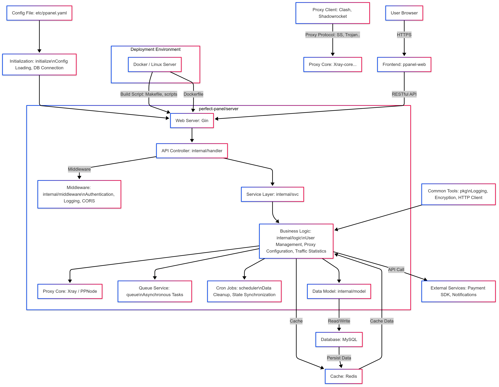

# PPanel Server

<div align="center">

[](LICENSE)
[](https://go.dev/)
[](https://goreportcard.com/report/github.com/perfect-panel/server)
[](../Dockerfile)
[](../.github/workflows/docker-build.yml)

**PPanel is a pure, professional, and perfect open-source proxy panel tool, designed for learning and practical use.**

[English](README.md) | [中文](readme_zh.md) | [Report Bug](https://github.com/cosaria/perfect-panel/issues/new) | [Request Feature](https://github.com/cosaria/perfect-panel/issues/new)

中文文档待同步，以本文件和根 `README.md` 为准。

</div>

> **Article 1.**  
> All human beings are born free and equal in dignity and rights.  
> They are endowed with reason and conscience and should act towards one another in a spirit of brotherhood.
>
> **Article 12.**  
> No one shall be subjected to arbitrary interference with his privacy, family, home or correspondence, nor to attacks upon his honour and reputation.  
> Everyone has the right to the protection of the law against such interference or attacks.
>
> **Article 19.**  
> Everyone has the right to freedom of opinion and expression; this right includes freedom to hold opinions without interference and to seek, receive and impart information and ideas through any media and regardless of frontiers.
>
> *Source: [United Nations – Universal Declaration of Human Rights (UN.org)](https://www.un.org/sites/un2.un.org/files/2021/03/udhr.pdf)*

## 📋 Overview

PPanel Server is the backend component of the PPanel project, providing robust APIs and core functionality for managing
proxy services. Built with Go, it emphasizes performance, security, and scalability.

### Key Features

- **Multi-Protocol Support**: Supports Shadowsocks, V2Ray, Trojan, and more.
- **Privacy First**: No user logs are collected, ensuring privacy and security.
- **Minimalist Design**: Simple yet powerful, with complete business logic.
- **User Management**: Full authentication and authorization system.
- **Subscription System**: Manage user subscriptions and service provisioning.
- **Payment Integration**: Supports multiple payment gateways.
- **Order Management**: Track and process user orders.
- **Ticket System**: Built-in customer support and issue tracking.
- **Node Management**: Monitor and control server nodes.
- **API Framework**: Comprehensive RESTful APIs for frontend integration.

### 发布边界说明

`server/` 是独立的 Go 工程，可以单独开发和构建；但在这个仓库里，默认官方发布路径由根目录编排，优先使用根 `Dockerfile`、`docker-compose.yml`、`make embed` 和 `make build-all`。`server/` 自身的 Docker 发布链保留为 compatibility path，不是新贡献者的默认入口。

## 🚀 Quick Start

### Prerequisites

- **Go**: 1.25+
- **Docker**: Optional, for containerized deployment
- **Git**: For cloning the repository

### Installation from Source

1. **Clone the repository**:
   ```bash
   git clone https://github.com/cosaria/perfect-panel.git
   cd perfect-panel/server
   ```

2. **准备配置**：
   先准备好 MySQL 和 Redis，并复制配置模板：
   ```bash
   cp etc/ppanel.yaml.example etc/ppanel.yaml
   ```

   首次启动前请补全 `etc/ppanel.yaml` 中的数据库和缓存连接信息；如果环境变量已准备好，也可以通过 `PPANEL_DB` 和 `PPANEL_REDIS` 引导生成初始配置。

3. **Install dependencies**:
   ```bash
   go mod download
   ```

4. **Build the server**:
   ```bash
   go build -o bin/ppanel .
   ```

5. **Run the server**:
   ```bash
   go run . run --config etc/ppanel.yaml
   ```

### 🐳 Docker Deployment

仓库默认部署入口在根目录的 `Dockerfile` 和 `docker-compose.yml`，配套构建路径是根 `make embed` / `make build-all`。
如果需要兼容现有镜像链，可以继续使用 `server/Dockerfile`，但它只属于 compatibility path，不是新贡献者的默认入口。

## 📖 API Documentation

Explore the full API documentation:

- **Swagger**: [https://ppanel.dev/en-US/swagger/ppanel](https://ppanel.dev/swagger/ppanel)

The documentation covers all endpoints, request/response formats, and authentication details.

## 🔗 相关模块

| 模块 | 说明 | 链接 |
|---|---|---|
| Admin Web | 管理后台前端 | [目录](../web/apps/admin/) |
| User Web | 用户面板前端 | [目录](../web/apps/user/) |
| Shared UI | 共享组件库 | [目录](../web/packages/ui/) |

## 🌐 Official Website

Visit [ppanel.dev](https://ppanel.dev/) for more details.

## 🏛 Architecture



## 📁 核心目录

```
server/
├── cmd/              # CLI entry points, including cmd/openapi/main.go
├── doc/              # Server docs and diagrams
├── etc/              # 配置模板和运行时配置
├── internal/
│   ├── bootstrap/    # 初始化、依赖注入与运行时状态（原 svc/initialize/runtime）
│   ├── domains/      # 业务域逻辑（原 services）
│   ├── jobs/         # 异步任务与调度（原 worker）
│   └── platform/     # HTTP、持久层与基础设施（原 routers/models/types/modules/adapter）
├── web/              # Embedded frontend assets and static serving
├── config/           # 配置与版本信息
├── script/           # 辅助脚本
├── go.mod            # Go module definition
├── go.sum            # Go dependency lockfile
├── Makefile          # Server-local build helpers
└── Dockerfile        # Compatibility Docker image
```

## 💻 Development

### 当前工作流

1. 运行测试：
   ```bash
   go test ./...
   ```

2. 导出 OpenAPI 契约：
   ```bash
   go run . openapi -o ../docs/openapi
   ```

3. 格式化代码：
   ```bash
   go fmt ./...
   ../.tools/bin/goimports -w .
   ```

4. 本地启动：
   ```bash
   go run . run --config etc/ppanel.yaml
   ```

5. 生成本地可执行文件：
   ```bash
   go build -o bin/ppanel .
   ```

## 🤝 Contributing

Contributions are welcome! Please follow the [Contribution Guidelines](CONTRIBUTING.md) for bug fixes, features, or
documentation improvements.

## ✨ Special Thanks

A huge thank you to the following outstanding open-source projects that have provided invaluable support for this
project's development! 🚀

<div style="overflow-x: auto;">
<table style="width: 100%; border-collapse: collapse; margin: 20px 0;">
  <thead>
    <tr style="background-color: #f5f5f5;">
      <th style="padding: 10px; text-align: center;">Project</th>
      <th style="padding: 10px; text-align: left;">Description</th>
      <th style="padding: 10px; text-align: center;">Project</th>
      <th style="padding: 10px; text-align: left;">Description</th>
    </tr>
  </thead>
  <tbody>
    <tr>
      <td align="center" style="padding: 15px; vertical-align: middle;">
        <a href="https://gin-gonic.com/" style="text-decoration: none;">
          <br/>
          <strong>Gin</strong><br/>
          
        </a>
      </td>
      <td style="padding: 15px; vertical-align: middle;">
        High-performance Go Web framework<br/>
      </td>
      <td align="center" style="padding: 15px; vertical-align: middle;">
        <a href="https://gorm.io/" style="text-decoration: none;">
          <br/>
          <strong>Gorm</strong><br/>
          
        </a>
      </td>
      <td style="padding: 15px; vertical-align: middle;">
        Powerful Go ORM framework<br/>
      </td>
    </tr>
    <tr>
      <td align="center" style="padding: 15px; vertical-align: middle;">
        <a href="https://github.com/hibiken/asynq" style="text-decoration: none;">
          <br/>
          <strong>Asynq</strong><br/>
          
        </a>
      </td>
      <td style="padding: 15px; vertical-align: middle;">
        Asynchronous task queue for Go<br/>
      </td>
      <td align="center" style="padding: 15px; vertical-align: middle;">
        <a href="https://goswagger.io/" style="text-decoration: none;">
          <br/>
          <strong>Go-Swagger</strong><br/>
          
        </a>
      </td>
      <td style="padding: 15px; vertical-align: middle;">
        Comprehensive Go Swagger toolkit<br/>
      </td>
    </tr>
    <tr>
      <td align="center" style="padding: 15px; vertical-align: middle;">
        <a href="https://go-zero.dev/" style="text-decoration: none;">
          <br/>
          <strong>Go-Zero</strong><br/>
          
        </a>
      </td>
      <td colspan="3" style="padding: 15px; vertical-align: middle;">
        Go microservices framework (this project's API generator is built on Go-Zero)<br/>
      </td>
    </tr>
  </tbody>
</table>
</div>

---

🎉 **Salute to Open Source**: Thank you to the open-source community for making development simpler and more efficient!
Please give these projects a ⭐ to support the open-source movement!
## 📄 License

This project is licensed under the [GPL-3.0 License](LICENSE).
