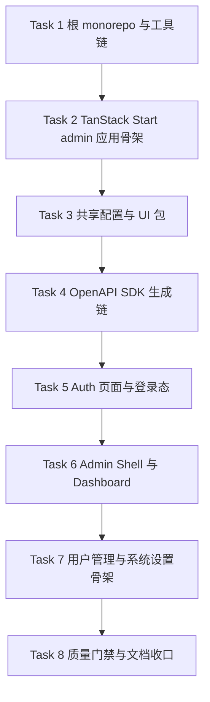

# Web-V2 Admin Implementation Plan

> **For agentic workers:** REQUIRED SUB-SKILL: Use superpowers:subagent-driven-development (recommended) or superpowers:executing-plans to implement this plan task-by-task. Steps use checkbox (`- [ ]`) syntax for tracking.

**Goal:** 从零搭建一个独立的 `web-v2` admin 前端 monorepo，基于 `TanStack Start + shadcn/ui + 全量 TanStack`，打通 `server-v2` 的真实登录、忘记密码、重置密码链路，并交付 admin shell、Dashboard、用户管理骨架、系统设置骨架。

**Architecture:** `web-v2` 采用独立 `pnpm workspace + turbo` monorepo。`apps/admin` 使用 `TanStack Start` 作为应用基座，`packages/ui` 承载共享 `shadcn/ui` 组件，`packages/api-client` 作为唯一 SDK 消费层，通过 `@hey-api/openapi-ts` 从 `server-v2` 导出的 `OpenAPI` 产物生成客户端。认证壳状态使用 `TanStack Store`，远端数据真相使用 `TanStack Query`。

**Tech Stack:** `TanStack Start`、React、Vite、`pnpm workspace`、`turbo`、Tailwind CSS 4、`shadcn/ui`、`@tanstack/react-router`、`@tanstack/react-query`、`@tanstack/react-form`、`@tanstack/react-table`、`@tanstack/store`、`@hey-api/openapi-ts`、`vitest`、`@testing-library/react`、`biome`

---

## Scope Check

这份计划只覆盖一个子项目：`web-v2/admin` 第一阶段。  
虽然会建立 monorepo 包结构，但当前只有一个真实应用 `apps/admin`。  
它不覆盖：

- `user` 端
- 完整 admin 业务 CRUD
- 旧 [web](/Users/admin/Codes/ProxyCode/perfect-panel/web) 的迁移

## 目录与责任锁定

### 核心目录

- `web-v2/apps/admin/`
  - `TanStack Start` admin 应用
- `web-v2/packages/ui/`
  - `shadcn/ui` 基础组件、主题 token、共享 layout 原子
- `web-v2/packages/api-client/`
  - 共享 SDK 与类型导出
- `web-v2/packages/typescript-config/`
  - monorepo 统一 TypeScript 配置
- `web-v2/packages/biome-config/`
  - monorepo 统一 `Biome` 规则
- `web-v2/tests/`
  - monorepo 级 smoke / contract 测试

### 关键文件约束

- `web-v2/apps/admin/src/shared/store/*`
  - 只放薄状态，不承载远端真相
- `web-v2/apps/admin/src/pages/*`
  - 只做页面装配，不直接写 fetch
- `web-v2/packages/api-client/src/generated/*`
  - 生成文件，不允许手动编辑
- `web-v2/packages/ui/src/components/ui/*`
  - `shadcn/ui` 基础组件
- `web-v2/apps/admin/src/widgets/*`
  - 页面级组合，不放业务规则

## 文件结构与职责

- `web-v2/package.json`
  - 根命令与 workspace 脚本
- `web-v2/pnpm-workspace.yaml`
  - workspace 包声明
- `web-v2/turbo.json`
  - 构建、测试、lint、openapi 任务编排
- `web-v2/biome.json`
  - 根 `Biome` 配置入口
- `web-v2/apps/admin/app.config.ts`
  - `TanStack Start` 应用配置
- `web-v2/apps/admin/src/router.tsx`
  - 路由器创建与 Query 集成
- `web-v2/apps/admin/src/routes/__root.tsx`
  - 根文档与 provider 壳
- `web-v2/apps/admin/src/routes/login.tsx`
  - 登录页
- `web-v2/apps/admin/src/routes/forgot-password.tsx`
  - 忘记密码页
- `web-v2/apps/admin/src/routes/reset-password.tsx`
  - 重置密码页
- `web-v2/apps/admin/src/routes/_authed.tsx`
  - 受保护 layout
- `web-v2/apps/admin/src/routes/_authed/index.tsx`
  - Dashboard
- `web-v2/apps/admin/src/routes/_authed/users.tsx`
  - 用户管理骨架页
- `web-v2/apps/admin/src/routes/_authed/settings.tsx`
  - 系统设置骨架页
- `web-v2/apps/admin/src/features/auth/*`
  - 登录、忘记密码、重置密码表单与 hooks
- `web-v2/apps/admin/src/widgets/admin-sidebar.tsx`
  - 基于 `shadcn/ui blocks/sidebar` 的侧栏
- `web-v2/apps/admin/src/widgets/admin-topbar.tsx`
  - 顶栏
- `web-v2/apps/admin/src/shared/store/auth-store.ts`
  - 登录态与壳状态
- `web-v2/packages/api-client/scripts/generate.mjs`
  - 从 `server-v2` 读取 OpenAPI 并生成 SDK
- `web-v2/packages/api-client/src/index.ts`
  - 统一 SDK 导出

## 实施策略



推进顺序不能反。原因是：

- 没有 monorepo 根工具链，后面每个包都会各自发明脚本
- 没有 `TanStack Start` 骨架，认证与 Layout 无法稳定落点
- 没有 `packages/ui` 与 `packages/api-client`，admin 会在应用层重复组件与接口类型
- 没有 auth 页与登录态，admin shell 无法接入真实 `server-v2`

## 全局验证矩阵

每个任务完成后至少执行：

```bash
cd /Users/admin/Codes/ProxyCode/perfect-panel/web-v2
pnpm test
```

涉及 OpenAPI 的任务额外执行：

```bash
cd /Users/admin/Codes/ProxyCode/perfect-panel/web-v2
pnpm openapi
```

涉及应用构建的任务额外执行：

```bash
cd /Users/admin/Codes/ProxyCode/perfect-panel/web-v2
pnpm build
pnpm typecheck
```

## Task 1: 建立 `web-v2` 根 monorepo 与工具链

**Files:**
- Create: `web-v2/package.json`
- Create: `web-v2/pnpm-workspace.yaml`
- Create: `web-v2/turbo.json`
- Create: `web-v2/biome.json`
- Create: `web-v2/tests/smoke/workspace-layout.test.ts`

- [ ] **Step 1: 写 failing smoke test，先约束根目录结构**

```ts
import { describe, expect, it } from 'vitest'
import { existsSync } from 'node:fs'
import { resolve } from 'node:path'

const root = resolve(import.meta.dirname, '..', '..')

describe('workspace layout', () => {
  it('has root workspace files', () => {
    expect(existsSync(resolve(root, 'package.json'))).toBe(true)
    expect(existsSync(resolve(root, 'pnpm-workspace.yaml'))).toBe(true)
    expect(existsSync(resolve(root, 'turbo.json'))).toBe(true)
    expect(existsSync(resolve(root, 'biome.json'))).toBe(true)
  })
})
```

- [ ] **Step 2: 运行测试并确认先失败**

Run: `cd /Users/admin/Codes/ProxyCode/perfect-panel/web-v2 && pnpm vitest run tests/smoke/workspace-layout.test.ts`  
Expected: FAIL，提示根文件不存在或 `pnpm` 脚本尚未建立

- [ ] **Step 3: 创建根工具链文件**

```json
// web-v2/package.json
{
  "name": "web-v2",
  "private": true,
  "packageManager": "pnpm@10.6.0",
  "scripts": {
    "dev": "turbo dev",
    "build": "turbo build",
    "test": "turbo test",
    "lint": "turbo lint",
    "format": "biome format . --write",
    "typecheck": "turbo typecheck",
    "openapi": "turbo openapi"
  },
  "devDependencies": {
    "@biomejs/biome": "^1.9.4",
    "turbo": "^2.0.14",
    "typescript": "^5.7.3",
    "vitest": "^2.1.8"
  }
}
```

```yaml
# web-v2/pnpm-workspace.yaml
packages:
  - apps/*
  - packages/*
```

```json
// web-v2/turbo.json
{
  "$schema": "https://turbo.build/schema.json",
  "tasks": {
    "dev": { "cache": false, "persistent": true },
    "build": { "dependsOn": ["^build"], "outputs": ["dist/**", ".tanstack/**"] },
    "test": { "dependsOn": ["^test"], "outputs": [] },
    "lint": { "dependsOn": ["^lint"], "outputs": [] },
    "typecheck": { "dependsOn": ["^typecheck"], "outputs": [] },
    "openapi": { "dependsOn": ["^openapi"], "outputs": ["src/generated/**"] }
  }
}
```

- [ ] **Step 4: 回跑 smoke 测试**

Run: `cd /Users/admin/Codes/ProxyCode/perfect-panel/web-v2 && pnpm install && pnpm vitest run tests/smoke/workspace-layout.test.ts`  
Expected: PASS

- [ ] **Step 5: 提交 monorepo 根检查点**

```bash
git add web-v2/package.json web-v2/pnpm-workspace.yaml web-v2/turbo.json web-v2/biome.json web-v2/tests/smoke/workspace-layout.test.ts
git commit -m "feat(web-v2): scaffold monorepo root"
```

## Task 2: 建立 `apps/admin` 的 `TanStack Start` 骨架

**Files:**
- Create: `web-v2/apps/admin/package.json`
- Create: `web-v2/apps/admin/app.config.ts`
- Create: `web-v2/apps/admin/vite.config.ts`
- Create: `web-v2/apps/admin/tsconfig.json`
- Create: `web-v2/apps/admin/src/router.tsx`
- Create: `web-v2/apps/admin/src/routes/__root.tsx`
- Create: `web-v2/apps/admin/src/routes/index.tsx`
- Create: `web-v2/apps/admin/src/app/providers.tsx`
- Test: `web-v2/apps/admin/src/app/router.test.tsx`

- [ ] **Step 1: 写 failing route shell 测试**

```tsx
import { render, screen } from '@testing-library/react'
import { describe, expect, it } from 'vitest'
import { AppProviders } from './providers'

describe('admin providers', () => {
  it('renders children inside providers', () => {
    render(
      <AppProviders>
        <div>admin-shell</div>
      </AppProviders>,
    )

    expect(screen.getByText('admin-shell')).toBeInTheDocument()
  })
})
```

- [ ] **Step 2: 运行测试并确认先失败**

Run: `cd /Users/admin/Codes/ProxyCode/perfect-panel/web-v2 && pnpm --filter @web-v2/admin test -- --run src/app/router.test.tsx`  
Expected: FAIL，提示 `apps/admin` 或 provider 文件不存在

- [ ] **Step 3: 初始化 `TanStack Start` admin 应用并收口最小结构**

```json
// web-v2/apps/admin/package.json
{
  "name": "@web-v2/admin",
  "private": true,
  "type": "module",
  "scripts": {
    "dev": "vinxi dev",
    "build": "vinxi build",
    "test": "vitest run",
    "lint": "biome check src",
    "typecheck": "tsc --noEmit"
  },
  "dependencies": {
    "@tanstack/react-start": "^1.121.0",
    "@tanstack/react-router": "^1.121.0",
    "@tanstack/react-query": "^5.67.1",
    "react": "^19.0.0",
    "react-dom": "^19.0.0"
  }
}
```

```tsx
// web-v2/apps/admin/src/router.tsx
import { createRouter as createTanStackRouter } from '@tanstack/react-router'
import { QueryClient } from '@tanstack/react-query'
import { routeTree } from './routeTree.gen'

export interface AppRouterContext {
  queryClient: QueryClient
}

export function createRouter() {
  const queryClient = new QueryClient()

  const router = createTanStackRouter({
    routeTree,
    context: { queryClient },
    defaultPreload: 'intent',
    scrollRestoration: true,
  })

  return router
}

declare module '@tanstack/react-router' {
  interface Register {
    router: ReturnType<typeof createRouter>
  }
}
```

- [ ] **Step 4: 回跑 admin 骨架测试**

Run: `cd /Users/admin/Codes/ProxyCode/perfect-panel/web-v2 && pnpm --filter @web-v2/admin test -- --run src/app/router.test.tsx`  
Expected: PASS

- [ ] **Step 5: 提交 admin 基座检查点**

```bash
git add web-v2/apps/admin
git commit -m "feat(web-v2): scaffold tanstack start admin app"
```

## Task 3: 建立共享配置包与 `packages/ui`

**Files:**
- Create: `web-v2/packages/typescript-config/package.json`
- Create: `web-v2/packages/typescript-config/base.json`
- Create: `web-v2/packages/typescript-config/react-app.json`
- Create: `web-v2/packages/biome-config/package.json`
- Create: `web-v2/packages/biome-config/base.json`
- Create: `web-v2/packages/ui/package.json`
- Create: `web-v2/packages/ui/components.json`
- Create: `web-v2/packages/ui/src/index.ts`
- Create: `web-v2/packages/ui/src/styles.css`
- Create: `web-v2/packages/ui/src/lib/utils.ts`
- Create: `web-v2/packages/ui/src/components/ui/button.tsx`
- Create: `web-v2/packages/ui/src/components/ui/sidebar.tsx`
- Test: `web-v2/packages/ui/src/sidebar-smoke.test.tsx`

- [ ] **Step 1: 写共享 UI failing test**

```tsx
import { render, screen } from '@testing-library/react'
import { describe, expect, it } from 'vitest'
import { Button } from './index'

describe('ui exports', () => {
  it('exports shadcn button', () => {
    render(<Button>保存</Button>)
    expect(screen.getByRole('button', { name: '保存' })).toBeInTheDocument()
  })
})
```

- [ ] **Step 2: 运行测试并确认先失败**

Run: `cd /Users/admin/Codes/ProxyCode/perfect-panel/web-v2 && pnpm --filter @web-v2/ui test -- --run src/sidebar-smoke.test.tsx`  
Expected: FAIL，提示 `packages/ui` 尚不存在

- [ ] **Step 3: 建立共享 UI 包和 shadcn token 基座**

```json
// web-v2/packages/ui/package.json
{
  "name": "@web-v2/ui",
  "private": true,
  "exports": {
    ".": "./src/index.ts",
    "./styles.css": "./src/styles.css"
  },
  "dependencies": {
    "@radix-ui/react-slot": "^1.1.1",
    "class-variance-authority": "^0.7.1",
    "clsx": "^2.1.1",
    "tailwind-merge": "^2.5.5"
  }
}
```

```ts
// web-v2/packages/ui/src/index.ts
export * from './components/ui/button'
export * from './components/ui/sidebar'
```

```ts
// web-v2/packages/ui/src/lib/utils.ts
import { clsx, type ClassValue } from 'clsx'
import { twMerge } from 'tailwind-merge'

export function cn(...inputs: ClassValue[]) {
  return twMerge(clsx(inputs))
}
```

- [ ] **Step 4: 回跑共享 UI 测试**

Run: `cd /Users/admin/Codes/ProxyCode/perfect-panel/web-v2 && pnpm --filter @web-v2/ui test -- --run src/sidebar-smoke.test.tsx`  
Expected: PASS

- [ ] **Step 5: 提交共享包检查点**

```bash
git add web-v2/packages/ui web-v2/packages/typescript-config web-v2/packages/biome-config
git commit -m "feat(web-v2): add shared config and ui package"
```

## Task 4: 建立 `packages/api-client` 与 OpenAPI 生成链

**Files:**
- Create: `web-v2/packages/api-client/package.json`
- Create: `web-v2/packages/api-client/scripts/generate.mjs`
- Create: `web-v2/packages/api-client/src/index.ts`
- Create: `web-v2/packages/api-client/src/generated/.gitkeep`
- Modify: `web-v2/package.json`
- Modify: `web-v2/turbo.json`
- Test: `web-v2/tests/contract/openapi-pipeline.test.ts`

- [ ] **Step 1: 写 failing contract pipeline test**

```ts
import { describe, expect, it } from 'vitest'
import { existsSync } from 'node:fs'
import { resolve } from 'node:path'

const root = resolve(import.meta.dirname, '..', '..')

describe('openapi pipeline', () => {
  it('defines generated api-client package', () => {
    expect(existsSync(resolve(root, 'packages/api-client/package.json'))).toBe(true)
    expect(existsSync(resolve(root, 'packages/api-client/scripts/generate.mjs'))).toBe(true)
  })
})
```

- [ ] **Step 2: 运行测试并确认先失败**

Run: `cd /Users/admin/Codes/ProxyCode/perfect-panel/web-v2 && pnpm vitest run tests/contract/openapi-pipeline.test.ts`  
Expected: FAIL，提示 `packages/api-client` 不存在

- [ ] **Step 3: 建立 SDK 生成脚本**

```js
// web-v2/packages/api-client/scripts/generate.mjs
import { existsSync } from 'node:fs'
import { resolve } from 'node:path'
import process from 'node:process'
import { generate } from '@hey-api/openapi-ts'

const root = resolve(import.meta.dirname, '..')
const repoRoot = resolve(root, '..', '..', '..')
const input = resolve(repoRoot, 'server-v2', 'openapi', 'dist', 'openapi.json')
const output = resolve(root, 'src', 'generated')

if (!existsSync(input)) {
  console.error(`缺少 OpenAPI 输入文件: ${input}`)
  process.exit(1)
}

await generate({
  input,
  output,
  client: '@hey-api/client-fetch',
})
```

```json
// web-v2/packages/api-client/package.json
{
  "name": "@web-v2/api-client",
  "private": true,
  "scripts": {
    "openapi": "node ./scripts/generate.mjs",
    "test": "vitest run",
    "lint": "biome check src scripts",
    "typecheck": "tsc --noEmit"
  },
  "devDependencies": {
    "@hey-api/openapi-ts": "^0.61.0"
  }
}
```

- [ ] **Step 4: 回跑 contract test 并执行生成**

Run: `cd /Users/admin/Codes/ProxyCode/perfect-panel/web-v2 && pnpm vitest run tests/contract/openapi-pipeline.test.ts && pnpm openapi`  
Expected: PASS，并在 `packages/api-client/src/generated` 看到生成产物

- [ ] **Step 5: 提交 SDK 生成链检查点**

```bash
git add web-v2/packages/api-client web-v2/tests/contract/openapi-pipeline.test.ts web-v2/package.json web-v2/turbo.json
git commit -m "feat(web-v2): add openapi sdk pipeline"
```

## Task 5: 实现认证页与登录态壳

**Files:**
- Create: `web-v2/apps/admin/src/features/auth/login-form.tsx`
- Create: `web-v2/apps/admin/src/features/auth/forgot-password-form.tsx`
- Create: `web-v2/apps/admin/src/features/auth/reset-password-form.tsx`
- Create: `web-v2/apps/admin/src/shared/store/auth-store.ts`
- Create: `web-v2/apps/admin/src/shared/auth/require-auth.tsx`
- Create: `web-v2/apps/admin/src/routes/login.tsx`
- Create: `web-v2/apps/admin/src/routes/forgot-password.tsx`
- Create: `web-v2/apps/admin/src/routes/reset-password.tsx`
- Test: `web-v2/apps/admin/src/features/auth/auth-flow.test.tsx`

- [ ] **Step 1: 写 failing auth flow test**

```tsx
import { render, screen } from '@testing-library/react'
import userEvent from '@testing-library/user-event'
import { describe, expect, it } from 'vitest'
import { LoginForm } from './login-form'

describe('login form', () => {
  it('renders email and password inputs', async () => {
    render(<LoginForm />)

    expect(screen.getByLabelText('邮箱')).toBeInTheDocument()
    expect(screen.getByLabelText('密码')).toBeInTheDocument()
    expect(screen.getByRole('button', { name: '登录' })).toBeInTheDocument()

    await userEvent.type(screen.getByLabelText('邮箱'), 'admin@example.com')
    await userEvent.type(screen.getByLabelText('密码'), 'password-123')
  })
})
```

- [ ] **Step 2: 运行测试并确认先失败**

Run: `cd /Users/admin/Codes/ProxyCode/perfect-panel/web-v2 && pnpm --filter @web-v2/admin test -- --run src/features/auth/auth-flow.test.tsx`  
Expected: FAIL，提示登录表单文件不存在

- [ ] **Step 3: 用 `TanStack Form`、`TanStack Store` 和 `packages/api-client` 落认证页**

```tsx
// web-v2/apps/admin/src/shared/store/auth-store.ts
import { Store } from '@tanstack/store'

export interface AuthState {
  accessToken: string | null
  email: string | null
}

export const authStore = new Store<AuthState>({
  accessToken: null,
  email: null,
})
```

```tsx
// web-v2/apps/admin/src/shared/auth/require-auth.tsx
import { Navigate } from '@tanstack/react-router'
import { useStore } from '@tanstack/react-store'
import { authStore } from '../store/auth-store'

export function RequireAuth({ children }: { children: React.ReactNode }) {
  const auth = useStore(authStore)

  if (!auth.accessToken) {
    return <Navigate to="/login" />
  }

  return <>{children}</>
}
```

- [ ] **Step 4: 回跑 auth flow test**

Run: `cd /Users/admin/Codes/ProxyCode/perfect-panel/web-v2 && pnpm --filter @web-v2/admin test -- --run src/features/auth/auth-flow.test.tsx`  
Expected: PASS

- [ ] **Step 5: 提交认证壳检查点**

```bash
git add web-v2/apps/admin/src/features/auth web-v2/apps/admin/src/shared/store/auth-store.ts web-v2/apps/admin/src/shared/auth/require-auth.tsx web-v2/apps/admin/src/routes/login.tsx web-v2/apps/admin/src/routes/forgot-password.tsx web-v2/apps/admin/src/routes/reset-password.tsx
git commit -m "feat(web-v2): add admin auth pages and auth shell"
```

## Task 6: 实现 admin shell、sidebar、topbar 与 Dashboard

**Files:**
- Create: `web-v2/apps/admin/src/widgets/admin-sidebar.tsx`
- Create: `web-v2/apps/admin/src/widgets/admin-topbar.tsx`
- Create: `web-v2/apps/admin/src/routes/_authed.tsx`
- Create: `web-v2/apps/admin/src/routes/_authed/index.tsx`
- Create: `web-v2/apps/admin/src/features/dashboard/status-cards.tsx`
- Test: `web-v2/apps/admin/src/widgets/admin-shell.test.tsx`

- [ ] **Step 1: 写 failing shell test**

```tsx
import { render, screen } from '@testing-library/react'
import { describe, expect, it } from 'vitest'
import { AdminSidebar } from './admin-sidebar'

describe('admin sidebar', () => {
  it('shows first-phase navigation items', () => {
    render(<AdminSidebar />)

    expect(screen.getByText('Dashboard')).toBeInTheDocument()
    expect(screen.getByText('用户管理')).toBeInTheDocument()
    expect(screen.getByText('系统设置')).toBeInTheDocument()
  })
})
```

- [ ] **Step 2: 运行测试并确认先失败**

Run: `cd /Users/admin/Codes/ProxyCode/perfect-panel/web-v2 && pnpm --filter @web-v2/admin test -- --run src/widgets/admin-shell.test.tsx`  
Expected: FAIL，提示 shell 组件不存在

- [ ] **Step 3: 基于 shadcn sidebar block 落 admin shell**

```tsx
// web-v2/apps/admin/src/routes/_authed.tsx
import { Outlet } from '@tanstack/react-router'
import { RequireAuth } from '../shared/auth/require-auth'
import { AdminSidebar } from '../widgets/admin-sidebar'
import { AdminTopbar } from '../widgets/admin-topbar'

export default function AuthedLayout() {
  return (
    <RequireAuth>
      <div className="min-h-screen bg-background text-foreground">
        <AdminSidebar />
        <main className="pl-72">
          <AdminTopbar />
          <div className="p-6">
            <Outlet />
          </div>
        </main>
      </div>
    </RequireAuth>
  )
}
```

- [ ] **Step 4: 回跑 shell test**

Run: `cd /Users/admin/Codes/ProxyCode/perfect-panel/web-v2 && pnpm --filter @web-v2/admin test -- --run src/widgets/admin-shell.test.tsx`  
Expected: PASS

- [ ] **Step 5: 提交 admin shell 检查点**

```bash
git add web-v2/apps/admin/src/widgets web-v2/apps/admin/src/routes/_authed.tsx web-v2/apps/admin/src/routes/_authed/index.tsx web-v2/apps/admin/src/features/dashboard
git commit -m "feat(web-v2): add admin shell and dashboard"
```

## Task 7: 落用户管理与系统设置骨架页

**Files:**
- Create: `web-v2/apps/admin/src/routes/_authed/users.tsx`
- Create: `web-v2/apps/admin/src/routes/_authed/settings.tsx`
- Create: `web-v2/apps/admin/src/features/users/users-table-shell.tsx`
- Create: `web-v2/apps/admin/src/features/settings/settings-shell.tsx`
- Test: `web-v2/apps/admin/src/features/skeleton-pages.test.tsx`

- [ ] **Step 1: 写 failing skeleton page test**

```tsx
import { render, screen } from '@testing-library/react'
import { describe, expect, it } from 'vitest'
import { UsersTableShell } from './users/users-table-shell'

describe('skeleton pages', () => {
  it('shows empty-state structure for users page', () => {
    render(<UsersTableShell />)

    expect(screen.getByText('用户管理')).toBeInTheDocument()
    expect(screen.getByText('当前阶段先提供页面结构和空状态。')).toBeInTheDocument()
  })
})
```

- [ ] **Step 2: 运行测试并确认先失败**

Run: `cd /Users/admin/Codes/ProxyCode/perfect-panel/web-v2 && pnpm --filter @web-v2/admin test -- --run src/features/skeleton-pages.test.tsx`  
Expected: FAIL，提示骨架页组件不存在

- [ ] **Step 3: 用 `TanStack Table` 先落结构化骨架，不接真实 CRUD**

```tsx
// web-v2/apps/admin/src/features/users/users-table-shell.tsx
export function UsersTableShell() {
  return (
    <section className="space-y-6">
      <header className="flex items-center justify-between">
        <div>
          <h1 className="text-2xl font-semibold">用户管理</h1>
          <p className="text-sm text-muted-foreground">当前阶段先提供页面结构和空状态。</p>
        </div>
      </header>
      <div className="rounded-xl border p-6 text-sm text-muted-foreground">
        暂无用户数据。后续任务会在这里接入真实列表和筛选。
      </div>
    </section>
  )
}
```

- [ ] **Step 4: 回跑骨架页测试**

Run: `cd /Users/admin/Codes/ProxyCode/perfect-panel/web-v2 && pnpm --filter @web-v2/admin test -- --run src/features/skeleton-pages.test.tsx`  
Expected: PASS

- [ ] **Step 5: 提交骨架页检查点**

```bash
git add web-v2/apps/admin/src/routes/_authed/users.tsx web-v2/apps/admin/src/routes/_authed/settings.tsx web-v2/apps/admin/src/features/users web-v2/apps/admin/src/features/settings
git commit -m "feat(web-v2): add users and settings skeleton pages"
```

## Task 8: 收口质量门禁、命令与文档

**Files:**
- Modify: `web-v2/package.json`
- Modify: `web-v2/apps/admin/package.json`
- Modify: `web-v2/packages/api-client/package.json`
- Create: `web-v2/tests/smoke/build-chain.test.ts`
- Modify: `web-v2/docs/specs/2026-04-10-web-v2-admin-design.md`（仅在发现术语漂移时）

- [ ] **Step 1: 写 failing build-chain smoke test**

```ts
import { describe, expect, it } from 'vitest'
import { readFileSync } from 'node:fs'
import { resolve } from 'node:path'

const root = resolve(import.meta.dirname, '..', '..')

describe('root scripts', () => {
  it('defines openapi and build commands', () => {
    const pkg = JSON.parse(readFileSync(resolve(root, 'package.json'), 'utf8'))

    expect(pkg.scripts.openapi).toBeDefined()
    expect(pkg.scripts.build).toBeDefined()
    expect(pkg.scripts.typecheck).toBeDefined()
  })
})
```

- [ ] **Step 2: 运行测试并确认先失败或缺脚本**

Run: `cd /Users/admin/Codes/ProxyCode/perfect-panel/web-v2 && pnpm vitest run tests/smoke/build-chain.test.ts`  
Expected: FAIL，提示脚本缺失或未对齐

- [ ] **Step 3: 收口脚本与门禁**

```json
// web-v2/package.json (scripts excerpt)
{
  "scripts": {
    "dev": "turbo dev",
    "build": "turbo build",
    "test": "turbo test",
    "lint": "turbo lint",
    "format": "biome format . --write",
    "typecheck": "turbo typecheck",
    "openapi": "turbo openapi"
  }
}
```

- [ ] **Step 4: 执行全量门禁**

Run:

```bash
cd /Users/admin/Codes/ProxyCode/perfect-panel/web-v2
pnpm lint
pnpm typecheck
pnpm test
pnpm build
pnpm openapi
```

Expected: 全部 PASS

- [ ] **Step 5: 提交 `web-v2` 第一阶段完成检查点**

```bash
git add web-v2
git commit -m "feat(web-v2): complete admin foundation"
```

## Spec Coverage Self-Review

- `独立 monorepo`
  - Task 1, Task 3
- `TanStack Start admin`
  - Task 2
- `shadcn/ui + sidebar/login blocks`
  - Task 3, Task 5, Task 6
- `全量 TanStack`
  - Task 2, Task 5, Task 6, Task 7
- `OpenAPI 在 web 端生成`
  - Task 4, Task 8
- `登录 / 忘记密码 / 重置密码`
  - Task 5
- `Dashboard / 用户管理骨架 / 系统设置骨架`
  - Task 6, Task 7

缺口检查结果：无新增 task 级缺口。

## 占位与一致性自检

- 无 `TODO / TBD / implement later`
- 所有任务都给出明确文件路径
- 所有任务都有显式验证命令
- 术语统一使用 `web-v2 / admin / packages/api-client / server-v2`

